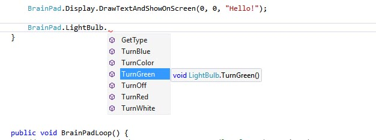

# C Sharp (C#)
It is not a secret that C and C++ are the most popular programing languages among professionals. This is more partically true for professionals that work with small digital systems.

C# is the modern cousin of the C and C++ family. It syntax is very close to JAVA, another very popular programming language.

The courses are in the process of being created. Please bear with us.

---

# Introduction to the BrainPad 

## Overview 
Students will learn how to create projects in Visual Studio along with programming basics. Applications in this lesson will be limited to the `BrainPad` object, `If` statements, a `While` loop and the template functions.

## Guidelines 
* Prerequisites: None
* Ages 12 and up
* PC setup with Visual Studio 2017, TinyCLR OS and Nuget packages installed. 
* Supplies: BrainPad and microUSB cable.

## Install Visual Studio and Download .vsix file
Install Visual Studio Community 2017. Select the Community download. Skip this step if you have Visual Studio 2017 installed.

* [Visual Studio 2017 Download](https://www.visualstudio.com/downloads/)

## Starting a New Project
Connect your BrainPad to your computer using a microUSB cable.

Next Open Visual Studio select `File > New > Project` and under Other Languages select `Visual C# > TinyCLR` and choose the `BrainPad Application`. Change the Location to  `C:\Users\<YourUsername>\Desktop\` then name the project `BrainPad_Project`.


From Visual Studio, select File > New > Project:

 

Once created, you'll be presented with a `Program.cs` tab.

  

This file contains the default code when you first create a project. The lines in green that begin with `'` are called comments, and they generally describe what the code does. Take a moment to review them.

Let's run the code to see these comments' descriptions come to life. Connect the BrainPad and press the `F5` function key or the Start button.
 


Visual Studio will now run the code, a few things will happen and the display will now have the text `"Hello, world!"`.



This file contains the default code when you first create a project. The lines in green that begin with `//` are called comments, they generally describe what the code does. 
Take a moment to review them. You can create your own comments in the code by typing `//` before any notes you like to add. Comments don't affect how your program runs. 
Comments are a great place to keep notes about how a piece of code might work. They are helpful if another programmer looks at your code, or you return to look at your own code at a later date, to help you understand what the code is doing behind the scenes. 

## The BrainPad Object
The world around us is full of objects. Every person, table or circuit board is an object. If we were to ask a person to say "hello," we'd be asking an object to perform a task. The same concept can be applied to code. Like in the previous application we ran, the BrainPad was asked to control the display through the BrainPad object.
The BrainPad object itself, is a piece of code that is contained in one file. This was developed by GHI Electronics to cover the internals of the BrainPad. This enables students like you, with an easy way to control the BrainPad circuit board.
After typing BrainPad, press the period key to get a list of all available options (Figure 3) for this object, like LightBulb.


Now we can use the arrow keys to go up and down in the list to find the LightBulb, and then press the period key again to see what options (Figure 4) are the available for the LightBulb.


Visual Studio does a great deal of simplifying the programming process by automatically listing available options for an object. They call this neat option built into Visual Studio, _IntelliSense_
Now that we know how to use the `BrainPad` object, let’s learn about controlling the LightBulb.

## The BrainPad LightBulb
LED lights are used in many different electronic devices. Here we will test the LightBulb by turning it green, then on, then off. 
Copy and paste the code from Example 1 into your project’s `BrainPadSetup()`, between its two curly braces { }. 

> [!Tip]
> Parentheses `( )` and curly braces `{ }` are used differently, do not confuse them?

```
BrainPad.LightBulb.TurnOff();
BrainPad.LightBulb.TurnGreen();
BrainPad.LightBulb.TurnOff();
BrainPad.LightBulb.TurnGreen();
```
Now, press `F5` to run the code and you’ll see the LightBulb turn green come on and stay on. This happens because our code is executed faster than we can see. So we never see the LightBulb actually blink.

## Problem Solving
Since applications execute extremely fast, we need to slow them down to figure out the problem. This way we can see what is happening or if the results are as expected. We will start by running the code one line at a time, this is called stepping in code to see what the application does at a slow speed.

## Stepping in Code
Add a breakpoint (stop point) at the first line of code inside of `BrainPadSetup()` by moving the cursor to that line and pressing the `F9` key as shown below.

You can also click in the grey area where the breakpoints appear to either remove or create new breakpoints. 


Press `F5` to run the application. The project will be built and deployed but then the execution will stop at the breakpoint as shown below.


## Adding Delays to Code
In order to see what's going on we need to add some delays in the program code. This is done by telling the BrainPad to wait between tasks.
Copy and paste the code from below into your project's `BrainPadSetup()`, between the two curly braces `{ }`. 

```
BrainPad.LightBulb.TurnOff();
BrainPad.Wait.Seconds(1);
BrainPad.LightBulb.TurnGreen();
BrainPad.Wait.Seconds(1);
BrainPad.LightBulb.TurnOff();
BrainPad.Wait.Seconds(1);
BrainPad.LightBulb.TurnGreen();
```
Run the code by pressing `START` and observe the LightBulb again. You should now see it turn green, then on and off twice.

## Change the LightBulb Color
This works great if you only want the LightBulb green. But what if you want a different color?   The LED inside the LightBulb is capable of showing more colors than just green. LED TV's use many tiny LEDS lined up in rows and columns to make up the picture you see. Like the LED lights in a TV they are capable of showing many different colors inside just one LED.  First let's use code similar to the last example, only this time will change the LightBulb from green to red to blue, using built-in functions already created.  
Copy and paste the code from below into your project's `BrainPadSetup()`, between the two curly braces `{ }`. 

```
BrainPad.LightBulb.TurnOff();
BrainPad.LightBulb.TurnGreen();
BrainPad.Wait.Seconds(1);
BrainPad.LightBulb.TurnOff();
BrainPad.LightBulb.TurnRed();
BrainPad.Wait.Seconds(1);
BrainPad.LightBulb.TurnOff();
BrainPad.LightBulb.TurnBlue();
BrainPad.Wait.Seconds(1);
```

## Even more LightBulb Colors.
Under the `BrainPad.LightBulb object` you'll find the method `BrainPad.LightBulb.SetRgbColor()`.  The `SetRgbColor()` method requires 3 values be passed into it.   Each value represents the intensity of each of the RGB colors (Red, Green and Blue). From 0 (fully off) to 100 (fully on).  In the example code below the LightBulb RGB values are all set to 100, resulting in a White colored LightBulb. You'll also notice these values go inside the parentheses and not inside the curly braces.
```
BrainPad.LightBulb.SetRgbColor(100,100,100);
```
We'll now redo the code above that turns the light from Green to Red to Blue. But this time we'll use the `SetRgbColor()` method to achieve the exact same results. 
Copy and paste the code from below into your project's `BrainPadSetup()`, between the two curly braces `{ }`. 

You may have noticed that methods contain parentheses like the `SetRgbColor()` method. Sometimes we put values inside these parentheses.  The first value represents Red, the second Green, and the third Blue. These values are called arguments. The arguments are passed in the method between its parentheses like this:
```
BrainPad.LightBulb.SetRgbColor(0,100,0);
```
Resulting in the Light Bulb turning Green.
