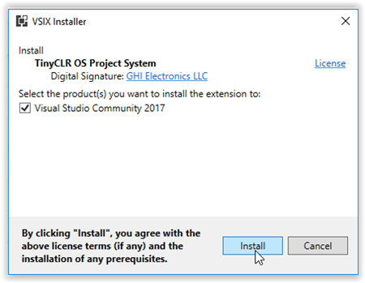

# Setting Up Visual Studio for the BrainPad
We recommend all students start with Microsoft Visual Studio. Visual Studio is the most popular desktop program development environment and is used by professional programmers the world over. The experience you gain programming the BrainPad in Visual Studio also applies to programming desktop computers and smart phones, and Visual Studio's advanced debugging and code completion features make writing code a breeze!

---

## Step 1: Install Visual Studio on your computer
The Visual Studio Community Edition is free and can be found here: 
.

* [Microsoft Visual Studio 2017 Community Edition Download](https://www.visualstudio.com/vs/community/)

When the installation program shows the "Workloads" screen, select .NET desktop development then click the Install button.

 

## Step 2: Install the TinyCLR OS extension (.vsix)

Click on the link below and under "Visual Studio Project System" click on the latest release in the top row of the table. When asked, open the file.

* [TinyCLR OS Visual Studio Extension](http://docs.ghielectronics.com/tinyclr/downloads.html#visual-studio-project-system)

 

Congratulations! You have successfully installed Visual Studio 2017 and the TinyCLR OS extension. You can now start programming the BrainPad by picking a language (Visual C# or Visual Basic) and clicking on the link below.

Click on a link below to get started:

Getting Started on the BrainPad using Visual C# 

Getting Started on the BrainPad using Visual Basic