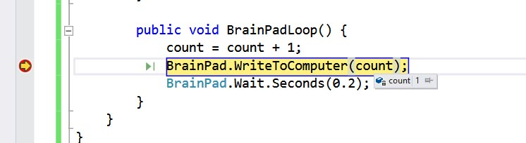

# Variables and Nested Statements
---

## Calling Methods & Arguments
We've already talked a bit about methods like `BrainPadSetup()` and `BrainPadLoop()`. A **Method Call** is nothing more then when the method is used or called in your program.

**Arguments** are values passed into these methods. The following examples list the different ways arguments can be used inside a method call.
```
BrainPad.Buzzer.StartBuzzing(3000);
```
The above example is used to play a sound on the Buzzer. We pass the argument 3000 to the `BrainPad.Buzzer.StartBuzzing()` method call. The 3000 represents the frequency to play. 
```
BrainPad.Wait.Seconds(0.5);
```
The above example is a method that makes the BrainPad wait 0.5 seconds before executing the next line of code. The 0.5 is the argument.`BrainPad.Wait.Seconds()` is called the method call the argument goes inside the method call between the parenthesis `()` of the method.

## The Integer Variable
A **variable** is a location in memory that is reserved for us to use. Instead having to know where the memory is, the system gives us access to that memory using a name we choose as shown in the example below

The type tells the system how much memory to reserve for that one variable. The most widely used variable is an **Integer**, defined by the `int` before the variable name, which is 4 bytes and can hold large numbers and negative numbers. For now, we suggest using Integers for everything, except when fractions are needed (more on that later).
```
int count;
```
The above line instructs the system to reserve a variable as an that is named `count` and the variable type is an Integer, or `int` when coding.

A variable name can use any letters and numbers but it cannot start with a number or contain spaces. Using the underscore symbol is allowed.

Valid variable names:
```
int count123;
int count_me_in;
int count2var;
```
In-valid variables names:
```
int count me;
int count#;
int 2count;
```
Variables in small programs can use any names. It could even be just "x". However, using a meaningful name is very important when writing programs, as there maybe hundreds of variables in a large program.

One of the benefits of variables, is they can be used to store numbers as shown in the example below. 
```
int count;
count = 10;
...
count = 123;
```
In the above example, the `count` variable is stored with the a value of 10. Later in the code, the same varible is used to store a new number, 123. 

Varibles can also be used in equation as shown below
```
int count = 5;
int result;
result = 5 + count;
```
In the above example, we create two variables one named `count`, which is initilazed with the value of 10, and one named `result` which is empty. The last line of code, takes the `count` variable and adds `5` then stores the total in the variable we created named `result`

You can also use the same variable in an equation to increment that variable. Like in the code below.
```
count = count + 1;
```
The code example above takes the current value of `count` adds `1` to it then stores the result back into the same `count` variable. This is handy when incrementing a number like the score in a game or counting the number of times something happens in a program. 

> [!Tip]
> You can shorten the above code to just `count++;` It means the same as `count = count + 1;`

## Using Variables to Change Buzzer Tones
In the example below, we create two variables and use them to change the tone of the buzzer, each time a certian button is pressed. 
```
public class Program {
    int frequency;
    int increment;

    public void BrainPadSetup() {
        frequency = 0;
        increment = 0;
    }

    public void BrainPadLoop() {
        if (BrainPad.Buttons.IsUpPressed()) {
            increment = 100;
        }
        if (BrainPad.Buttons.IsDownPressed()) {
            increment = -100;
        }
        if (increment != 0) {
            frequency = frequency + increment;
            increment = 0;

            BrainPad.Buzzer.StartBuzzing(frequency);
            BrainPad.WriteToComputer(frequency);
            BrainPad.Wait.Seconds(0.2);
            BrainPad.Buzzer.StopBuzzing();
        }
    }
}
```
As we use the up and down buttons to change the frequency, the value held by the frequency variable is printed in the Output Window. Using the code above, can we determine the highest frequency a person can hear?

## The if-statement with Variables
The same way the **if statement** was used to check if a button was pressed, it can be used with variables. In the code below we show that if the frequency is larger than 6,000 turn the red light on, otherwise turn it off. Add the code shown below to the `BrainPadLoop()` in the example above, right above the `BrainPad.Wait.Seconds(0.2)` line.
```
if (frequency > 6000) {
     BrainPad.LightBulb.TurnRed();
}
else {
    BrainPad.LightBulb.TurnOff();
}
```
Pressing the up button will increase the frequency. Once the frequency is greater than 6,000 the red light will turn on.

## Inspecting Variables
Printing the variable value worked well for small programs with a single variable. It is not practical to continuously print every variable out when it comes to larger programs. Instead, we can use the debugger feature to pause the code and inspect variables.

```
public class Program {
    int count;

    public void BrainPadSetup() {
        count = 0;
    }

    public void BrainPadLoop() {
        count = count + 1;
        BrainPad.WriteToComputer(count);
        BrainPad.Wait.Seconds(0.2);
    }
}
```
Add a breakpoint to the loop as shown below, then Press `F5` key or `Start` button to start your program and step through the code. Move the mouse over the `count` variable in your code and wait a second. A pop up window will come up showing the value of the count variable as pictured below.

 

If you press the `Continue` button the code will continue until the end of the code or it reaches another breakpoint. Since our code is in the `BrainPadLoop` it will circle around and stop at the same breakpoint, only this time the `count` variable will be incremented by one.

## Double Variable
While an Integer can hold large numbers, it can't hold fractions. For example, there is no way to set an integer to 0.5 or 123.8. The variable type **double** should be used whenever fractions are needed. If a double can hold large numbers and fractions, why not just use it for everything? You certainly can but double type variables require more memory and processing. Fractions are not always desirable in the programming world as shown below.

```
public class Program {
    double frequency;
    int increment;

    public void BrainPadSetup() {
        frequency = 0;
        increment = 0;
    }

    public void BrainPadLoop() {
         if (BrainPad.Buttons.IsUpPressed()) {
             increment = 100;
         }

         if (BrainPad.Buttons.IsDownPressed()) {
             increment = -100;
         }

         if (increment != 0) {
             frequency = frequency + increment;
             increment = 0;

              BrainPad.Buzzer.StartBuzzing((int)frequency);
              BrainPad.WriteToComputer(frequency);
              BrainPad.Wait.Seconds(0.2);
              BrainPad.Buzzer.StopBuzzing();
         }
     }
}
```
The code above shows how a double isn't always the best variable type choice. Instead of simply passing an integer into `StartBuzzing` method we have to cast it as an integer first. This is done by placing (int) before the variable, which requires additional un-needed processing.


Time to go back to our favorite green light! In the code below, we will turn the green light on and off for a specified amount of time, set by a variable called delay. The up and down buttons control the delay variable, causing the light to be on and off longer or shorter. The variable is also printed out using `WriteToComputer()` method with our`delay` variable as its argument.

```
public class Program {
    double delay;

    public void BrainPadSetup() {
        delay = 0.20;
    }

    public void BrainPadLoop() {
        if (BrainPad.Buttons.IsUpPressed()) {
            delay = delay + 0.10;
        }

        if (BrainPad.Buttons.IsDownPressed()) {
            delay = delay - 0.10;
            if (delay < 0)
                 delay = 0;
        }
        BrainPad.WriteToComputer(delay);

        BrainPad.LightBulb.TurnGreen();
        BrainPad.Wait.Seconds(delay);

        BrainPad.LightBulb.TurnOff();
        BrainPad.Wait.Seconds(delay);
    }
}
```
## Returned Values
Some methods return a value, like when reading the light sensor. This value can be placed into a variable and this variable can be used with if statements. We have lightbulb and light sensor on the BrainPad. Let's turn the light on when it's dark as shown in Example 15.
```
public class Program {
        double level;

        public void BrainPadSetup() {
            level = 0;
        }

        public void BrainPadLoop() {
            level = BrainPad.LightSensor.ReadLightLevel();
            BrainPad.WriteToComputer(level);

            if (level < 0.5) {
                BrainPad.LightBulb.TurnWhite();
            }
            else {
                BrainPad.LightBulb.TurnOff();
            }
        }
    }
```
How can we determine what threshold to use to turn the lightbulb on? This is a perfect example of when inspecting variables is needed. Run the program and test it by placing a finger over the light sensor to block the light. You may need to adjust the threshold from 0.5 to something else. Take a look at the Output Window to see the light levels to determine what value works best for you.

## Strings
A **string** is a type of variable that holds text as shown in the code example below. The text "Hello World!" is considered a string variable. String variables are always surrounded by quotation marks `""`. 
```
BrainPad.WriteToComputer("Hello World!");
```

It's important to remember that the value `2` and the string `"2"` are not the same thing. They may be the same to us but internally in the system they are very different. When `x` is an integer adding 2 + 2 means `x` equals 4, as you would expect.

```
x = 2 + 2;
```

Let's assume `str` is a string variable in the example below, what is the value of str?

```
str = "2" + "2";
```
The plus sign symbol `+` means something different when dealing with strings. Using the plus sign `+` to connect strings is called *concatenation*. Which means a series of interconnected things.
When concatenating strings in the example above, the result is "22". This will make more sense if you try the code below.

```
str = "Hello number " + "2";
```
The result is `"Hello number 2"`. Note how even a space makes a difference with in the string.

## ToString()
One of the important built-in methods for variables is the ToString() method. This method will take the value from count and convert it to a string as shown in the code below.

```
public class Program {
    double count;

    public void BrainPadSetup() {
        count = 0;
    }

    public void BrainPadLoop() {
        count = count + 1;
        BrainPad.WriteToComputer("Count: " + count.ToString());
    }
}
```
The code above continiously increase the `count` variable and display it as a string.

The variable `count` an integer that starts at zero and increments by one in every loop. The string "Count: " is concatenated before the value to give us these results. It then prints the variable's value in the Output Window, as seen in the image below.

 

> [!Tip]
> `BrainPad.WriteToComputer()` method is an excellent way to send messages to Visual Studio about things happening in your program while you're debugging. Messages here are only shown in Visual Studio's Output window and don't effect what's displayed on your BrainPad. 

C# is smart when it comes to concatenation. Try changing code `count.ToString()` to just `count`. Concatenating numbers and other objects with strings will automatically call the ToString() method as shown below.
```
BrainPad.WriteToComputer("Count: " + count);
```

## While loops
A **while loop** statement in C# repeatedly executes the code within its curly braces `{}` as long as a given condition is true. The example below shows the structure of the while loop. 

```
while(as long as this condition is true){
     This code is executed
}
```
You can make a while loop run forever by making it's condition always return true. As shown in the example below. 1 equals 1 is always true. 
```
 public class Program {
     public void BrainPadSetup() {
         int count = 0;

         while (1 == 1) {
             count = count + 1;
             BrainPad.WriteToComputer("Count: " + count);

             BrainPad.Wait.Seconds(0.2);
         }
     }

     public void BrainPadLoop() {
         //Put your program code here. It runs repeatedly after the BrainPad starts up.
     }
}
```
It should be noted clearly that we used == and not = in the while statement. The single = is used to set a value, not compare them.

The code below sets `count` to the value of 10.
```
int count = 10;
``` 
While this code below compares `count` to the value of 10 to see if it's equal.
```
if (count == 10)
```
The Boolean type `true` can also be used as shown in the example below.
```
 public class Program {
     public void BrainPadSetup() {
         int count = 0;

         while (true) {
             count = count + 1;
             BrainPad.WriteToComputer("Count: " + count);

             BrainPad.Wait.Seconds(0.2);
         }
     }

     public void BrainPadLoop() {
         //Put your program code here. It runs repeatedly after the BrainPad starts up.
     }
}
```

## Finite while loops
Both of the examples above create while loops that never end. So any code below the infinte while loop will never execute. Sometimes we might want to loop until a condition reaches a certain point or value. The code example demonstrates the use of a finite while loop, meaning it will stop looping at some point. 
```
public class Program {
    public void BrainPadSetup() {
        int count = 0;

        while (count < 10) {
            count = count + 1;
            BrainPad.WriteToComputer("Count: " + count);
            BrainPad.Wait.Seconds(0.2);
        }
    }

    public void BrainPadLoop() {
        //Put your program code here. It runs repeatedly after the BrainPad starts up.
    }
}
```
 The above code counts up to 10 before the while loop stops. 

However, the count started at zero, and not one. Why didn't it show the zero? If we look at the code above carefully you'll notice that the first line of code in our while loop increase the `count` variable by one. This happens before it is displayed to the Output window. So by the time we reach the line 
```
BrainPad.WriteToComputer("Count: " + count);
``` 
the `count` variable is already equal to `1`. To fix this we can move the line:
```
count = count + 1
```
To the bottom of the while loop. This means the entire contents of the while loop will execute before the `count` variable is incremented by `1`


There is another possible issue in our code. If we want it to count to 10. The program never prints the value 10 to the Output window. 
 
In plain English, our program says: run the following code as long as count is less than 10. Since 10 is not less than 10, then 10 will not be printed. The while loop can be easily modified so 10 is printed too. The code example below checks if `count` is less than or equal to 10. 
```
while (count <= 10)
```

## Nesting 
Any reasonably sized program will have loops inside loops, or if statements inside loops, maybe even inside other if statements and loops! This is called nesting. While programmers should try to keep this simple to understand, nesting is sometimes required.
How do we write a program that prints one to 10 repeatedly forever? This is accomplished by having two nested while loops. One that counts one to 10, which goes inside another loop that loops indefinitely as shown in code example below. 
```
public class Program {
    public void BrainPadSetup() {
        int count = 0;

        while (true) {
            while (count <= 10) {
                BrainPad.WriteToComputer("Count: " + count);
                count = count + 1;
                BrainPad.Wait.Seconds(0.2);
            }
        }
    }

    public void BrainPadLoop() {
        // Declared but not used
    }
}
```
The above program still will not work the way we want. It will print 1 to 10 only once. Then the program will continue to loop but will not print anything after `count` is greater then 10. Can you fix the code without looking at the solution below?

```
public class Program {
    public void BrainPadSetup() {
        int count;

        while (true) {
            count = 0;

            while (count <= 10) {
                BrainPad.WriteToComputer("Count: " + count);
                count = count + 1;
                BrainPad.Wait.Seconds(0.2);
            }
        }
    }

    public void BrainPadLoop() {
        // Declared but not used
    }
}
```
Instead of intializing the `count` variable to 0 at the beginning of our code, we do it inside while loop instead. This means after the nested while loop finishs counting to 10, the first while loop goes back to the top and resets our `count` variable to 0. Which is less than 10, starting our nested while loop to begin printing again.  

## The For Loop
The **For Loop** executes a block of statements, those between its `{}` curly braces, repeatedly until the specified condition returns false. *For loops* are handy for actions where you have to do a specific task a specific number of times. The syntax of the *for loop* always starts with the keyword `for` As noted in the example below.

```
for (intializer; condition; iterator) {

} 
```

```
for (int i = 1; i <= 5; i++) {

} 
```
 
There are 3 parameters inside each *for loop*, each parameter is sepearted by a `;` semicolon. 

First, the variable `i` is initialized, in our example we set it to `1`. This step happens only once, regardless of how many times the loop repeats. 

The second part of the parameter is the condition part. While our `i` variable is less than or equal to `5` the conditon evaluates to `true`, so the loop continues.  

The last parameter in the *for loop* is the iterator. Ours says that everytime we reach the end of our loop the `i` variable is increased by `1` and then starts back at the top of the loop again. This repeats itself until the condition part of the for loop returns `false`. 

In the example below we use a *for loop* to count to 10 and display the value on the BrainPad's display. After the for loop is done, we then display the words "finished"

```
public void BrainPadSetup() {
    for(int i = 1; i <= 10; i++) {
        BrainPad.Display.DrawNumberAndShowOnScreen(10, 10, i);

        //Pauses the BrainPad 1 second before contining the loop
        BrainPad.Wait.Seconds(1);
     }
     
     BrainPad.Display.DrawTextAndShowOnScreen(10, 10, "Finished");
}
```
## Arrays
Arrays are an excellent way to store many of the same data type into a single named varible. The array works well with *for loops* like we just learned previously. In the code examples below we show you how an array is declared and how it's intialized with values. 

An array of integers:

```
int[] nummbers = { 4, 88, 34, 32, 23 };
```

An array of strings:

```
string[] names = { "Tom", "Bill", "Sally", "Greg", "Allen" };
```
The syntax for creating an array, like the ones above, always begin with the data type of the array, followed by `[]` brackets. Next we give our array a name. Just like our variable names, make the array names meaningful. After naming the array we follow with an `=` equal sign. After the equal sign and inbetween the two `{}` curly braces is the data we want to store in the array seperated by commas. 

Let's now demonstrate how we access the data from within our array, using the *for loop* we learned earlier. In the code example below we will use our array of strings to display each name stored in the array on the BrainPad display.

```
class Program {
    string[] names = { "Tom", "Bill", "Sally", "Greg", "Allen" };

    public void BrainPadSetup() {
        for(int i = 0; i < names.Length; i++) {
            BrainPad.Display.DrawTextAndShowOnScreen(10, 10, names[i]);

            BrainPad.Wait.Seconds(1);
        }
        
        BrainPad.Display.DrawTextAndShowOnScreen(10, 10, "Finished");
    }

    public void BrainPadLoop() {
            
    }
}
```

If you look closely in our *for loop* you'll notice in the parameter of our `BrainPad.Display.DrawTextAndShowOnScreen()` function, you will see the `names[]` array. The elements of an array are stored as shown in the image below. 


You'll notice that our array `names` contains 5 elements. But the actual location value inside our array starts at `0`, and ends at `4`. Because all arrays start counting at `0`. So the first element of any array, ours as an example will be `names[0]` which contains the string `"Tom"`. You'll also notice instead of a using a hard coded value in our for loop parameter. We can find out the length of our array, by using the `Length` property of `names` like this `names.Length`. This is something built into the code that returns the length of the array. 

Let's show in our previous code example how we can use two arrays together within our *for loop*, to hold two different values. Using two arrays together in this fashion is often referred to as using *parrallel arrays*

```
class Program {
        string[] names = { "Tom", "Bill", "Sally", "Greg", "Allen" };
        int[] ages = { 15, 21, 36, 50, 17 };

        public void BrainPadSetup() {
            for (int i = 0; i < names.Length; i++) {
                BrainPad.Display.DrawText(10, 10, names[i]);

                BrainPad.Display.DrawText(20, 40, ages[i].ToString());

                BrainPad.Display.ShowOnScreen();

                BrainPad.Wait.Seconds(1);

                BrainPad.Display.ClearScreen();
            }
            
            BrainPad.Display.DrawTextAndShowOnScreen(10, 10, "Finished");
        }

        public void BrainPadLoop() {

        }
    }
```
## Foreach loop
We showed how you can access an array using the for loop. Now we'll show you how to use the **foreach loop**. The *foreach loop* is perfect when you have to cycle through only one array at a time. Unlike the previous example where we used parallel arrays, and accessed two different array elements. 

In the code below, you'll notice the parameters required for the *foreach loop* are different then the for loop and don't require 3 parameters. The *foreach* loop below first creates a string variable called `name` within it's parameters. Each time through the *foreach loop* advances to the next element of the array called `names[]` and sets our newly created `name` variable to its value. The *foreach loop* is a good example of why we pick meanful variable names in our code. 

```
foreach(string name in names){
}
```

Here is a code sample that uses the *foreach loop* and the `names[]` array

```
class Program {
        string[] names = { "Tom", "Bill", "Sally", "Greg", "Allen" };
        int[] age = { 15, 21, 36, 50, 17 };

        public void BrainPadSetup() {
            foreach (string name in names) {
                BrainPad.Display.DrawTextAndShowOnScreen(10, 10, name);              
            }

            BrainPad.Display.DrawTextAndShowOnScreen(10, 10, "Finished");
        }

        public void BrainPadLoop() {

        }
}
```
