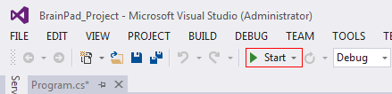
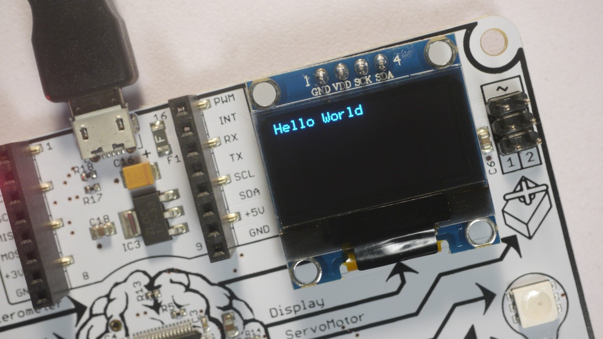

___
# Introduction to the BrainPad 
___


## Overview 
Students will learn how to create projects in Visual Studio along with programming basics. Applications in this lesson will be limited to the `BrainPad` object, `If` statements, a `While` loop and the template functions.

## Guidelines 
* Prerequisites: None
* Ages 12 and up
* PC setup with Visual Studio 2017, TinyCLR OS and Nuget packages installed. 
* Supplies: BrainPad and microUSB cable.

## Install Visual Studio and Download .vsix file
Install Visual Studio Community 2017. Select the Community download. Skip this step if you have Visual Studio 2017 installed.
* [Visual Studio 2017 Download](https://www.visualstudio.com/downloads/)


## Starting a New Project
Connect your BrainPad to your computer using a microUSB cable.

Next Open Visual Studio select `File>New>Project` and under Other Languages select `Visual Basic>TinyCLR` and choose the `BrainPad Application`. Change the Location to  `C:\Users\<YourUsername>\Desktop\` then name the project BrainPad_Project.


**From Visual Studio, select File > New > Project.**
 

_`Creating the BrainPad_Project BrainPad TinyCLR Application.`_


Once created, you'll be presented with a `Program.vb` tab.

  

`The Program.vb file and its contents are shown.`


This file contains the default code when you first create a project. The lines in green that begin with `'` are called comments, and they generally describe what the code does. Take a moment to review them.

Let's run the code to see these comments' descriptions come to life. Connect the BrainPad and press the **F5** function key or the Start button.
 


_`Press the Start button to run the Program.`_


Visual Studio will now run the code, a few things will happen and the display will now have the text `"Hello, world!"`.



_`The display shows "Hello world"`_

What happened exactly? Our application began by calling the `BrainPadSetup()` function. This function is called one time, when the application starts, and is generally used to set things up. In this case, it executed the 

`BrainPad.Display.DrawText` line to instruct the display to show the text "Hello, world!" After `BrainPadSetup()` was finished, the application called `BrainPadLoop()`. Code placed inside this function is executed in an infinite loop. This is why the code that turns the LED on and then off again never stops.


## Exercise
Change the text to make the program print your name on the display.


## Answer
Change this line to your name instead of "Hello World!"

``` 
BrainPad.Display.DrawText(0,0,"YOUR NAME HERE")
```


## The BrainPad Object
The world around us is full of objects. Every person, table or circuit board is an object. If we were to ask a person to say "hello," we'd be asking an object to perform a task. The same concept can be applied to code. Like in the previous application we ran, the BrainPad was asked to control the display and light bulb through the 
`BrainPad` object.
The `BrainPad` object itself, is a piece of code that is contained in one file. This was developed by GHI Electronics to cover the internals of the `BrainPad`. This enables students like you, with an easy way to control the BrainPad circuit board.
After typing `BrainPad`, press the period key to get a list of all available options for this object, like `Display`.


_`Using IntelliSense we can see the options offered by the BrainPad object.`_

Now we can use the arrow keys to go up and down in the list to find the `Display`, and then press the period key again to see what options are the available for the `Display`.


_`Using IntelliSense we can see the options offered by the Display object.`_

Visual Studio does a great deal of simplifying programming by automatically listing the available options for each object.

Now that we know how to use the `BrainPad`  object, let's learn about controlling the LED Light Bulb.

## The BrainPad LightBulb

LED lights are used in many different electronic devices. Here we will test the LightBulb by turning it **<span style="color:green">GREEN</span>**, then `ON` and `OFF`. 

Copy and paste the code from _Example 1_ into your project's `BrainPadSetup()` function.

```
BrainPad.LightBulb.TurnOff()
BrainPad.LightBulb.TurnGreen()
BrainPad.LightBulb.TurnOff()
BrainPad.LightBulb.TurnGreen()
```

`Put this code inside the BrainPadSetup() function.`

Now, press **F5** to run the code and you'll see the LightBulb turn **<span style="color:green">GREEN</span>** and stay on. This happens because our code is executed faster than we can see.

## Problem Solving
Since applications execute extremely fast, we need to slow them down to figure out the problem. This way we can see what is happening or if the results are as expected. We will start by stepping in code to see what the application does at a slow speed.

### Stepping in Code

Add a breakpoint at the first line of code inside of `BrainPadSetup()` by moving the cursor to that line and pressing the **F9** 


_`We've added a breakpoint on line 5.`_

Press **F5** to run the application. The project will be built and deployed but then the execution will stop at the breakpoint.


_`The program has executed up to the breakpoint.`_

Press the **F10** key to execute the current line, which turns the green light off. Now press the **F10** key again, and the LightBulb will turn **<span style="color:green">GREEN</span>**. The next steps will continue through the rest of the code. When you reach the closing curly bracket, press **F5** to stop.
Now that we know our code works (it's just happening too fast) we can add some delays so we can see the light turn on and then off.

## Delays in Code
In order to see what's going on we need to add some delays in the code. This is done by telling the BrainPad to wait between tasks.

```
BrainPad.LightBulb.TurnOff()
BrainPad.Wait.Seconds(0.5)
BrainPad.LightBulb.TurnGreen()
BrainPad.Wait.Seconds(0.5)
BrainPad.LightBulb.TurnOff()
BrainPad.Wait.Seconds(0.5)
BrainPad.LightBulb.TurnGreen()
```


_`This code waits half a second (0.5) between turning the Lightbulb GREEN and OFF.`_

Copy and paste the code from above into your project's `BrainPadSetup()` function. Run the code and observe the LightBulb again. You should now see the LightBulb turning **<span style="color:green">GREEN</span>** and off every half a second.

## Exercise
Create a Traffic Light simulation using the following logic and the LightBulb:

1. Turn the light on **<span style="color:green">GREEN</span>** 
2. Wait 5 seconds.
3. Turn the **LightBulb** off.
4. Turn the light on **<span style="color:yellow">YELLOW</span>** 
5. Wait 2 seconds.
6. Turn the **LightBulb** off.
7. Turn the light on **<span style="color:red">RED</span>** 
8. Wait 5 seconds. 

## Answer

```
BrainPad.LightBulb.TurnGreen()
BrainPad.Wait.Seconds(5)
BrainPad.LightBulb.TurnOff()
BrainPad.LightBulb.TurnYellow()
BrainPad.Wait.Seconds(2)
BrainPad.LightBulb.TurnOff()
BrainPad.LightBulb.TurnRed()
BrainPad.Wait.Seconds(5)
```


## While Loop
The previous exercise turned the LightBulb several colors but it only did it once. We could repeat the code over and over to make the traffic light run a few more times but what if we want this to run indefinitely? This is where `While`  loops come in handy.

```
While BrainPad.Looping
    'Your code
End While
```
`Code inside a while loop will be executed indefinitely.`

Code inside a while loop will be executed indefinitely as long as its condition is met. In our case, we'll use a constant value from the BrainPad object called `Looping`. This constant always returns true, which causes the loop's condition to always be met.

```
While BrainPad.Looping
      BrainPad.LightBulb.TurnGreen()
      BrainPad.Wait.Seconds(0.5)
      BrainPad.LightBulb.TurnOff()
      BrainPad.Wait.Seconds(0.5)
End While
```

_`This code will blink the LightBulb GREEN on and off for half a second indefinitely.`_

Let's keep things simple and blink the **LightBulb** **<span style="color:green">GREEN</span>** every half a second. Copy and paste the code from above into your project's `BrainPadSetup()` function. Run the code and observe the LightBulb.

> [!Tip]
> The `BrainPadLoop()` function does the same thing as our `While` loop behind the scenes, so you can use this function in your application to simplify things.


## Understanding The Loop
To further understand what's going on, add a breakpoint by moving the cursor to the first line where we turn the light **<span style="color:green">GREEN</span>** and press **F9**. This will add a breakpoint and pause the application as soon as it reaches that line.

### block


_`Add a breakpoint while the application is running`_

Now use **F10** to step through the code and when the program reaches the end of the `While` loop it will go back to the beginning. Stop the program execution by pressing the STOP button.


_`The stop button will stop the application that's running.`_

Now, reset the BrainPad and note how the green light is still blinking but this time without the need for Visual Studio. In fact, you can connect the BrainPad to any appropriate power source (such as a phone charger) and the LightBulb will turn on **<span style="color:green">GREEN</span>** and will blink without the need for a PC.

## Exercise
Make the LightBulb cycle through **3** different colors indefinitely.

## Answer

```
Public Sub BrainPadSetup()
    While BrainPad.Looping
      BrainPad.LightBulb.TurnGreen()
      BrainPad.Wait.Seconds(0.5)
      BrainPad.LightBulb.TurnRed()
      BrainPad.Wait.Seconds(0.5)
      BrainPad.LightBulb.TurnYellow()
      BrainPad.Wait.Seconds(0.5)
    End While
End Sub
```


## If Statement
 An `If` statement (or conditional statement) checks to see if a statement is `TRUE` or `FALSE` and then does one of two things depending on the result. Like if the DOWN button is pressed, turn the LightBulb**<span style="color:green">GREEN</span>**.

```
Public Sub BrainPadSetup()
    BrainPad.LightBulb.TurnGreen()
    If BrainPad.Buttons.IsDownPressed() Then
         BrainPad.LightBulb.TurnOff()
    End If
End Sub
```


_`Pressing and hold the down button when running this program will turn the LightBulb GREEN.`_

For the code above to work, you have to be holding the button down at the time the program is deployed. This is because once the `If` statement is reached, the program will continue executing until the program ends. To solve this hard to reach goal, we need to repeatedly check if the button is pressed, as seen in the above code. This is where a `While` loop comes in handy. Let's use the `BrainPadLoop()` function to simplify things **<span style="color:green">per the tip earlier</span>**.

```
Public Sub BrainPadSetup()
    BrainPad.LightBulb.TurnOff()
End Sub

Public Sub BrainPadLoop()
    If BrainPad.Buttons.IsDownPressed() Then
        BrainPad.LightBulb.TurnOff()
    End If
End Sub
```
 

The above code makes sure the LightBulb is `OFF` and then it falls into an infinite loop. However, this program still has a bug. Run the program and test it. The LightBulb will be `OFF` when the program runs and then once the down button is pressed the the LightBulb turn **<span style="color:green">GREEN</span>** . That is all good so far, but when the button is released, the LightBulb never turns `OFF`. Can you guess why? Try stepping in the code to see what happens when the button `is pressed` and when it `is not pressed`.

Computers are strict on following orders. In previous examples, the LightBulb never turned `OFF` because we actually never told the program to turn the LightBulb `OFF`. This means we have to tell the program to turn the LightBulb `ON` when the button is pressed and we also have to tell it to turn the LightBulb `OFF` when the button `is not pressed`.

```
Public Sub BrainPadSetup()
    BrainPad.LightBulb.TurnOff()
End Sub

Public Sub BrainPadLoop()
    If BrainPad.Buttons.IsDownPressed() Then
        BrainPad.LightBulb.TurnGreen()
    End If
    If Not BrainPad.Buttons.IsDownPressed() Then
        BrainPad.LightBulb.TurnOff()
    End If
End Sub
```
_`This code loops indefinitely checking if the down button is pressed. If it is pressed, the LightBulb will turn on GREEN`_


The above code first makes sure the LightBulb is off and then it falls into an infinite loop. However, this program still has a bug. Run the program and test it. The LightBulb will be off when the program runs and then once the down button is pressed the the LightBulb turn **<span style="color:green">GREEN</span>**. That is all good so far, but when the button is released, the LightBulb never turns off. Can you guess why? Try stepping in the code to see what happens when the button `is pressed` and when it is `not pressed`.

Computers are strict on following orders. In previous examples, the LightBulb never turned off because we actually never told the program to turn the **<span style="color:green">GREEN</span>** LightBulb off. This means we have to tell the program to turn the light on when the button is pressed and we also have to tell it to turn the LightBulb off when the button `is not pressed` as shown.

``` 
Public Sub BrainPadSetup()
    BrainPad.LightBulb.TurnOff()
End Sub

Public Sub BrainPadLoop()
    If BrainPad.Buttons.IsDownPressed() Then
        BrainPad.LightBulb.TurnGreen()
    End If
    If Not BrainPad.Buttons.IsDownPressed() Then
        BrainPad.LightBulb.TurnOff()
    End If
End Sub
```
_`This code will turn the LightBulb GREEN
 when the down button is pressed, and off when the down button **is not pressed** the **LightBulb** will turn on`_

While the BrainPad doesn't have a method called `BrainPad.Button.IsDownNotPressed()` we can continue to use `BrainPad.Button.IsDownPressed()` but with `If Not` before it to represent if the button `is not pressed`.  Now when you run it, not pressing the button will turn/keep the LightBulb off.


## Exercise
Turn the LightBulb <span style="color:green">GREEN</span>  when the `up` button `is pressed`. Turn the LightBulb off when the `down` button `is pressed`. Turn the LightBulb <span style="color:red">RED</span>  on when the `left` button is pressed and <span style="color:blue">BLUE</span>  when `right` button is pressed

## Answer

```
Public Sub BrainPadSetup()
    BrainPad.LightBulb.TurnOff()
End Sub

Public Sub BrainPadLoop()
    If BrainPad.Buttons.IsUpPressed() Then
        BrainPad.LightBulb.TurnGreen()
    End If
    If BrainPad.Buttons.IsDownPressed() Then
        BrainPad.LightBulb.TurnOff()
    End If
    If BrainPad.Buttons.IsLeftPressed() Then
        BrainPad.LightBulb.TurnRed()
    End If
    If BrainPad.Buttons.IsRightPressed() Then
        BrainPad.LightBulb.TurnRed()
    End If
End Sub
```


## Else Statement

The Else statement is always used with the If statement and has a very useful purpose that would be perfect for the last example. Previously, we needed to check if the button is pressed and if the button is not pressed. We can simplify this by catching when an If statement isn't true using Else as shown in the code below.

```
Public Sub BrainPadSetup()
    BrainPad.LightBulb.TurnOff()
End Sub

Public Sub BrainPadLoop()
     If BrainPad.Buttons.IsDownPressed() Then
         BrainPad.LightBulb.TurnGreen()
     Else
         BrainPad.LightBulb.TurnOff()
     End If
End Sub
```
_`This code uses an else statement to check if a button is pressed or not to turn the LightBulb green and off.`_

## Or & And Operators

The most used logical operators are the Or and And operators. These are typically used within the `If` statement. In the example below, we want the buzzer to generate a 5,000 Hz sound when both the `up` and `down` buttons are pressed. This is accomplished by using an `&&` operator between `IsUpPressed()` and `IsDownPressed()`.

```
Public Sub BrainPadLoop()
    If BrainPad.Button.IsUpPressed() And BrainPad.Button.IsDownPressed() Then
        BrainPad.Buzzer.Start(5000)
    Else
        BrainPad.Buzzer.Stop()
    End If
End Sub
```
_`This code checks if both up and down are pressed, if so it plays a high pitch sound.`_


## Exercise
Turn the LightBulb <span style="color:green">GREEN</span> on and play the buzzer at 5,000 Hz whenever the `up` or `down` button is pressed. Pressing both or either one will have the same effect.

## Extra Credit

**<span style="color:green">Tip:</span>** Use nested statements such as an `If` statement inside another `If` statement.


