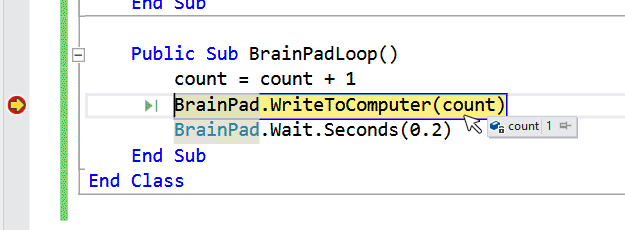

# Variables and Nested Statements

## Calling Methods & Arguments
We've already talked a bit about methods like `BrainPadSetup()` and `BrainPadLoop()`. A **Method Call** is nothing more than when the method is used or called in your program.

**Arguments** are values passed into these methods. The following examples list the different ways arguments can be used inside a method call.

```vb
BrainPad.Buzzer.StartBuzzing(3000)
```

The above example is used to play a sound on the Buzzer. We give the value `3000` to the `BrainPad.Buzzer.StartBuzzing()` method call. The 3000 represents the frequency to play. 

```vb
BrainPad.Wait.Seconds(0.5)
```

The above example is a method that makes the BrainPad wait 0.5 seconds before executing the next line of code. The 0.5 is the argument. `BrainPad.Wait.Seconds()` is called the method call. The argument goes inside the method call between the parenthesis `()` of the method.

## The Integer Variables
A **variable** is a location in memory that is reserved for us to use in our program. Instead of having to know where the memory is, the system gives us access to that memory using a name we choose as shown in the example below:

```vb
Dim count As Integer
```

A variable name can use any letters and numbers but it cannot start with a number or contain spaces. Using the underscore symbol is allowed.

Valid variable names:
```vb
Dim count123 As Integer
Dim count_Me_In As Integer
Dim count2var As Integer
```

Variables in small programs can use any names. It could even be just "x". However, using a meaningful name is very important when writing programs, as there may be hundreds of variables in a large program.

One of the benefits of variables, is they can be used to store numbers as shown in the example below. 

```vb
Dim count As Integer
count = 10
...
count = 123
```

In the above example, the `count` variable is stored with a value of 10. Later in the code, the same variable is used to store a new number: 123. 

Variables can also be used in equations as shown below

```vb
Dim count As Integer
Dim result As Integer
count = 5
result = 5 + count
```

In the above example, we create two variables one named `count`, which in our code is then set to 5, and one named `result` which is empty. The last line of code takes the `count` variable and adds `5` then stores the total in the variable we created named `result`.

You can also use the same variable in an equation to increment that variable. Like in the code below.

```vb
count=count+1
```
The code example above takes the current value of `count` adds `1` to it then stores the result back into the same `count` variable. This is handy when incrementing a number like the score in a game or counting the number of times something happens in a program. 

> [!Tip]
> You can shorten the above code to just `count += 1` It means the same as `count = count + 1`

## Using Variables to Change Buzzer Tones
In the example below, we create two variables and use them to change the tone of the buzzer each time a certian button is pressed. 

```vb
Class Program
    Dim frequency As Integer
    Dim increment As Integer

    Public Sub BrainPadSetup()
        frequency = 0
        increment = 0
    End Sub

    Public Sub BrainPadLoop()
        If BrainPad.Buttons.IsUpPressed() Then
            increment = 100
        End If

        If BrainPad.Buttons.IsDownPressed() Then
            increment = -100
        End If

        If increment <> 0 Then
            frequency = frequency + increment
            increment = 0
            BrainPad.Buzzer.StartBuzzing(frequency)
            BrainPad.WriteToComputer(frequency.ToString())
            BrainPad.Wait.Seconds(0.2)
            BrainPad.Buzzer.StopBuzzing()
        End If
    End Sub
End Class
```

As we use the up and down buttons, we change a variable called `increment`, to either `-100` or `+100`, then that value is added to the value held in the `frequency` variable. We also added the BrainPad.WriteToComputer(frequency.ToString()) method to display the value in the Visual Studio Output window. 

Using the code above, can we determine the highest frequency a person can hear?

## The If-statement with Variables
The same way the **If statement** was used to check if a button was pressed, it can be used with variables. In the code below we show that, if the frequency is larger than 6,000, turn the LightBulb red, otherwise, turn it off. Add the code shown below to the `BrainPadLoop()` in the example above, right before the `BrainPad.Wait.Seconds(0.2)` line.

```vb
If frequency > 6000 Then
    BrainPad.LightBulb.TurnRed()
Else
    BrainPad.LightBulb.TurnOff()
End If
```

Pressing the up button will increase the frequency. Once the frequency is greater than 6,000 the LightBulb will turn red. Otherwise it will turn off.  

## Inspecting Variables
Printing the variable value worked well for small programs with a single variable. It is not practical to continuously print every variable out when it comes to larger programs. Instead, we can use the debugger feature to pause the code and inspect variables.

```vb
Class Program
    Dim count As Integer = 0
    Dim increment As Integer = 0

    Public Sub BrainPadSetup()

    End Sub

    Public Sub BrainPadLoop()
        count = count + 1
        BrainPad.WriteToComputer(count)
        BrainPad.Wait.Seconds(0.2)
    End Sub
End Class  
```

Add a breakpoint in the loop in the previous program and step through code. Move the mouse over the count variable and wait a second. A pop up window will come up showing the value of the count variable.

 

## Double Variable
While an Integer can hold large numbers, it can't hold fractions. For example, there is no way to set an integer to 0.5 or 123.8. The variable type **double** should be used whenever fractions are needed. If a double can hold large numbers and fractions, why not just use it for everything? You certainly can but double type variables require more memory and processing. Fractions are not always desirable in the programming world as shown below.

```vb
Class Program
    Dim frequency As Double
    Dim increment As Integer

    Public Sub BrainPadSetup()
        frequency = 0
        increment = 0
    End Sub

    Public Sub BrainPadLoop()
        If BrainPad.Buttons.IsUpPressed() Then
            increment = 100
        End If

        If BrainPad.Buttons.IsDownPressed() Then
            increment = -100
        End If

        If increment <> 0 Then
            frequency = frequency + increment
            increment = 0
            BrainPad.Buzzer.StartBuzzing(CType(frequency, Integer))
            BrainPad.WriteToComputer(frequency)
            BrainPad.Wait.Seconds(0.2)
            BrainPad.Buzzer.StopBuzzing()
        End If
    End Sub
End Class
```
The code above shows how a `Double` isn't always the best variable type choice. Instead of simply passing an `Integer` into the `StartBuzzing()` method we have to cast it as an integer first. This is done by placing (CType(frequency, Integer)) this tells us to convert the variable `frequency` to an `Integer`, which requires additional un-needed processing.


Time to go back to our favorite LightBulb! In the code below, we will turn the the LightBulb green, then on and off for a specified amount of time. All set by a variable called delay. The up and down buttons control the delay variable, causing the light to be on and off longer or shorter. The variable is also printed out using `WriteToComputer()` method with our `delay` variable as its argument.


```vb
Class Program
    Dim delay As Double

    Public Sub BrainPadSetup()
        delay = 0.2
    End Sub

    Public Sub BrainPadLoop()
        If BrainPad.Buttons.IsUpPressed() Then
            delay = delay + 0.2
        End If

        If BrainPad.Buttons.IsDownPressed() Then
            delay = delay - 0.2
        End If

        BrainPad.WriteToComputer(delay)
        BrainPad.LightBulb.TurnGreen()
        BrainPad.Wait.Seconds(delay)
        BrainPad.LightBulb.TurnOff()
        BrainPad.Wait.Seconds(delay)
    End Sub
End Class
```

## Returned Values
Some methods return a value, like when reading the light sensor. This value can be placed into a variable and this variable can be used with an if statement. We have the Lightbulb and Light Sensor on the BrainPad. Let's turn the Lightbulb on when it's dark as shown in the code example below.  This can be tested by turning the lights off inside the room or by placing a finger over the light sensor to block the incoming light.

```vb
Class Program
    Dim level As Double

    Public Sub BrainPadSetup()
        level = 0
    End Sub

    Public Sub BrainPadLoop()
        level = BrainPad.LightSensor.ReadLightLevel()
        BrainPad.WriteToComputer(level)

        If level > 0.5 Then
            BrainPad.LightBulb.TurnWhite()
        Else
            BrainPad.LightBulb.TurnOff()
        End If
    End Sub
End Class
```
How can we determine what threshold to use to turn the LightBulb on? This is a perfect example of when inspecting variables is needed. Run the program and test it by placing a finger over the Light Sensor to block the light. You may need to adjust the threshold from 0.5 to something else. Take a look at the output window to see the light levels and determine what value works best for your needs. Next stop the program and change the threshold value and then run the program again to test the results.
 
## Strings
A **string** is a type of variable that holds text as shown in the code example below. The text "Hello World!" is considered a string variable. String variables are always surrounded by quotation marks `""`. 

```vb
BrainPad.WriteToComputer("Hello World!")
```

It's important to remember that the value `2` and the string `"2"` are not the same thing. They may be the same to us but internally in the system they are very different. When `x` is an integer adding 2 + 2 means `x` equals 4, as you would expect.

Assuming x is an Integer, what value is in variable x?

```vb
x = 2 + 2
```
Let's assume `str` is a string variable in the example below. What do you think the value of str would be?

```vb
str = "2" + "2"
```
The plus sign symbol `+` means something different when dealing with strings. Using the plus sign `+` to connect strings is called *concatenation*. Which means a series of interconnected things.

When concatenating strings in the example above, the result is "22". This will make more sense if you try the code below.

```vb
str = "Hello number " + "2"
```
The result is `"Hello number 2"`. Note how even a space makes a difference with in the string.

```vb
str = "Hello number " + 2
```

## ToString()
One of the important built-in methods for variables is the ToString() method. This method will take the value from count and convert it to a string as shown in the code below.

```vb
Class Program
    Dim count As Integer = 0

    Public Sub BrainPadSetup()
        count = 0
    End Sub

    Public Sub BrainPadLoop()
        count = count + 1
        BrainPad.WriteToComputer("Count: " + count.ToString())
    End Sub
End Class
```
The code above continiously increase the `count` variable and display it as a string.

The variable `count` an integer that starts at zero and increments by one in every loop. The string "Count: " is concatenated before the value to give us these results. It then prints the variable's value in the Output Window, as seen in the image below.


> [!Tip]
> `BrainPad.WriteToComputer()` method is an excellent way to send messages to Visual Studio about things happening in your program while you're debugging. Messages here are only shown in Visual Studio's Output window and don't effect what's displayed on your BrainPad's Display. 

Visual Basic is smart when it comes to concatenation. Try changing code `count.ToString()` to just `count`. Concatenating numbers and other objects with strings will automatically call the `ToString()` method as shown below.
```vb
BrainPad.WriteToComputer("Count: " + count)
```

## While loops
A **while loop** statement in VB repeatedly executes the code between the `While` and `End While` lines as long as a given condition is true. The example below shows the structure of the while loop. 

```vb
While(as long as this condition is true)
     This code is executed
     This code is executed
End While
```

You can make a while loop run forever by making it's condition always return true. As shown in the example below. 1 equals 1 is always true. 

```vb
Class Program
    Public Sub BrainPadSetup()
        Dim count As Integer
        count = 0
        While 1 = 1
            count = count + 1
            BrainPad.WriteToComputer("Count: " + count.ToString())
        End While
    End Sub

    Public Sub BrainPadLoop()

    End Sub
End Class
```
The Boolean type `true` can also be used as shown in the example below.

```vb
Class Program
    Public Sub BrainPadSetup()
        Dim count As Integer
        count = 0
        While True
            count = count + 1
            BrainPad.WriteToComputer("Count: " + count.ToString())
        End While
    End Sub

    Public Sub BrainPadLoop()

    End Sub
End Class
```

## Finite while loops
Both of the examples above create while loops that never end. So any code below the infinte while loop will never execute. Sometimes we might want to loop until a condition reaches a certain point or value. The code example demonstrates the use of a finite while loop, meaning it will stop looping at some point. 

```vb
Class Program
    Public Sub BrainPadSetup()
        Dim count As Integer
        count = 0
        While count < 10
            count = count + 1
            BrainPad.WriteToComputer("Count: " + count.ToString())
        End While
    End Sub

    Public Sub BrainPadLoop()

    End Sub
End Class
```

The above code counts up to 10 before the while loop stops. 

However, the count started at zero, and not one. Why didn't it show the zero? If we look at the code above carefully you'll notice that the first line of code in our while loop increase the `count` variable by one. This happens before it is displayed to the Output window. So by the time we reach the line 

```vb
BrainPad.WriteToComputer("Count: " + count)
``` 

the `count` variable is already equal to `1`. To fix this we can move the line:

```vb
count = count + 1
```

To the bottom of the while loop. This means the entire contents of the while loop will execute before the `count` variable is incremented by `1` as shown in the code below.

```vb
Class Program
    Public Sub BrainPadSetup()
        Dim count As Integer
        count = 0
        While count < 10
            BrainPad.WriteDebugMessage("Count: " + count.ToString())
            count = count + 1
        End While
    End Sub

    Public Sub BrainPadLoop()

    End Sub
End Class
```

There is another possible issue in our code. If we want it to count to 10. The program never prints the value 10 to the Output window. 
 
In plain English, our program says: run the following code as long as count is less than 10. Since 10 is not less than 10, then 10 will not be printed. The while loop can be easily modified so 10 is printed too. The code example below checks if `count` is less than or equal to 10.

```vb
While count <= 10
```

## Nesting
Any reasonably sized program will have loops inside loops, or if statements inside loops, maybe even inside other if statements and loops! This is called nesting. While programmers should try to keep this simple to understand, nesting is sometimes required.
How do we write a program that prints one to 10 repeatedly forever? This is accomplished by having two nested while loops. One that counts one to 10, which goes inside another loop that loops indefinitely as shown in code example below.

```vb
Class Program
    Public Sub BrainPadSetup()
        Dim count As Integer
        count = 1
        While True
            While count < 10
                BrainPad.WriteToComputer("Count: " + count.ToString())
                count = count + 1
            End While
        End While
    End Sub

    Public Sub BrainPadLoop()

    End Sub
End Class
```

The above program still will not work the way we want. It will print 1 to 10 only once. Then the program will continue to loop but will not print anything after `count` is greater then 10. Can you fix the code without looking at the solution below?

```vb
Class Program
    Public Sub BrainPadSetup()
        Dim count As Integer
        count = 0
        While True
            count = 1

            While count < 10
                BrainPad.WriteToComputer("Count: " + count.ToString())
                count = count + 1
            End While
        End While
    End Sub

    Public Sub BrainPadLoop()

    End Sub
End Class
```

## The For Loop
The **For loop** executes a block of statements, those between the initial `For` statement and the keyword `Next`, repeatedly until the condition is done. *For loops* are handy for actions where you have to do a specific task a specific number of times. The syntax of the *For loop* always starts with the keyword `For` As noted in the example below.


```vb
For i = 1 To 5 Step 1 
  
Next
```
 
A few things are happening in the line of code that contains our `For` statement. First, `i` is initialized, in our example we set it to `1`. This step happens only once, regardless of how many times the loop repeats. 

The second part we tell the computer how high or how many times to loop through the *For loop*. In our example we have `5`. 

Finally the last part of the code contains the keyword `Step` and tells us how much to increment the `i`. In our example we increment `i` by `1` everytime we reach the end of the loop. The end of the *For Loop* is noted by the keyword `Next`


In the example below we use a *For loop* to count to 10 and display the value on the BrainPad's display. After the for loop is done, we then display the words "finished"

```vb
Public Sub BrainPadSetup()
    For i = 1 To 5 Step 1           
        BrainPad.Display.DrawNumberAndShowOnScreen(55, 25, i)

        BrainPad.Wait.Seconds(1)
    Next

    BrainPad.Display.DrawTextAndShowOnScreen(17,25, "Finished")
End Sub
```

## Arrays
Arrays are an excellent way to store many of the same data type into a single named varible. The array works well with *for loops* like we just learned previously. In the code examples below we show you how an array is declared and how it's intialized with values. 

An array of integers:

```vb
Dim nums() As Integer = {1, 2, 3}
```

An array of strings:

```vb
Dim names() As String = { "Tom", "Bill", "Sally", "Greg", "Allen" }
```

The syntax for creating an array, like the ones above, always begin with the keyword `Dim`. 

Next we choose a meaningful name for our array, it is followed by `()` parentheses. Then we use the keyword `As` followed by the data type of our array. 


 After selecting the arrays data type we follow with an `=` equal sign. After the equal sign and inbetween the two `{}` curly braces is the data we want to store in the array seperated by commas. 

Let's now demonstrate how we access the data from within our array, using the *for loop* we learned earlier. In the code example below we will use our array of strings to display each name stored in the array on the BrainPad display.

```vb
Class Program
    Dim names() As String = {"Tom", "Bill", "Sally", "Greg", "Allen"}
    
    Public Sub BrainPadSetup()
        For i = 0 To names.Length - 1 Step 1
            BrainPad.Display.DrawTextAndShowOnScreen(55, 25, names(i))

            BrainPad.Wait.Seconds(1)
        Next

        BrainPad.Display.DrawTextAndShowOnScreen(17, 25, "Finished")
    End Sub

    Public Sub BrainPadLoop()
        
    End Sub
End Class
```

If you look closely in our *for loop* you'll notice in the parameter of our `BrainPad.Display.DrawTextAndShowOnScreen()` function, you will see the `names()` array, with our `i` variable as its parameter. The elements of an array are stored as shown in the image below. 


You'll notice that our array `names` contains 5 elements. But the actual location value inside our array parameter starts at `0`, and ends at `4`. Because all arrays start counting at `0`. So the first element of any array, ours as an example will be `names(0)` which contains the string `"Tom"`. You'll also notice instead of using a hard coded value in our for loop parameter. We can find out the length of our array, by using the `Length` property of `names` like this `names.Length`. This is something built into the code that returns the length of the array. 

Also notice, when we find the length of the area, we ask the computer to subtract one `-1`. This is because `names.Length` returns `5` because we have 5 elements in our array. But, as pointed out and demonstrated in the image above, our array storage slot starts at `names(0)` and only goes to `names(4)` trying to access `names(5)` would cause an error. 

Let's show in our previous code example how we can use two arrays together within our *for loop*, to hold two different values. Using two arrays together in this fashion is often referred to as using *parrallel arrays*

```vb
Class Program
    Dim names() As String = {"Tom", "Bill", "Sally", "Greg", "Allen"}
    Dim ages() As Integer = {15, 21, 36, 50, 17}

    Public Sub BrainPadSetup()
        For i = 0 To names.Length - 1 Step 1
            BrainPad.Display.DrawText(30, 10, names(i))
            BrainPad.Display.DrawNumber(40, 40, ages(i))
            BrainPad.Display.ShowOnScreen()
            BrainPad.Wait.Seconds(1)
            BrainPad.Display.ClearScreen()
        Next

        BrainPad.Display.DrawTextAndShowOnScreen(17, 25, "Finished")

    End Sub

    Public Sub BrainPadLoop()
        'Put your program code here. It runs repeatedly after the BrainPad starts up.

    End Sub
End Class
```

## For Each loop
We showed how you can access an array using the for loop. Now we'll show you how to use the **For Each loop**. The *For Each loop* is perfect when you have to cycle through only one array at a time. Unlike the previous example where we used parallel arrays, and accessed two different array elements. 

Note that the *For Each loop* syntax reads very similar to regular English. 

```vb
For Each name As String In names

Next
``` 

The *For Each loop* below first creates a string variable called `name`. Each time through the *For Each loop* advances to the next element of the array called `names()` and sets our newly created `name` variable to its value. The *For Each loop* is a good example of why we pick meanful variable names in our code to make it more readable. 

Here is a code sample that uses the *For Each loop* and the `names()` array

```vb
Class Program
    Dim names() As String = {"Tom", "Bill", "Sally", "Greg", "Allen"}

    Public Sub BrainPadSetup()

        For Each name As String In names
            BrainPad.Display.DrawTextAndShowOnScreen(30, 25, name)

            BrainPad.Wait.Seconds(1)
        Next

        BrainPad.Display.DrawTextAndShowOnScreen(17, 25, "Finished")

    End Sub

    Public Sub BrainPadLoop()
        'Put your program code here. It runs repeatedly after the BrainPad starts up.

    End Sub
End Class
```

