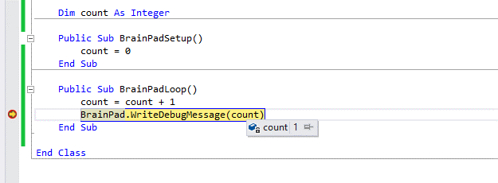
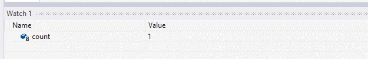
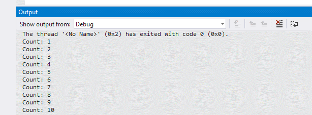
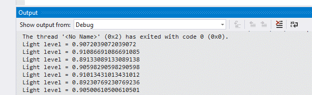

# Variables and Nested Statements

## Overview 
Students will learn about variables, strings, while loops and nested statements.

## Guidelines 
* Prerequisites: None
* Ages 12 and up
* PC setup with Visual Studio 2017, TinyCLR OS and Nuget packages installed. 
* Supplies: BrainPad and Micro USB cable.

## Arguments
Arguments are values passed on to methods. For example, to set the frequency of the buzzer, a value is passed on to that method. The 3000 is the arguments.

```vb
BrainPad.Buzzer.Start(3000)
```

Arguments are also used when adding delays. Here, the 0.2 is the argument.

```vb
BrainPad.Wait.Seconds(0.2)
```

Variables can be constants, like the numbers used above. They can also be variables, which will be explained in the coming sections. Also, arguments can also be something completely different!

```vb
Class Program
    Public Sub BrainPadSetup()
        'Declared but not used
    End Sub

    Public Sub BrainPadLoop()
        If BrainPad.Buttons.IsPressed(BrainPad.Buttons.Button.Up) Then
            BrainPad.WriteDebugMessage("Up button is pressed")
        Else
            BrainPad.WriteDebugMessage("Up button is not pressed")
        End If
    End Sub
End Class
```

What is that argument used with `Button.IsPressed()`? In this case, the `Button.IsPressed` takes an argument to specify which button is to be checked.

This code 
```vb
BrainPad.Buttons.IsPressed(BrainPad.Buttons.Button.Up)
```

Is much clearer than:
```vb
BrainPad.Button.IsPressed(4)
```

What is button 4? In fact, internally the up button may be number 4 but remembering this will be difficult.

## Exercise
Try to use the wrong argument type then build the project to observe the error messages.

## Integer Variables
Variable is a location in memory that is reserved for us to use. Instead of knowing where the memory is and how it is located, the system gives us an access to that memory using a name we select.

```vb
Dim count As Integer
```

The above line instructs the system to reserve (Dim) a variable that is named count and the variable type is an Integer. The name can be use any letters from the alphabet and any numbers but it must not start with a number and it can’t contain spaces.

Here are few allowed name examples:

```vb
Dim count123 As Integer
Dim countMeIn As Integer
Dim count2var As Integer
```

Variables in small programs can use simply names. It can simply be just `x`. However, using a meaningful name is very important when writing any serious program, as there maybe tens, or hundreds, of variables.

The variable now can store numbers.

Note that the variable can be used in the equation and in the result as well.

```vb
count = count + 2
```

The above code will add 2 to the count.

Math can be used as well.

```vb
count = 5 + result
```

After selecting an appropriate name, an appropriate type is needed. The type tell the system how much memory to reserve for that one variable. The most widely used variable is an Integer, and can hold very large numbers, even negative numbers. We suggest the use for Integers for everything, except when fractions are needed. More on fractions later. 

## Changing Tones
Use the code below:

```vb
Class Program
    Dim frequency As Integer
    Dim increment As Integer

    Public Sub BrainPadSetup()
        frequency = 0
        increment = 0
    End Sub

    Public Sub BrainPadLoop()
        If BrainPad.Button.IsUpPressed() Then
            increment = 100
        End If

        If BrainPad.Button.IsDownPressed() Then
            increment = -100
        End If

        If increment <> 0 Then
            frequency = frequency + increment
            increment = 0
            BrainPad.Buzzer.Start(frequency)
            BrainPad.WriteDebugMessage(frequency.ToString())
            BrainPad.Wait.Seconds(0.2)
            BrainPad.Buzzer.Stop()
        End If
    End Sub
End Class
```

The previous example loops 5 times every second and sets the buzzer to a frequency. The frequency is a variable, also named frequency in this example. The buttons will be checked and when the up button is pressed the `frequency` is incremented by 100 and when the down button is pressed the frequency is decremented by 100. The value held by the frequency variable is also printed using the `Debug.Print` statement. Can we now determine the highest frequency a person can hear?

## The if-statement with Variables
The same way the if-statement was used to check if a button was pressed, it can be used with variables. If frequency is larger than 6000 then turn the red light off, else turn the red light off. Add this code inside the while-loop in the previous code example.

```vb
If frequency > 6000 Then
    BrainPad.LightBulb.TurnRed()
Else
    BrainPad. LightBulb.TurnOff()
End If
```

## Exercise
Add a variable that starts at 0 and then it is incremented by 1 in every loop. Once the variable reaches 1000, turn the LightBulb yellow. Print the variable value on the output window and make sure its incrementing, then verify the LightBulb turns yellow when the variable go over 1000.

## Inspecting Variables
Printing the variable value worked well for small programs with a single variable. It is not practical to continuously print every variable out. Instead, we can use the debugger feature to pause the code and inspect variables.

```vb
Class Program   
    Dim count As Integer = 0
    Dim increment As Integer = 0

    Public Sub BrainPadSetup()
        
    End Sub

    Public Sub BrainPadLoop()
        count = count + 1
        BrainPad.DebugPrint(count)
        BrainPad.Wait.Seconds(0.2)
    End Sub   
End Class    
```

Add a breakpoint in the loop in the previous program and step through code. Move the mouse over the count variable and wait a second. A pop up window will come up showing the value of the count variable.

 

The watch windows can be used with important variables that need to be inspected regularly. Locate the watch window and type the variable name in the left sell. This will show the variable value and type.



## Exercise
Run the previous program for few loops, then pause the program, or add a breakpoint. Inspect the value on the watch window. It should be something other than 0.  Change the value manually to `0` and then re-run the program and observe how the output window now shows the variable going back counting from 0.

## Double Variable
While an Integer can hold very large numbers, it can’t hold fractions. For example, there is no way to set an integer to 0.5 or 123.8. The variable type Double should be used whenever fractions are needed. Why not use a Double variable since it can hold large numbers and fractions? You can, but it requires more memory and processing so it isn't as efficient.

```vb
Class Program
    Dim frequency As Double
    Dim increment As Integer

    Public Sub BrainPadSetup()
        frequency = 0
        increment = 0
    End Sub

    Public Sub BrainPadLoop()
        If BrainPad.Button.IsUpPressed() Then
            increment = 100
        End If

        If BrainPad.Button.IsDownPressed() Then
            increment = -100
        End If

        If increment <> 0 Then
            frequency = frequency + increment
            increment = 0
            BrainPad.Buzzer.Start(CType(frequency, Integer))
            BrainPad.WriteMessageOnComputer(frequency)
            BrainPad.Wait.Seconds(0.2)
            BrainPad.Buzzer.Stop()
        End If
    End Sub
End Class
```

The previous example uses a Double instead of an Integer for the frequency. Since the `Buzzer.Start()` method expects an integer, the variable need to be converted using the CType(). This is demonstrating how using Double for everything is not desirable.

Time to go back and have fun with our favorite green light! This example will turn the green light on for a specific time, set by a variable called delay. It then turns the light off for the same length of time. Pressing the up and down buttons control the delay variable, causing the light to be on and off for longer or shorter periods. The variable is also printed out using `DebugOutput()`.

```vb
Class Program
    Dim delay As Double

    Public Sub BrainPadSetup()
        delay = 0.2
    End Sub

    Public Sub BrainPadLoop()
        If BrainPad.Buttons.IsPressed(BrainPad.Buttons.Button.Up) Then
            delay = delay + 0.2
        End If

        If BrainPad.Buttons.IsPressed(BrainPad.Buttons.Button.Down) Then
            delay = delay - 0.2
        End If

        BrainPad.WriteDebugMessage(delay)

        BrainPad.LightBulb.TurnGreen()
        BrainPad.Wait.Seconds(delay)
        BrainPad.LightBulb.TurnOff()
        BrainPad.Wait.Seconds(delay)
    End Sub
End Class
```

## Returned Values
Some methods return a value, like when reading the light sensor. This value can be placed into a variable and then the variable can be used with if-statements. We have lights bulb and a light sensor on the BrainPad. Why not turn the light on when it is dark? This can be tested by turning the lights off inside the room or by placing a finger over the light sensor to block the light.

```vb
Class Program
    Dim level As Double

    Public Sub BrainPadSetup()
        level = 0
    End Sub

    Public Sub BrainPadLoop()
        level = BrainPad.LightSensor.ReadLightLevel()
        BrainPad.WriteDebugMessage(level)

        If level > 0.5 Then
            BrainPad.LightBulb.TurnOn()
        Else
            BrainPad.LightBulb.TurnOff()
        End If
    End Sub
End Class
```

How do we know what value to use as the threshold on when to turn the light bulb on? This is a perfect example on where inspecting variables is needed. Run the program and test by placing a finger over the light sensor to block the light. This may not work nicely and you need to adjust the threshold from 0.5 to something else. Take a look at the output window to see the light levels to determine what value work best for your needs. Then stop the program, change the threshold and then run the program again to test the results.

## Exercise
Modify the last program to have a way to set the threshold using the up button. 

Hint, the threshold was a constant before but now it is going to be a variable that is set to whatever the light sensor returns when the button is pressed. 

Name the variable threshold and make sure it is type Double.

## Strings
A string is a type of variable that holds text. 

```vb
BrainPad.WriteDebugMessage("Hello World!")
```

It is important to remember that the integer 2 and the string "2" are not the same thing. This maybe the same for us but internally in the system they are very different.

Assuming x is an Integer, what value is in variable x?

```vb
x = 2 + 2
```

The result is what you expect, 4. But now assume str is a string variable, what is the value of str?

```vb
str = "2" + "2"
```

The string is just text, not a number. When adding strings, the result is a string that combines the strings. The result from above is "22". This should make more sense if you try this example.

```vb
str = "Hello number " + "2"
```

The result is "Hello number 2". Note how even a space makes a difference in the last example.

This code will generate an error since 2 is a number here not a string.

```vb
str = "Hello number " + 2
```

## ToString()
One of the important built in method for variables is the ToString() method. This method will take the value from the variable and converts it into a string.

```vb
Class Program
    Dim count As Integer=0

    Public Sub BrainPadSetup()
        count = 0
    End Sub

    Public Sub BrainPadLoop()
        count = count + 1
        BrainPad.DebugOutput("Count: " + count.ToString())
    End Sub
End Class
```

The prior example uses a variable type integer that starts at zero and increments by one in every loop. It will then print the variable value in the Output Window.



## Exercise
Show something like this in the output window:



## Finite while-loops

The `While` loop and `BrainPadLoop()` have been used extensively so far. The `While` loop will run while something is true and since we have passed it the value True then it will loop forever.

Is this statement true?

```vb
1 = 1
```

 Yes 1 equals 1, that is true! So keeping that in mind, we can make a while-loop keep looping forever using this statement.

```vb
Class Program
    Public Sub BrainPadSetup()
        Dim count As Integer
        count = 0
        While 1 = 1
            count = count + 1
            BrainPad.WriteDebugMessage("Count: " + count.ToString())
        End While
    End Sub

    Public Sub BrainPadLoop()

    End Sub
End Class
```

Or True can simply be used.

```vb
Class Program
    Public Sub BrainPadSetup()
        Dim count As Integer
        count = 0
        While True
            count = count + 1
            BrainPad.WriteDebugMessage("Count: " + count.ToString())
        End While
    End Sub

    Public Sub BrainPadLoop()

    End Sub
End Class
```

A `While` loop can also be finite, meaning will stop looping at some point.

```vb
Class Program
    Public Sub BrainPadSetup()
        Dim count As Integer
        count = 0
        While count < 10
            count = count + 1
            BrainPad.WriteDebugMessage("Count: " + count.ToString())
        End While
    End Sub

    Public Sub BrainPadLoop()

    End Sub
End Class
```

What did the last program do? It printed the count from 1 to 10. But count started at 0, not one. Shouldn't it print count 0? Time for debugging (troubleshooting). Start by setting a breakpoint at count = 0 and then step in the code to see what the value of count is (use watch window) and then see why the value 0 was never printed. Think about a fix before looking at the next code.

The fix is very easy!

```vb
Class Program
    Public Sub BrainPadSetup()
        Dim count As Integer
        count = 0
        While count < 10
            BrainPad.WriteDebugMessage("Count: " + count.ToString())
            count = count + 1
        End While
    End Sub

    Public Sub BrainPadLoop()

    End Sub
End Class
```

What about the 10? Shouldn't the program print Count: 10? The answer is in the while-loop. In plain English, it says: run the following code as long as count is less than 10. Since 10 is not less than 10 then 10 will not be printed. The while-loop can be improved like this:

```vb
While count <= 10
```

This new statement says run the loop as long as the count is less than or equals to 10.

## Exercise
Write a program the prints all even numbers between 6 to 66.

## Nesting
Some programs will have loops inside loops, or if-statements inside loops, maybe inside other if-statements and more loops! This is called nesting. While programmers should try to keep this simple to understand, nesting is sometimes required.
How do we write a program that prints 1 to 10 repeatedly forever? This is accomplished by having two nested while-loops. One that counts 1 to 10, which goes inside another loop that loops infinitely.

```vb
Class Program
    Public Sub BrainPadSetup()
        Dim count As Integer
        count = 1
        While True
            While count < 10
                BrainPad.WriteDebugMessage("Count: " + count.ToString())
                count = count + 1
            End While
        End While
    End Sub

    Public Sub BrainPadLoop()

    End Sub
End Class
```

The above program will not work. It will print 1 to 10 one time only then the program will not end and it will not print anything after. Time again for debugging the code to determine what the issue is. Run the program and determine the cause of the error. The fix is simple but try to find it before peeking at the fixed code.

```
Class Program
    Public Sub BrainPadSetup()
        Dim count As Integer
        count = 0
        While True
            count = 1

            While count < 10
                BrainPad.WriteDebugMessage("Count: " + count.ToString())
                count = count + 1
            End While
        End While
    End Sub

    Public Sub BrainPadLoop()

    End Sub
End Class
```

## Exercise
Write a program that prints 0 to 10 repeatedly when the up button is **not** pressed when it is bright. If it is dark the button doesn’t do anything. Do not use `And`, instead nest the if-statements.