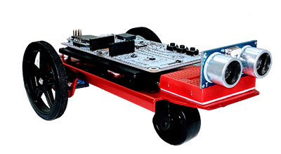

# Expandability

Additional functionality can be added to the BrainPad through its expansion headers. This can be done through a plug-and-play click modules or by direct wiring.

## Plug-and-play Click Modules
This is an easy option as these modules simply plug in. There are hundreds of available options https://shop.mikroe.com/click 

 

This page covers further details on the [click modules](../tinyclr/accessories/mikroe_arduino_uno_click_shield.md)

Advanced users can add any of the available modules. However, there are [courses](courses/intro.md) that cover specific modules and include all the needed drivers.

## Direct Wiring
This option is only recommended for advanced users with electronics background. 

 

As a demo, we built this robot with a chassis we ordered from Amazon http://a.co/dwzywoI The continuous servo motors simply plug in. Pay attention to wires, where the orange wire should be connected to the pin labeled with ~. We then used a breadboard with an ultrasonic distance sensor. This will be used to detect objects, to back up the robot.

```csharp
BrainPad.ServoMotors.ServoOne.ConfigureAsContinuous(false);
BrainPad.ServoMotors.ServoTwo.ConfigureAsContinuous(true);

BrainPad.Display.DrawSmallTextAndShowOnScreen(0, 20, "Press Left");
while (BrainPad.Buttons.IsLeftPressed() == false)
{
    // Beep 
    BrainPad.Buzzer.Beep();
    BrainPad.Wait.Seconds(0.3);
}
BrainPad.Display.ClearScreen();
BrainPad.Display.DrawSmallTextAndShowOnScreen(40, 20, "Go!");

//BrainPad.ServoMotorsIsServoTwoInverted(true);

bool dirrection = true;
BrainPad.ServoMotors.ServoOne.Set(50);
BrainPad.Display.DrawSmallTextAndShowOnScreen(40, 20, "Reflect");

// using reflector
bool use_builtin = true;
if (use_builtin)
{
    GpioPulseReaderWriter echolen = new GpioPulseReaderWriter(
        GpioPulseReaderWriter.Mode.EchoDuration,
        true, 10, BrainPad.Expansion.GpioPin.Mosi,
        true, BrainPad.Expansion.GpioPin.Miso);

    Move(100, 60);


    //dance!
    while (true)
    {

                    
        double l = echolen.Read();
        BrainPad.Display.DrawSmallTextAndShowOnScreen(0, 0, l.ToString());
        if (l < 600)
        {
            Move(-100, -100);
            BrainPad.Wait.Seconds(1);
            Move(-100, 100);
            BrainPad.Wait.Seconds(0.5);
            Move(100, 60);
        }

        BrainPad.Wait.Seconds(0.3);
    }
}
```

This other demo video talk about stepper motors and uses the BrainPad.

<iframe width="560" height="315" src="https://www.youtube.com/embed/SdUkC9XtTSo" frameborder="0" allowfullscreen></iframe>
