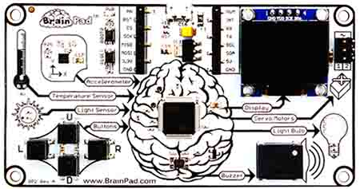
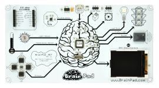

# BrainPad Intro
 

The BrainPad is a revolutionized board for STEM and STEAM programs. It is very simple with much to offer out of the box, yet it is expandable. It is simple enough that a beginner can start with, but powerful that an advanced user can use it to expand their knowledge. It works with higher elementary kids to a retired person.

Visit the official BrainPad website at www.brainpad.com

<iframe width="560" height="315" src="https://www.youtube.com/embed/EKK_CfSFAHc" frameborder="0" allowfullscreen></iframe>

This video shows a 6-year-old using a PC for the first time! And her first PC experience was in programming the BrainPad.

<iframe width="560" height="315" src="https://www.youtube.com/embed/vCylsiJp4U8" frameborder="0" allowfullscreen></iframe>

The BrainPad design is based on the TinYCLR OS's official FEZ hardware. This means that the BrainPad will always receive the latest TinyCLR OS updates.

# The Future Plan
We want your feedback. After years of work with hundreds of students, the BrainPad setup is simple and works through the TinyCLR OS ecosystem of boards. However, we are constantly working on making the use of the BrainPad yet simpler.

This video shows one of the schools we worked with:

<iframe width="560" height="315" src="https://www.youtube.com/embed/U8yOwRuEiKE" frameborder="0" allowfullscreen></iframe>

# The Community
We have been working with local and online communities for years. Hop on our [forum](https://forums.ghielectronics.com/c/brainpad) and share the discussion now. Or [talk to us directly](http://brainpad.com/contact-us/) about our next local community gathering. Teachers and students like you are also interested in STEM & STEAM.

# Firmware Update

## Using TinyCLR Config
(coming soon)

## Manual Loading the Firmware
TinyCLR Config tool should be used to update the firmware. As a backup, use the instructions on the [bootloader page](../hardware/loaders/bootloader.md) for manual update.

Here is a video that shows the manual firmware update. It also includes the steps needed for the old BrainPad and steps for updating the bootloader.

<iframe width="560" height="315" src="https://www.youtube.com/embed/dLlGMwuNZcc" frameborder="0" allowfullscreen></iframe>

 The BrainPad uses the [FEZCLR firmware](../tinyclr/downloads.md#fezclr)

# Advance Hardware Info
Advance hardware info are found on the [hardware](../hardware/products/brainpad.md) page. Also, learn about the magic [TinyCLR OS](../tinyclr/intro.md). 

# The Original BrainPad
 
The Original (old) BrainPad (the large one) has been decommissioned. It has served well in working with schools to help us make a lot of decisions. 

> [!Tip]
> You can determine if you have the old BrainPad by looking for the traffic light in the top right corner. Only the old BrainPad has the traffic light.

As a bonus, we will continue to support the original BrainPad with the new software. However, emulating the old display with the new software is severely effecting the system's performance. The display will not be enabled by default. We do not recommend the use of display on the old BrainPad.

## Using the Traffic Light
The new software does not include the traffic light as the new BrainPad doesn't have a traffic light. However, this can be added as shown in this video.

<iframe width="560" height="315" src="https://www.youtube.com/embed/Od7bU2rR5Vg" frameborder="0" allowfullscreen></iframe>

