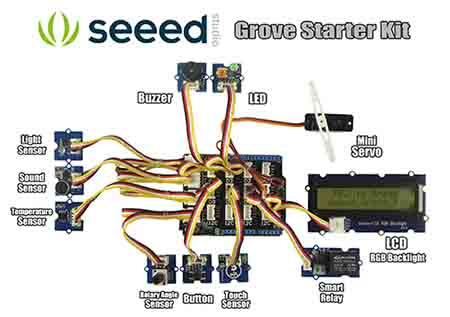

# TinyCLR OS Accessories
---


There are thousands of accessories that can be used with [boards](../tinyclr/boards/intro.md) supported by TinyCLR OS, especially [FEZ](../fez/intro.md). However, we have hand picked a few of our favorites and then built the necessary drivers for them.

Have a list of your own and want to contribute? Talk to us, [directly](https://www.ghielectronics.com/contact) on through the [community forum](https://forums.ghielectronics.com/).

# Adafruit Display Shield
---
 

The [Adafruit 1.8" Color TFT Shield w/microSD and Joystick](https://www.adafruit.com/product/802) plugs right on top of FEZ, or any other Arduino-pinout compatible board.

To use this shield, just plug it on top of your Arduno-pinout compatible board, like the [FEZ](../fez/intro.md).

The driver is found [here](https://github.com/ghi-electronics/TinyCLR-Accessories).

# MikroElektronika Arduino UNO Click Shield
---
 

Through MikroElektronika's [mikroBUS standard](https://www.mikroe.com/mikrobus/), hundreds of [Mikro's Click boards](https://shop.mikroe.com/click) can be easily connected to your board.

The [BrainPad](../../brainpad/intro.md), [Clicker](../tinyclr/boards/mikroelektronika.md#clicker), and [Quail](../tinyclr/boards/mikroelektronika.md#quail) boards all have sockets for plugging click boards.

This video talks about the technology behind SPI bus, shift registers, and serial-parallel data. It uses the [LED ring click](https://shop.mikroe.com/led-ring-r-click) on the BrainPad.

<iframe width="560" height="315" src="https://www.youtube.com/embed/2qYLsM9DoBI" frameborder="0" allowfullscreen></iframe>

The source code is found [here](https://github.com/ghi-electronics/Tech-Talks/tree/master/044%20-%20SPI%20Bus).

You can use these click boards with [FEZ](../fez/intro.md), or any other Arduino-pinout compatible board, through the [Arduino UNO click shield](https://shop.mikroe.com/arduino-uno-click-shield).

The same code used above with the BrainPad can be used with FEZ and the Arduino UNO click shield. Simply, change the pins from BrainPad to FEZ. The pins are labeled right on the shield. For example, the `CS` pin on socket 1 is labeled `CS/D10`.

The complete project is found [here](https://github.com/ghi-electronics/TinyCLR-Accessories)

# Pololu Zumo Robot
---
 

The [Pololu Zumo Robot](https://www.pololu.com/category/169/zumo-robot-for-arduino) from Pololu is one of our favorites, especially the pre-assembled version.

Drop your [FEZ](../fez/intro.md) on top of the Zumo Robot, or any other Arduino-compatible board, and you are ready to make the robot follow lines and dance around.

The driver is found [here](https://github.com/ghi-electronics/TinyCLR-Accessories).

You are now ready for some serious dancing!

```
public static void Main()
{
    bool state = false;


    while (!ZumoBot.ButtonIsPressed())
    {
        state = !state;
        ZumoBot.SetLed(state);
        ZumoBot.Beep();
        Thread.Sleep(500);
    }
    Thread.Sleep(300);
    ZumoBot.SetLed(false);
    Thread.Sleep(300);
    ZumoBot.SetLed(true);
    Thread.Sleep(300);
    ZumoBot.SetLed(false);
    Thread.Sleep(300);
    ZumoBot.SetLed(true);

    while (true)
    {
        long left =  ZumoBot.Reflectors.GetLevel(0);
        long right = ZumoBot.Reflectors.GetLevel(5);
        //Debug.WriteLine(">" + ZumoBot.Reflectors.GetLevel(0));
        //System.Diagnostics.Debug.WriteLine("l: " + left + " r: " + right);
        if (left < 8000 && right < 8000)
        {
            ZumoBot.Motors.Move(40, 40);
        }
        else
        {
            // backup and turn
            ZumoBot.Motors.MoveBackward();
            Thread.Sleep(500);
            ZumoBot.Motors.Stop();
            Thread.Sleep(1000);
            ZumoBot.Motors.TurnLeft();
            Thread.Sleep(500);
            ZumoBot.Motors.Stop();
            Thread.Sleep(1000);
        }
        Thread.Sleep(30);
    }

}
```

# Seeed Grove Starter Kit
---
 

Grove is a modular electronic platform for quick prototyping. Every module has one function, such as touch sensing, creating audio effect and so on. Just plug the modules you need to the base shield, then you are ready to test your idea buds. We have picked the [Seeed Grove Starter Kit for Arduino](https://www.seeedstudio.com/Grove-Starter-Kit-for-Arduino-p-1855.html) as  starting base but you can add additional Grove modules as well.

The included Grove modules plug into the included arduino shield. This shield works with any arduio-pinout compatible board, like the [FEZ](../fez/intro.md).

Plug the shield on top of your board, and get the [drivers](https://github.com/ghi-electronics/TinyCLR-Accessories).


This example that makes some noise!

```
Buzzer buzz = new Buzzer(FEZ.GpioPin.D4);
buzz.Beep();
Thread.Sleep(5000);
buzz.TurnOn();
Thread.Sleep(1000);
buzz.TurnOff();
while(true)
{
    buzz.Beep();
    Thread.Sleep(1000);
}

This example will read the temperature
TemperatureSensor temp = new TemperatureSensor(FEZ.AdcChannel.A1);
while(true)
{
    Debug.WriteLine("-> " + temp.ReadTemperature());
    Thread.Sleep(1000);
}
```

This example will show some text on the character display

```csharp
LcdRgbBacklight lcd = new LcdRgbBacklight();
lcd.Clear();
lcd.SetBacklightRGB(100, 100, 0);
lcd.BlinkBacklight(true);
lcd.BlinkBacklight(false);
lcd.Write("*** TinyCLR ***");
Thread.Sleep(1000);
lcd.SetCursor(0, 1);
lcd.Write("Count:");
int count = 0;
while (true)
{
    lcd.SetCursor(7, 1);
    lcd.Write(count.ToString());
    count++;
    lcd.SetBacklightRGB(100, 100, (byte)count);
    Thread.Sleep(100);
}
```

> [!Warning]
> Pay attention to the 3.3V-5V switch on the shield. The rotary and temperature sensors only work with 3.3V but the RGB character display only works with 5V.

Since the character display connects to I2C and only works with 5V. We have modified one of the I2C sockets to be always 5V. This allows us to keep the switch at 3.3V, leaving all other sockets at 3.3V.

> [!Warning]
> These steps require some experience and will void your warranty!

Start by cutting the power trace going to the last socket.

(image)

Now, add a wire from the socket directly to 5V.

(image)

# Sparkfun Ardumoto Shield Kit
---
 

The sparkfun [Sparkfun Ardumoto Shield Kit](https://www.sparkfun.com/products/14180) is a low cost way of building a robot, somewhat quickly.


Plug the shield on top of your [FEZ](intro.md), or any other Arduino-pinout compatible board.

You are now ready for some serious dancing!

```
public static void Main()
{
    var GPIO = GpioController.GetDefault();
    var DIRA = GPIO.OpenPin(FEZ.GpioPin.D2);
    var DIRB = GPIO.OpenPin(FEZ.GpioPin.D4);
    DIRA.SetDriveMode(GpioPinDriveMode.Output);
    DIRB.SetDriveMode(GpioPinDriveMode.Output);

    var PWM1 = PwmController.FromId(FEZ.PwmPin.Controller1.Id);
    var PWM3 = PwmController.FromId(FEZ.PwmPin.Controller3.Id);
    PWM1.SetDesiredFrequency(5000);
    PWM3.SetDesiredFrequency(5000);

    var PWMA = PWM1.OpenPin(FEZ.PwmPin.Controller1.D3);
    var PWMB = PWM3.OpenPin(FEZ.PwmPin.Controller3.D11);
    PWMA.Start();
    PWMB.Start();
    // reverse direction every one second!
    // Do not foget the shield needs power. Thsi can come from VIN, meaning plug a power pack into your *duino board.
    PWMB.SetActiveDutyCyclePercentage(0.9);
    while (true)
    {

        DIRA.Write(GpioPinValue.High);
        DIRB.Write(GpioPinValue.High);
        System.Threading.Thread.Sleep(1000);

        //change speed 
        PWMA.SetActiveDutyCyclePercentage(0.9);

        DIRA.Write(GpioPinValue.Low);
        DIRB.Write(GpioPinValue.Low);
        System.Threading.Thread.Sleep(1000);

        //change speed 
        PWMA.SetActiveDutyCyclePercentage(0.5);
    }
}
```

***

Visit our main website at [**www.ghielectronics.com**](http://www.ghielectronics.com) and our community forums at [**forums.ghielectronics.com**](https://forums.ghielectronics.com/).