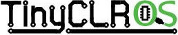

# TinyCLR OS
---

TinyCLR OS allows tiny systems to run .NET applications with rich debugging capabilities though Visual Studio 2017.

* [TinyCLR OS Website](http://www.tinyclr.com/)
* [TinyCLR on FEZ](../tinyclr/boards/fez.md)
* [TinyCLR Ports Repo](https://github.com/ghi-electronics/TinyCLR-Ports)

***

Visit our main website at [**www.ghielectronics.com**](http://www.ghielectronics.com) and our community forums at [**forums.ghielectronics.com**](https://forums.ghielectronics.com/).