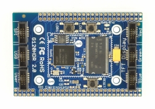

# G120HDR Modules
---
The G120HDR Module is a through-hole version of the [G120 Module](../scm/g120.md)

## G120HDR

## G120HDR Rev2

### Resources

* [Schematic](http://files.ghielectronics.com/downloads/Schematics/Systems/G120HDR%20Module%20Rev2%20Schematic.pdf)

