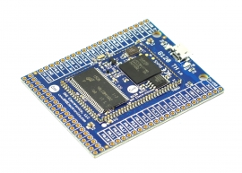

# G120 TH Module
---
 

A through-hole version of the G120.

## Resources

* [Schematic](http://files.ghielectronics.com/downloads/Schematics/Systems/G120%20TH%20Rev%201.0%20Schematic.pdf)

## Software

For information on programming the G120 TH Module, please go to the [G120](../scm/g120.md) page.