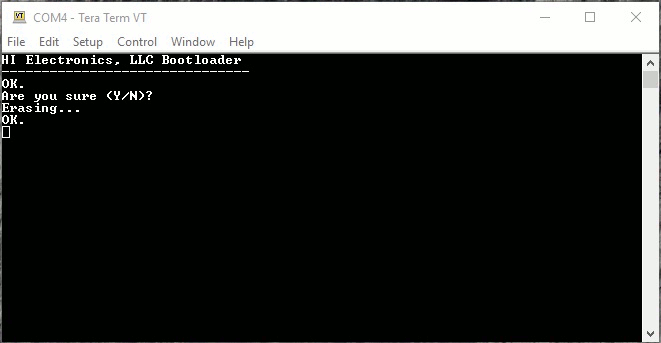
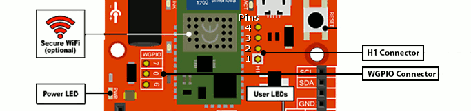
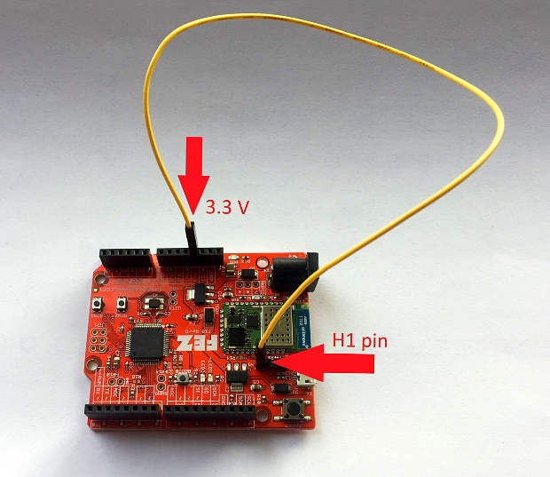
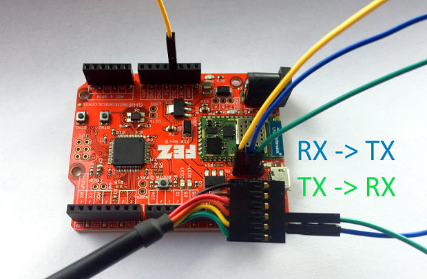
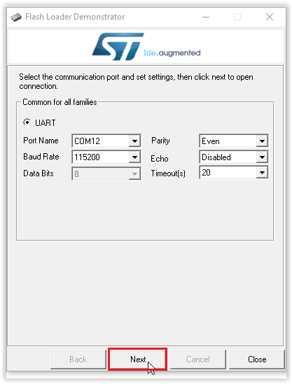
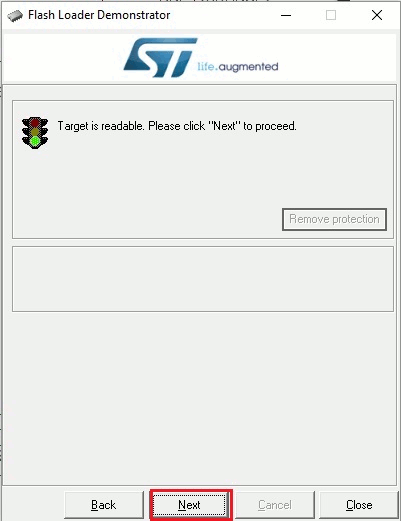
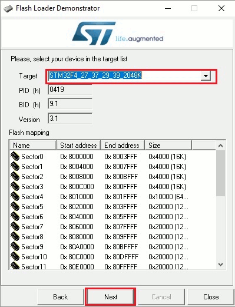
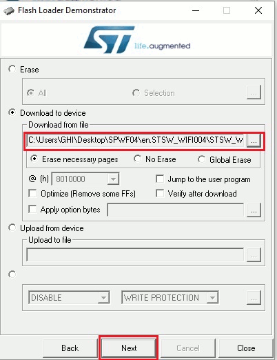
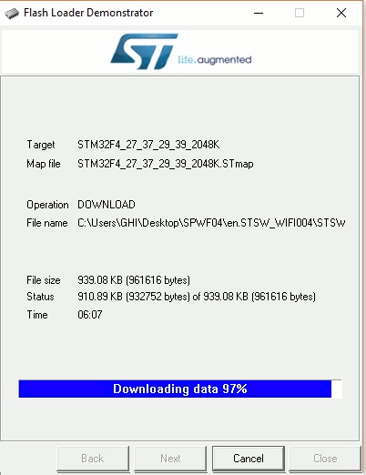

# SPWF04SA
---
## Introduction

The SPWF04SA WiFi module, by STMicroelectronics, is an inexpensive option to bring IoT to embedded devices. While discontinued and out of support, this page provides resources for existing products.

## Using the SPWF04SA WiFi Module

On the this [page](../../software/tinyclr/tutorials/networking/spwf04sx.md), you will find examples on how to access the SPWF04SA WiFi module via the [TinyCLR OS](../../software/tinyclr/intro.md).

## Updating the SPWF04SA Wi-Fi Module Firmware

> [!Warning]
> Before updating the WiFi firmware, erase all applications on the host board to prevent them from interfering with the upgrade process and to prevent possible damage to the host processor.

When the WiFi module starts, it sends a PowerOn message which tells you what firmware version is installed. For example, `PowerOn 171117-0328fe3-SPWF04S`. In this case the firmware is dated 17 November 2017.

### Requirements
To upgrade the WiFi module's firmware, you must first download and install the following:
* [Flash Loader Demonstrator from STMicroelectronics](https://www.st.com/en/development-tools/flasher-stm32.html).

* [Firmware files from STMicroelectronics](https://www.st.com/content/st_com/en/products/embedded-software/wireless-connectivity-software/stsw-wifi004.html#getsoftware-scroll).

You will also need:
* A USB to serial adapter. We were successful using the FTDI TTL-232R-3V3 Cable. Some older USB to serial adapters will not work.

* Some jumper wires.

> [!Tip]
> For the USB to serial adapter you can use the Gadgeteer USB-Serial Module with a Gadgeteer Breadboard. Connect the module socket to the breadboard socket using a ribbon cable. You must also power the breadboard by connecting GND and 3.3V from the FEZ to the corresponding breadboard connectors.

### Erase the Host Firmware

Before updating the WiFi module firmware, you must erase the firmware on the host board or SoM. This is accomplished using terminal software while the board is in bootloader mode. The instructions are very similar to the instructions for [manually loading firmware](../../hardware/loaders/ghi-bootloader.md#manually-loading-the-firmware).

1. Connect the board to your computer's USB port.
2. Put your board in bootloader mode. Each product has a specific way to enter the boot loader.
3. Open any terminal software, for example [Tera Term](http://ttssh2.osdn.jp/).
4. Select serial and pick the COM port associated with your board (if unsure, check Device Manager).
5. Press `E` and then enter to start the erasing procedure.
6. Press `Y` to confirm, then enter.

    

### Connect the WiFi Module

Before updating the WiFi firmware, you must first connect the following pins (Pictures show FEZ board. See table below for other devices):

* Connect BOOT0 of the WiFi module to a 3.3 volt source.

    

* Connect the GND pin of the USB to serial adapter to a GND pin on the host board. Note: You don't need this connection if you will be powering the device from your computer's USB port.

* Connect the RX pin of the USB to serial adapter to TXD of the WiFi module.

* Connect the TX pin of USB to serial adapter to RXD of WiFi module.

    

* Power up the board and connect the USB to serial adapter to your PC.

* You are now ready to flash the WiFi module.

| WiFi Pin Name | FEZ | UC2550/UC5550 | UCM Dev Board | UCM Breakout Board |
|----------------|-----|---------------|---------------|--------------------|
| BOOT0 | Header H1 pin 1 | SO-DIMM pin 108 | HDR B MS2 | MS2 |
| TXD | Header H1 pin 2 | SO-DIMM pin 93 | HDR A SPI B MISO | SPI B MISO |
| RXD | Header H1 pin 3 | SO-DIMM pin 94 | HDR A SPI B MOSI | SPI B MOSI |
| GPIO 0 | WGPIO pin 0 | SO-DIMM pin 36 | HDR B MS5 | N/A |

### Flash the WiFi Module

* Launch `Flash Loader Demonstrator` by selecting `Demonstrator GUI` in the Windows Start Menu. Make sure to select the port name for the USB to serial adapter you are using. Set the baud rate to 115200, parity to even, disable echo, and set timeout to 20. Then click the `Next` button. If you can't find the serial port for your USB to serial adapter, you might have to install its device driver. If its device driver is installed you should see it in Device Manager under `Ports (COM & LPT)`.

    

* Click the `Next` button. If all steps were done correctly you should see:

    

* Click the `Next` button and then choose your device in the dropdown menu. After selecting your device click on the `Next` button.

    

* Click the `Download to device` radio button and then select the WiFi firmware file you [downloaded](https://www.st.com/content/st_com/en/products/embedded-software/wireless-connectivity-software/stsw-wifi004.html#getsoftware-scroll) earlier. This file is a .hex file called `SPWF04S-xxxxxx-xxxxxxx-Full.hex`. If you are searching for the file, make sure to search for a .hex file. Click the `Next` button to copy this file to the WiFi module.

    

* It will take a few minutes to erase the old firmware and copy the new firmware to the WiFi module.

    

* When update is done, remove all wires and [load the firmware](../../hardware/loaders/ghi-bootloader.md#loading-the-firmware) on the board.

* Reset the board.

* Next you need to reset the WiFi module to its factory settings.

### Reset Factory WiFi Settings
After each update you must reset the WiFi module to its factory settings:
* Unplug the board or SoM.

* Connect a jumper wire from GPIO 0 of the WiFi module to a 3.3 volt source.

* Power up the board.

* Remove the jumper wire and reset the device.
