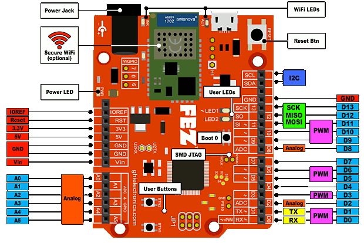

# Introduction
---

## The Maker Board to Rule Them All!
FEZ (fast and easy) is our magnificent maker board. This low cost board offers Arduino pinout compatibility, optional WiFi for IoT applications, and can be programmed using multiple programming languages and development environments. However, we are focused on TinyCLR OS support to program the board in .NET C# and Visual Basic.

Pricing, purchasing and other information can be found on the [FEZ page](https://www.ghielectronics.com/products/FEZ) on our main website.

| Spec           | Value                           |
|----------------|---------------------------------|
| Processor      | STMicroelectronics ST32F401RET6 |
| Speed          | 84 MHz                          |
| Internal RAM   | 96 KByte                        |
| Internal Flash | 512 KByte                       |
| Dimensions     | 70.6 x 56.0 x 14.5 mm           |

| Peripheral         | Quantity          |
|--------------------|-------------------|
| GPIO (5V tolerant) | 22                |
| IRQ                | 22                |
| UART               | 1                 |
| I2C                | 1                 |
| SPI                | 1                 |
| PWM                | 8                 |
| 12 Bit ADC         | 8                 |
| CAN                | 0                 |
| USB Client         | 1                 |
| WiFi              | Optional          |

\**Note:  Many peripherals share I/O pins.  Not all peripherals will be available to your application.*

## Resources
* [Schematic](http://files.ghielectronics.com/downloads/Schematics/FEZ/FEZ%20T18%20Rev%20D%20Schematic.pdf)
* [TinyCLR Tutorials](../../software/tinyclr/tutorials/intro.md)
* [Instructions](../components/spwf04sa.md) for updating the WiFi module firmware.

FEZ can be powered through the USB connector and/or the power connector. The barrel jack is pin positive, sleeve negative, 2.1mm. It is capable of anywhere 6V to 9V. 500mA of power should be enough for most needs.

## TinyCLR OS

TinyCLR OS provides a way to program FEZ in C# or Visual Basic from the Microsoft Visual Studio integrated development environment.  To get started you must first install the bootloader and firmware (instructions below) and then go to the TinyCLR [Getting Started](../../software/tinyclr/getting-started.md) page for instructions.

### Loading Bootloader

1. Download the FEZ bootloader [here](../../hardware/loaders/ghi-bootloader.md).
2. Connect your device to the USB client port.
3. Put the board in DFU mode: Hold BOOT0 button low and press/release the reset button. Wait for a second then release BOOT0. Windows *Device Manager* will now show "STM Device in DFU Mode" under the 'Universal Serial Bus controller' TAB.
4. Go to the [STM32 Bootloader](../../hardware/loaders/stm32-bootloader.md) to learn how to upload DFU files.

### Loading the Firmware

1. Activate the bootloader, hold the BTN1 button low while resetting the board.
2. Open [TinyCLR Config](../../software/tinyclr/tinyclr-config.md) tool.
3. Click the loader tab.
4. Select the correct COM port. If you are not seeing it then the device is not in the loader mode.
5. Click the `Update to Latest` button.

You can also update the firmware manually. Download the [firmware](../../software/tinyclr/downloads.md) and learn how to use the [GHI Bootloader](../../hardware/loaders/ghi-bootloader.md) manually.

### Start Coding

Now that you have installed the bootloader and firmware on the FEZ, you can setup your host computer and start programming. Go to the TinyCLR [Getting Started](../../software/tinyclr/getting-started.md) page for instructions.

### Code Samples

For some examples of using TinyCLR, take a look at the [TinyCLR Samples repo](https://github.com/ghi-electronics/TinyCLR-Samples). You may also find the [TinyCLR tutorials](../../software/tinyclr/tutorials/intro.md) useful.

### Native Code

TinyCLR OS also lets you use native code that works alongside your managed application. Native code can be used to provide improved performance or access to advanced features not exposed through TinyCLR. For more information check out [Native Code on TinyCLR](../../software/tinyclr/native/intro.md).

The memory area reserved for native code in TinyCLR OS on FEZ starts at 0x20016000 and its length is 0x3F8.

***

Visit our main website at [**www.ghielectronics.com**](http://www.ghielectronics.com) and our community forums at [**forums.ghielectronics.com**](https://forums.ghielectronics.com/).
