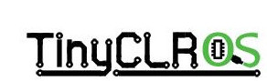
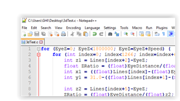
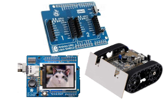

# Introduction
---

## The Maker Board to Rule Them All!
FEZ (fast and easy) is our magnificient maker board. This low cost board offers Arduino pinout compatibility, optional WiFi for IOT applications, and can be programmed using multiple programming languages and development environments.

Pricing, purchasing and other information can be found on the [FEZ page]() on our main website.

### Specifications

| Spec           | Value                           |
|----------------|---------------------------------|
| Processor      | STMicroelectronics ST32F401RET6 |
| Speed          | 84 MHz                          |
| Internal RAM   | 96 kB                           |
| Internal Flash | 512 kB                          |
| Dimensions     | 70.6 x 56.0 x 14.5 mm           |

### Peripherals*

| Peripheral         | Quantity          |
|--------------------|-------------------|
| GPIO (5V tolerant) | 22                |
| IRQ                | 22                |
| UART               | 1                 |
| I2C                | 1                 |
| SPI                | 1                 |
| PWM                | 9                 |
| 12 Bit ADC         | 7                 |
| CAN                | 0                 |
| USB Client         | 1                 |
| WiFi               | Optional          |

\**Note:  Many peripherals share I/O pins.  Not all peripherals will be available to your application.*

### Resources
* [Schematic](http://files.ghielectronics.com/downloads/Schematics/FEZ/FEZ%20T18.pdf)
* [TinyCLR Tutorial](../../software/tinyclr/tutorials/intro.md)

### Programming Options

|  |  |
|--|--|
| **TinyCLR**   Embedded programming using Visual Studio .NET. [**Learn more...**](tinyclr.md) | **Arduino**   Very popular open source standard. [**Learn more...**](arduino.md) |
|  |  |
| **Mbed**   Free online C/C++ compiler. [**Learn more...**](mbed.md) | **MicroPython**   A version of Python for microcontrollers. [**Learn more...**](python.md) |
|  |  |
| **Bare Metal**   Use the Cortex-M4 compiler of your choice. [**Learn more...**](bare-metal.md) | **Accessories**   Selected to help get you started. [**Learn more...**](shields/shields.md)
|  | 

***

Our TinyCLR operating system lets you program the FEZ (and other devices) in C# or Visual Basic using Microsoft's Visual Studio -- and it's all free!  [**Learn more...**](tinyclr.md).

Visit our main website at [**www.ghielectronics.com**](http://www.ghielectronics.com) and our community forums at [**forums.ghielectronics.com**](https://forums.ghielectronics.com/).
