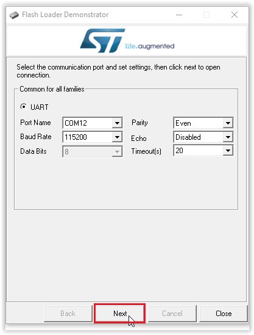

# Introduction
---

## The Maker Board to Rule Them All!
FEZ (fast and easy) is our magnificient maker board. This low cost board offers Arduino pinout compatibility, optional Wi-Fi for IOT applications, and can be programmed using multiple programming languages and development environments.

Pricing, purchasing and other information can be found on the [FEZ page](https://www.ghielectronics.com/products/FEZ) on our main website.

### Specifications

| Spec           | Value                           |
|----------------|---------------------------------|
| Processor      | STMicroelectronics ST32F401RET6 |
| Speed          | 84 MHz                          |
| Internal RAM   | 96 KByte                        |
| Internal Flash | 512 KByte                       |
| Dimensions     | 70.6 x 56.0 x 14.5 mm           |

### Peripherals*

| Peripheral         | Quantity          |
|--------------------|-------------------|
| GPIO (5V tolerant) | 22                |
| IRQ                | 22                |
| UART               | 1                 |
| I2C                | 1                 |
| SPI                | 1                 |
| PWM                | 8                 |
| 12 Bit ADC         | 8                 |
| CAN                | 0                 |
| USB Client         | 1                 |
| Wi-Fi              | Optional          |

\**Note:  Many peripherals share I/O pins.  Not all peripherals will be available to your application.*

### Resources
* [Schematic](http://files.ghielectronics.com/downloads/Schematics/FEZ/FEZ%20T18%20Rev%20D%20Schematic.pdf)
* [TinyCLR Tutorial](../../software/tinyclr/tutorials/intro.md)

### Programming Options

|  |  |
|--|--|
| **TinyCLR**   Embedded programming using Visual Studio .NET. [**Learn more...**](tinyclr.md) | **Arduino**   Very popular open source standard. [**Learn more...**](arduino.md) |
|  |  |
| **Mbed**   Free online C/C++ compiler. [**Learn more...**](mbed.md) | **MicroPython**   A version of Python for microcontrollers. [**Learn more...**](python.md) |
|  |  |
| **Bare Metal**   Use the Cortex-M4 compiler of your choice. [**Learn more...**](bare-metal.md) | **Shields**   Selected to help get you started. [**Learn more...**](shields/shields.md)
|  | 

***

## Updating the FEZ Wi-Fi Module Firmware
---

> [!Warning]
> Before updating the Wi-Fi firmware, erase all applications on the FEZ to avoid damaging the processor.

When the Wi-Fi module starts, it sends a PowerOn message which tells you what firmware version is installed. For example, `PowerOn 171117-0328fe3-SPWF04S`. In this case the firmware is dated 11/17/17.

### Requirements
To upgrade the Wi-Fi module's firmware, you must first download and install the following:
* [Flash Loader Demonstrator from STMicroelectronics](https://www.st.com/en/development-tools/flasher-stm32.html).

* [Firmware files from STMicroelectronics](https://www.st.com/content/st_com/en/products/embedded-software/wireless-connectivity-software/stsw-wifi004.html#getsoftware-scroll).

You will also need:
* A USB to serial adapter. We were successful using the FTDI TTL-232R-3V3 Cable. Some older USB to serial adapters will not work.

* Some jumper wires.

> [!Tip]
> For the USB to serial adapter you can use the Gadgeteer USB-Serial Module with a Gadgeteer Breadboard. Connect the module socket to the breadboard socket using a ribbon cable. You must also power the breadboard by connecting GND and 3.3V from the FEZ to the corresponding breadboard connectors.

### Erase the FEZ Firmware

Before updating the Wi-Fi module firmware, you must erase the firmware on the FEZ. This is accomplished using terminal software while the FEZ is in bootloader mode. The instructions are very similar to the instructions for [manually loading firmware on the FEZ](tinyclr.md#manually-loading-the-firmware).

1. Connect the FEZ to your computer using a micro USB cable.
2. Put the FEZ in bootloader mode: Hold down BTN1, press and release the RESET button, and then release BTN1.
3. Open any terminal software, for example [Tera Term](http://ttssh2.osdn.jp/).
4. Select serial and pick the COM port associated with your board (if unsure, check Device Manager).
5. Press `E` and then enter to start the erasing procedure.
6. Press `Y` to confirm, then enter.

    

### Connect the Wi-Fi Module

Before updating the Wi-Fi firmware, you must first locate the `H1 Connector` and make the following connections (you might want to solder a header onto the FEZ H1 connector):

* Connect the H1 pin with the square outline (pin 1, BOOT0 of the Wi-Fi module) to the 3V3 header pin.

    

* Connect the GND pin of the USB to serial adapter to a GND pin on the FEZ (can use H1 pin 4). Note: You don't need this connection if you will be powering your FEZ from your computer's USB port.

* Connect the RX pin of the USB to serial adapter to TXD of the Wi-Fi module (H1 pin 2).

* Connect the TX pin of USB to serial adapter to RXD of Wi-Fi module (H1 pin 3).

    

* Power up the board and connect the USB to serial adapter to your PC.

* You are now ready to flash the Wi-Fi module.

### Flash the Wi-Fi Module

* Launch `Flash Loader Demonstrator` by selecting `Demonstrator GUI` in the Windows Start Menu. Make sure to select the port name for the USB to serial adapter you are using. Set the baud rate to 115200, parity to even, disable echo, and set timeout to 20. Then click the `Next` button. If you can't find the serial port for your USB to serial adapter, you might have to install its device driver. If its device driver is installed you should see it in Device Manager under `Ports (COM & LPT)`.

    

* Click the `Next` button. If all steps were done correctly you should see:

    

* Click the `Next` button and then choose your device in the dropdown menu. After selecting your device click on the `Next` button.

    

* Click on the `Download to device` radio button and then select the Wi-Fi firmware file you [downloaded](https://www.st.com/content/st_com/en/products/embedded-software/wireless-connectivity-software/stsw-wifi004.html#getsoftware-scroll) earlier. This file is a .hex file called `SPWF04S-xxxxxx-xxxxxxx-Full.hex`. If you are searching for the file, make sure to search for a .hex file. Click the `Next` button to copy this file to the Wi-Fi module.

    

* It will take a few minutes to erase the old firmware and copy the new firmware to the Wi-Fi module.

    

* When update is done, remove all wires and [load the firmware](tinyclr.md#loading-the-firmware) on the FEZ.

* Reset the board.

* Next you need to reset the Wi-Fi module to its factory settings.

### Reset Factory Wi-Fi Settings
After each update you must reset the Wi-Fi module to its factory settings:
* Unplug the FEZ.

* Connect a jumper wire from 3V3 to pin 0 of the WGPIO connector.

* Power up the FEZ.

* Remove the jumper wire and reset the FEZ.

***

Our TinyCLR operating system lets you program the FEZ (and other devices) in C# or Visual Basic using Microsoft's Visual Studio -- and it's all free!  [**Learn more...**](tinyclr.md).

Visit our main website at [**www.ghielectronics.com**](http://www.ghielectronics.com) and our community forums at [**forums.ghielectronics.com**](https://forums.ghielectronics.com/).
