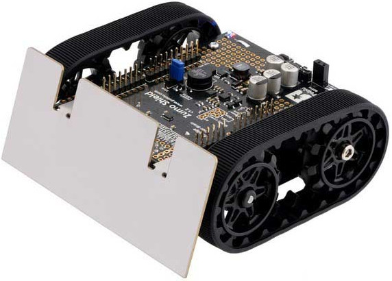

# Pololu Zumo Robot
---
 

The [Pololu Zumo Robot](https://www.pololu.com/category/169/zumo-robot-for-arduino) from Pololu is one of our favorites, especially the pre-assembled version.

Drop your [FEZ](../../fez/intro.md) on top of the Zumo Robot, or any other Arduino-compatible board, and you are ready to make the robot follow lines and dance around.

The driver is found [here](https://github.com/ghi-electronics/TinyCLR-Accessories).

You are now ready for some serious dancing!

```
public static void Main()
{
    bool state = false;


    while (!ZumoBot.ButtonIsPressed())
    {
        state = !state;
        ZumoBot.SetLed(state);
        ZumoBot.Beep();
        Thread.Sleep(500);
    }
    Thread.Sleep(300);
    ZumoBot.SetLed(false);
    Thread.Sleep(300);
    ZumoBot.SetLed(true);
    Thread.Sleep(300);
    ZumoBot.SetLed(false);
    Thread.Sleep(300);
    ZumoBot.SetLed(true);

    while (true)
    {
        long left =  ZumoBot.Reflectors.GetLevel(0);
        long right = ZumoBot.Reflectors.GetLevel(5);
        //Debug.WriteLine(">" + ZumoBot.Reflectors.GetLevel(0));
        //System.Diagnostics.Debug.WriteLine("l: " + left + " r: " + right);
        if (left < 8000 && right < 8000)
        {
            ZumoBot.Motors.Move(40, 40);
        }
        else
        {
            // backup and turn
            ZumoBot.Motors.MoveBackward();
            Thread.Sleep(500);
            ZumoBot.Motors.Stop();
            Thread.Sleep(1000);
            ZumoBot.Motors.TurnLeft();
            Thread.Sleep(500);
            ZumoBot.Motors.Stop();
            Thread.Sleep(1000);
        }
        Thread.Sleep(30);
    }

}
```