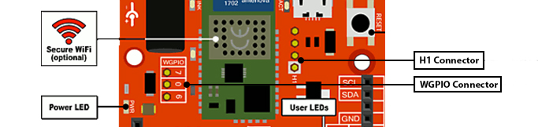
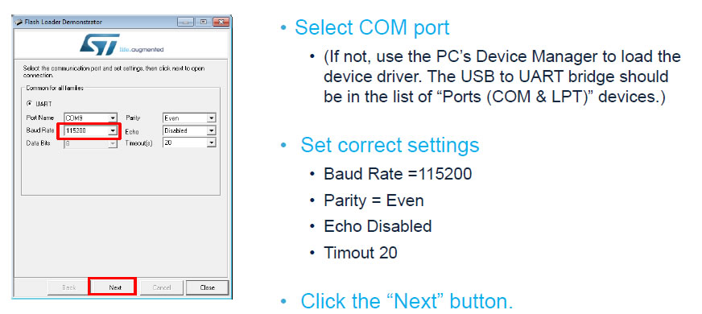
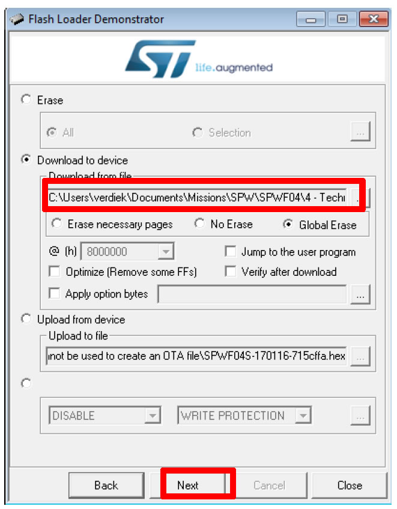

https://www.st.com/en/development-tools/flasher-stm32.html

# Update of FEZ Wifi module
---

> [!Warning]
> You should erase all applications from FEZ board before update to avoid to damage processor.

When wifi module starts, you receive a PowerOn message which tells you what firmware you have. For example, it can be `PowerOn 171117-0328fe3-SPWF04S`. In this case firmware it dated from 11/17/17.

## Requirements
For this operation, you must first download and install:
* [Flash Loader Demonstrator from ST](https://www.st.com/en/development-tools/flasher-stm32.html),
* [Firmware files from ST](https://www.st.com/content/st_com/en/products/embedded-software/wireless-connectivity-software/stsw-wifi004.html)

And you need some tools:
* an usb to serial module,
* some wires

> [!Tips]
> For your usb to serial module, you can use a Gadgeteer USB-serial module with a Gadgeteer Breadboard: connect the module and breadboard with socket. You must, in this case, power the breadboard by connecting GND and 3.3V from FEZ board to breadboard.

## Setting up the board

Before updating the wifi FEZ board, you must first locate the `H1 Connector` and connect:
* the pin with the square outline with 3.3V by a wire (this H1 pin is BOOT0 of wifi module),
* connect the pin opposite to H1 to GND,
* GND pin of serial module to one of GND pins of FEZ board,
* TX of serial module to RX of wifi FEZ module (on H1 connector near H1 pin),
* RX of serial module to TX of wifi FEZ module (on H1 connector near GND pin)

To place the wifi FEZ board in Bootloader mode:
* Prepare a wire connected to GND but don't connect it yet.
* Power on the board and connect USB serial to PC.
* Now, you connect the wire which you have prepared and touch with it the pad label R14 on board (it will reset the wifi board). You can now disconnect it from R14.

You are ready to flash wifi board.

## Updating the board

To update the wifi FEZ firmware, you must:
*Launch `Flash Loader Demonstrator` with Demonstrator GUI link. Set it with following settings:

*Click Next until the page where you can choose the firmware to update:

The firmware file is an .hex file, you have downloaded [Firmware files from ST](https://www.st.com/content/st_com/en/products/embedded-software/wireless-connectivity-software/stsw-wifi004.html), it is called `SPWF04S-xxxxxx-yyyyyy-Full.hex`. Update can take few minutes to be done.
* When update is done, remove the wire 3.3V to H1 pin.
* Reset the board.
* After that you need to reset factory settings.

## Reset factory settings
You must do that after each update to reset factory settings of wifi board:
* Unplug FEZ board.
* Connect a wire from 3.3V to 0 pin of WGPIO connector.
* Power on the board.
* Remove wire and reset the board.