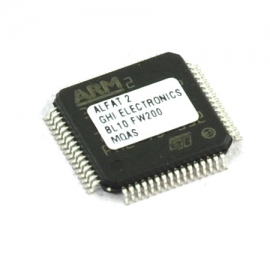

# File System
---

Since 2003, GHI Electronics has made several industry-first file system chipsets.

## F40

Originally called ALFAT.

* [Datasheet](http://files.ghielectronics.com/downloads/Documents/Datasheets/F40%20Datasheet.pdf)
* [User Manual](http://files.ghielectronics.com/downloads/Documents/Manuals/Filesystem%20User%20Manual.pdf)
* [ALFAT-OEM Schematic](http://files.ghielectronics.com/downloads/Schematics/FileSystem/ALFAT%20OEM%20Board%20Schematic.pdf)
* [ALFAT-SD Schematic](http://files.ghielectronics.com/downloads/Schematics/FileSystem/ALFAT%20SD%20Board%20Schematic.pdf)
* [ALFAT-USB](http://files.ghielectronics.com/downloads/Schematics/FileSystem/ALFAT%20USB%20Board%20Schematic.pdf)
* [Firmware 1.08](http://files.ghielectronics.com/downloads/ALFAT/Firmwares/ALFAT%20Firmware%20v1.0.8.ghi)
* [Firmware 2.00](http://files.ghielectronics.com/downloads/ALFAT/Firmwares/ALFAT%20Firmware%20v2.0.0.ghi)

## F20
* [Datasheet](http://files.ghielectronics.com/downloads/Documents/Datasheets/F20%20Datasheet.pdf)
* [Firmware v103](http://files.ghielectronics.com/downloads/ALFAT/Firmwares/F20%20Firmware%20v1.0.3.ghi)
* [F20-uSD Schematic](http://files.ghielectronics.com/downloads/Schematics/FileSystem/F20%20uSD%20Schematic.pdf)

## uALFAT
* [User Manual](http://files.ghielectronics.com/downloads/Documents/Manuals/uALFAT%20User%20Manual.pdf)
* [Firmware 3.13](http://files.ghielectronics.com/downloads/ALFAT/Firmwares/uALFAT%20Firmware%20v3.13.ghi)

***

Visit our main website at [**www.ghielectronics.com**](http://www.ghielectronics.com) and our community forums at [**forums.ghielectronics.com**](https://forums.ghielectronics.com/).
