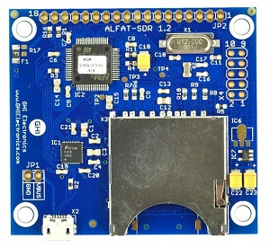
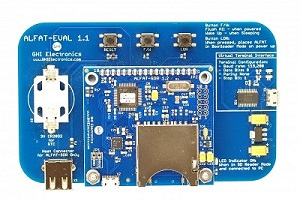

# File System
---

This page has the technical details and manuals for the File System products. The main website's [File System page](https://www.ghielectronics.com/products/filesystem) has more info as well.

## F40 (ALFAT) Chipset

F40, originally called ALFAT, is the flagship file system chipset.

* Part Number ALF2X-SC-512
* [Datasheet](http://files.ghielectronics.com/downloads/Documents/Datasheets/F40%20Datasheet.pdf)
* [User Manual](http://files.ghielectronics.com/downloads/Documents/Manuals/Filesystem%20User%20Manual.pdf)
* [Firmware v1.0.8](http://files.ghielectronics.com/downloads/ALFAT/Firmwares/ALFAT%20Firmware%20v1.0.8.ghi)
* [Firmware v2.0.0](http://files.ghielectronics.com/downloads/ALFAT/Firmwares/ALFAT%20Firmware%20v2.0.0.ghi)

### ALFAT OEM Board

F40 chipset with SD and dual-USB connectors. The PHY needed for USB 2.0 480 MHz speeds is available on one of the USB ports.

* Part Number ALFAT-OM-337
* [ALFAT-OEM Schematic](http://files.ghielectronics.com/downloads/Schematics/FileSystem/ALFAT%20OEM%20Board%20Schematic.pdf)

### ALFAT SD

F40 chipset with SD connector.

* Part Number ALFAT-SD-338
* [ALFAT-SD Schematic](http://files.ghielectronics.com/downloads/Schematics/FileSystem/ALFAT%20SD%20Board%20Schematic.pdf)

### ALFAT USB

F40 chipset with USB connector.

* Part Number ALFAT-USB-428
* [ALFAT-USB Schematic](http://files.ghielectronics.com/downloads/Schematics/FileSystem/ALFAT%20USB%20Board%20Schematic.pdf)

### ALFAT SDR

This board wires the F40 in SD-reader mode.

* Part Number AFSDR-FS-523
* [ALFAT-SDR Schematic](http://files.ghielectronics.com/downloads/Schematics/FileSystem/ALFAT%20SDR%20Board%20Schematic.pdf)

### ALFAT Evaluation Kit

This kit offers everything needed to evaluate F40 (ALFAT) and the different ALFAT OEM boards.

The kit includes:
1. ALFAT OEM board
2. ALFAT SDR board
3. ALFAT EVAL carrier board
4. Storage devices and USB cable

* Part Number AFEVL-FS-524
* [ALFAT Eval Kit Schematic](http://files.ghielectronics.com/downloads/Schematics/FileSystem/ALFAT%20Evaluation%20Kit%20Schematic.pdf)

## F20 Chipset

This low-cost chipset is compatible with F40 but with a limited feature set.

* Part Number F20SC-SC-558
* [Datasheet](http://files.ghielectronics.com/downloads/Documents/Datasheets/F20%20Datasheet.pdf)
* [User Manual](http://files.ghielectronics.com/downloads/Documents/Manuals/Filesystem%20User%20Manual.pdf)
* [Firmware v1.0.3](http://files.ghielectronics.com/downloads/ALFAT/Firmwares/F20%20Firmware%20v1.0.3.ghi)

### F20 uSD Board

This boards combines F20 with a micro SD card connector on a very tiny circuit.

* Part Number F20FS-546
* [F20-uSD Schematic](http://files.ghielectronics.com/downloads/Schematics/FileSystem/F20%20uSD%20Schematic.pdf)

## Legacy Products

### uALFAT Chipset
This is a legacy product, replaced by F40.
* [User Manual](http://files.ghielectronics.com/downloads/Documents/Manuals/uALFAT%20User%20Manual.pdf)
* [Firmware v3.13](http://files.ghielectronics.com/downloads/ALFAT/Firmwares/uALFAT%20Firmware%20v3.13.ghi)

### USBwiz Chipset
This is a legacy product, replaced by F40.
* [User Manual](http://files.ghielectronics.com/downloads/Documents/Manuals/USBwiz%20User%20Manual.pdf)
* [Firmware v2.29](http://files.ghielectronics.com/downloads/ALFAT/Firmwares/USBwiz%20Firmware%20v2.29.ghi)

## Legal
### License

This product and its firmware and libraries are licensed royalty-free for commercial and noncommercial use. None of the provided documentation/schematics/libraries/sources are to be used in any manner outside for the benefit of implementing and using this product into your design.

### Disclaimer

IN NO EVENT SHALL GHI ELECTRONICS, LLC BE LIABLE FOR ANY DIRECT, INDIRECT, INCIDENTAL, SPECIAL, EXEMPLARY, OR CONSEQUENTIAL DAMAGES (INCLUDING, BUT NOT LIMITED TO, PROCUREMENT OF SUBSTITUTE GOODS OR SERVICES; LOSS OF USE, DATA, OR PROFITS; OR BUSINESS INTERRUPTION) HOWEVER CAUSED AND ON ANY THEORY OF LIABILITY, WHETHER IN CONTRACT, STRICT LIABILITY, OR TORT (INCLUDING NEGLIGENCE OR OTHERWISE) ARISING IN ANY WAY OUT OF THE USE OF THIS PRODUCT, EVEN IF ADVISED OF THE POSSIBILITY OF SUCH DAMAGE. GHI ELECTRONICS, LLC LINE OF PRODUCTS ARE NOT DESIGNED FOR LIFE SUPPORT APPLICATIONS. SPECIFICATIONS, PRICE AND AVAILABILITY ARE SUBJECT TO CHANGE WITHOUT ANY NOTICE.

***

Visit our main website at [**www.ghielectronics.com**](https://www.ghielectronics.com) and our community forums at [**forums.ghielectronics.com**](https://forums.ghielectronics.com/).
