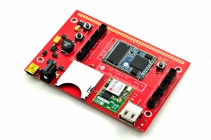

# FEZ Cobra II Eco and Wi-Fi
---
  

FEZ Cobra II is a .NET Gadgeteer product that utilizes .NET Micro Frameworks (NETMF). The core of FEZ Cobra II is the G120 System on Module (SoM).

Follow the instructions on the [G120 page](../scm/g120.md) to learn how to use FEZ Cobra with NETMF and TinyCLR OS.

## Resources
* Eco and WiFi [Schematic](http://files.ghielectronics.com/downloads/Schematics/FEZ/FEZ%20Cobra%20II%20Schematic.pdf)
* Net [Schematic](http://files.ghielectronics.com/downloads/Schematics/FEZ/FEZ%20Cobra%20II%20Net%20Schematic.pdf)
* Cobra II Extender [schematic](http://files.ghielectronics.com/downloads/Schematics/FEZ/FEZ%20Cobra%20II%20Extender%20Schematic.pdf)

> [!Tip]
> To activate bootloader v2, press and hold the LDR0 button while resetting the board.

