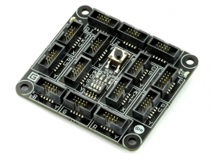

# FEZ Spider
---

FEZ Spider is a .NET Gadgeteer product that utilizes .NET Micro Frameworks (NETMF). The core of FEZ Spider is the EMX System on Module (SoM).

To use with NETMF/Gadgeteer, follow these [setup instructions](../../software/netmf/getting-started.md).

## Resources
* [Schematic](http://files.ghielectronics.com/downloads/Schematics/FEZ/FEZ%20Spider%20Schematic.pdf)
