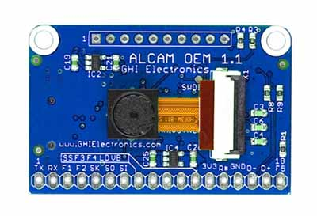

# Imaging
---

ALCAM-OEM is a small yet powerful imaging hardware. It could capture stills and videos to SD card and able to fetch images using serial commands. It started in a successful [Kickstarter campaign](https://www.kickstarter.com/projects/1359959821/alcam-oem) 

## Resources
 * [Examples](http://files.ghielectronics.com/downloads/ALCAM/ALCAM%20Examples.zip)
 * [ALCAM Explorer](http://files.ghielectronics.com/downloads/ALCAM/ALCAM%20Explorer.zip)
 * [User Manual](http://files.ghielectronics.com/downloads/Documents/Manuals/ALCAM%20SoC%20User%20Manual.pdf)

We have worked on similar custom commercial designs with imaging needs but decided to proceed with a one-size-fits-all. Please [contact us](https://www.ghielectronics.com/contact) to discuss your imaging needs.

***

Visit our main website at [**www.ghielectronics.com**](http://www.ghielectronics.com) and our community forums at [**forums.ghielectronics.com**](https://forums.ghielectronics.com/).