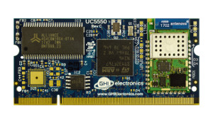
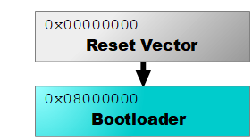

# Hardware
---

|  |  |
|---|---|
| **UCMs (Universal Compute Modules)**   Interchangeable plug-in microcontroller modules suitable for a wide variety of applications. [**Learn More...**](ucm/intro.md) | **SCMs (Surface Compute Modules)**   Surface mount microcontroller modules ideal for harsh or high vibration environments. [**Learn More...**](scm/intro.md) |
|  |  |
| **FEZ**   The Maker Board to Rule Them All! [**Learn More...**](fez/intro.md)| **File System**   Technical details and manuals for the File System products. [**Learn More...**](/filesystem/intro.md)|
|  |  |
| **Bootloaders**   [**Learn more...**](loaders/intro.md) | **Legacy Products**   Here you will find information on GHI's legacy products and longevity policy. [**Learn More...**](legacy/intro.md) |
|  |  |

***

You can also visit our main website at [**www.ghielectronics.com**](http://www.ghielectronics.com) and our community forums at [**forums.ghielectronics.com**](https://forums.ghielectronics.com/).