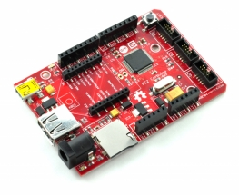

# FEZ Cerbuino Bee
---
 

An Arduino-pinout compatible single board computer with Gadgeteer sockets.

## Resources

* [Schematic](http://files.ghielectronics.com/downloads/Schematics/FEZ/FEZ%20Cerbuino%20Bee%20Schematic.pdf)

## Software

For information on programming the FEZ Cerbuino Bee, please go to the [FEZ Cerberus](../gadgeteer/fez_cerberus.md) page.
