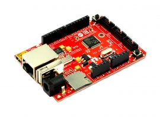
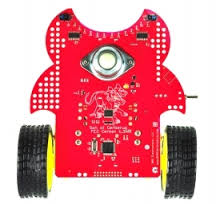

# FEZ Cerberus

FEZ Cerberus is a .NET Gadgeteer product, that utilizes .NET Micro Frameworks (NETMF). The core of FEZ Cerberus is the G30 System on Chip (SoC).

FEZ Cerberus is the mother of of [the Cerb Family](the-cerb-family).

# Resources
* [FEZ Cerberus Schematics (add it)]()

# Using the Gadgeteer software
We discourage the use of NETMF and Gadgeteer software technologies on our products in favor for TinyCLR OS, [Read more](intro.html).

# Using TinyCLR OS
If haven't yet, read about using .NET Gadgeteer devices [with TinyCLR OS](intro.html#with-tinyclr-os)

## Loading Bootloader Version 2
1. Download the [bootloader file](http://files.ghielectronics.com/downloads/Bootloaders/Cerb%20Bootloader.2.0.3.ghi)
2. Press and hold BOOT button down while resetting the board. 
3. If there is no BOOT button, there will be shunt-footprint labeled BOOT or LDR. Short the 2 pads with a wire while resettign the board.
4. The system will now detect an ST DFU device.
5. Read more on [uploading DFU files](/hardware/loaders/stm32_bootloader.html#uploading-dfu-files) on STM32 microcontrollers.

## Loading the Firmware

To activate bootloader version 2, (how? There is no loader button!)

Download the [firmware](http://files.ghielectronics.com/downloads/TinyCLR/Firmware/Cerb/Cerb%20Firmware.0.6.0.ghi) and folow [Loading the Firmware](intro.html#loading-the-firmware) steps.

# The Cerb Family
The FEZ Cerberus come in differnt form facotr, together caled the Cerb family. The entire family run the same software.

## FEZ Cerberus
 

The mother of the family!

## FEZ Cerbuino Bee
 

An arduino-pinout compatible for acceping shields and also has some Gadgeteer coket option.

## FEZ Cerbuino Net

An arduino-pinout compatible for acceping shields and also has some Gadgeteer coket option.

## FEZ Cerb40

DIP40 formfactor board. Not really a Gadgeteer board but it is very small!

## FEZ Cerbot
(change the image)

A robot with reflective sensors and tons of LEDs. Gadgeteer coekts are used as an easy way to add features.