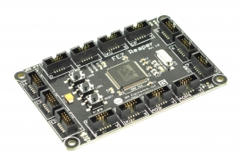

# FEZ Raptor

FEZ Reaper is a .NET Gadgeteer product, that utilizes .NET Micro Frameworks (NETMF). The core of FEZ Reaper is the G80 System on Chip (SoC).

# Resources
* [Schematics]()

# Using the Gadgeteer software
We discourage the use of NETMF and Gadgeteer software technologies on our products in favor for TinyCLR OS. [Read more](intro.md) about the use of NETMF, Gadgeteer and TinyCLR OS.

# Using TinyCLR OS
If haven't yet, read about using .NET Gadgeteer devices [with TinyCLR OS](intro.md#with-tinyclr-os)

## Loading Bootloader Version 2
The G80 SoC ships with the Bootloader loaded and locked. No further steps are necessary.

## Loading the Firmware

To activate bootloader version 2, press and hold both LDR0 and LDR1 buttons down while resetting the board.

Download the [G80 firmware](../../../tinyclr/downloads.md#g80) and follow [Loading the Firmware](../../loaders/bootloader.md#loading-the-firmware) steps.

