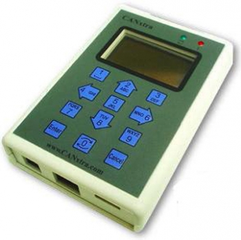

# CANxtra

CANxtra is a hand-held programmable OBD-II tool, that includes CAN, LIN and other vehicle busses.

Resources below are provided for reference only. Please [contact us]() for all of custom automotive needs.

Resources: (move to new server)
* Get them [here](https://www.ghielectronics.com/downloads/discontinued/CANxtra/)
