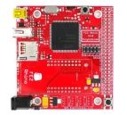

# USBizi
 

USBizi was the first single chip .NET Micro Framework (NETMF) on the market. It was available in 100pin and 144pin LQFP packages.

We are no longer making the chip available but we are making all [bootloader binaries](https://old.ghielectronics.com/downloads/NETMF/USBizi/) (move to new server) available for free, including for commercial use. 

# Resources
* [User Manual](http://files.ghielectronics.com/downloads/Documents/Manuals/USBizi 100 User Manual.pdf) 

# Using the NETMF software
We discourage the use of NETMF software on our products in favor for TinyCLR OS, [Read more](intro.md).

# Using TinyCLR OS
If haven't yet, read about using .NET NETMF devices [with TinyCLR OS](intro.md#with-tinyclr-os)

## Loading Bootloader v2
(coming soon)

## Loading the Firmware

> [!Tip]
> First make sure you have bootloader v2 loaded. This needs to be done only once.

To activate bootloader v2, set .... to be completed!

Download the [USBizi firmware](../../../tinyclr/downloads.md#usbizi) and follow [Loading the Firmware](../../loaders/ghi_bootloader.md#loading-the-firmware) steps.

# USBizi Based products
## USBizi DevSys

The original development board for USBizi.

## FEZ Panda

An Arduino-poinout compatible board.

* [Schematic](http://files.ghielectronics.com/downloads/Schematics/FEZ/FEZ Panda Schematic.pdf)

## FEZ Panda II

An Arduino-poinout compatible board.

* [Schematic](http://files.ghielectronics.com/downloads/Schematics/FEZ/FEZ Panda II Schematic.pdf)

## FEZ Rhino

* [Schematic](http://files.ghielectronics.com/downloads/Schematics/FEZ/FEZ Rhino Schematic.pdf)

## FEZ Mini

* [Schematic](http://files.ghielectronics.com/downloads/Schematics/FEZ/FEZ Mini Schematic.pdf)

USBizi was the core of many of GHI Electronics' products, FEZ Panda, FEZ Panda II, FEZ Domino, FEZ Rhino and FEZ Mini. 
Move resources from old server [here](https://old.ghielectronics.com/downloads/FEZ/)
