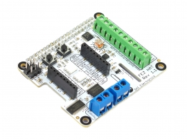

# Raspberry Pi Hats
Several HATs were made for the RPI. The software was focused on the use of Win10. 

Thid [GitHub repo](https://github.com/ghi-electronics/Windows-IoT) includes the software for all HATs.

## FEZ HAT

* Schematic

## FEZ ProtoPi

* Schematic

## FEZ Utility

* Schematic

## FEZ Cream

This HAT was part of the [Gadgeteering](gadgeteering.md) efforts.

* Schematic
