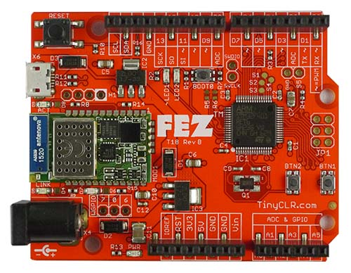

# FEZ

FEZ (fast and easy) is the official board for TinyCLR OS. This low-cost, WiFi IoT-ready, Arduino-pinout compatible, and TinyCLR-OS-ready board is everything a developer needs to evaluate TinyCLR OS and to build modern IoT applications.

We have also handpicked some 3rd-party [accessories](../../tinyclr/accessories/intro.md) to help you get going even faster.

# TinyCLR OS
TinyCLR OS allows tiny systems to run .NET applications with rich debugging capabilities though Visual Studio 2017.

* [TinyCLR OS Website](http://www.tinyclr.com/)
* [TinyCLR on FEZ](../../tinyclr/boards/fez.md)
* [TinyCLR Ports Repo](https://github.com/ghi-electronics/TinyCLR-Ports)

# Other Options
TinyCLR OS is the official supported platform for FEZ; however, these are some other good options. GHI Electronics is not affiliated and **does not provide support** for any of these 3rd party options.

## Arduino
Arduino is simplified multi-platform IDE/C++ combo, with a community STM32 options. 

This video shows the use of Arduino (The FEZ and the BrainPad share the same hardware core).

<iframe width="560" height="315" src="https://www.youtube.com/embed/CIIIbwWzBDI" frameborder="0" allowfullscreen></iframe>

* [Arduino Website](https://www.arduino.cc/)
* [Arduino STM32 Github](https://github.com/stm32duino)

## mbed
mbed is an online compiler platform. There is nothing to install, just log in and start coding!
One of the supported boards is Nucleo-F401RE, which uses the exact same microcontroller found on FEZ. Start with it to build and compile then follow the [STM32 bootloader](../loaders/stm32_bootloader.md) instructions on generating and loading DFU files. 

This video shows the steps needed to use Mbed (The FEZ and the BrainPad share the same hardware core).

<iframe width="560" height="315" src="https://www.youtube.com/embed/8qcKctDvV_4" frameborder="0" allowfullscreen></iframe>

* [mbed Website](https://developer.mbed.org/)
* [Nucleo-F401RE](https://developer.mbed.org/platforms/ST-Nucleo-F401RE/)

## MicroPython
MicroPython allows tiny systems to run Python 3, with a small subset of the standard library.
The STM32F4 is already one of available ports, making it easier to run MicroPython on FEZ.

This video shows the steps needed to use MicroPython (The FEZ and the BrainPad share the same hardware core).

<iframe width="560" height="315" src="https://www.youtube.com/embed/u6MoDpUNQDc" frameborder="0" allowfullscreen></iframe>

* [MicroPyho Website](http://www.micropython.org/)
* [GitHub Repo](https://github.com/micropython/micropython)

## Plain Coding!
You can just start coding everything from scratch. The easiest options would be to start with [Mbed](#mbed) online tools and then export the project. Wither way, you can use free open-source GNU GCC tools to build your programs, which is what we use to build TinyCLR OS firmware. Another option is to use a commercial compiler, like Keil compiler/IDE. Keil tools are free for 32KB or less program size (MDK-Lite).

> [!Tip]
> If you are not adding a SWD-JTAG tool, like ST-Link, follow the [STM32 bootloader](../loaders/stm32_bootloader.md) instructions on generating and loading DFU files. 
 
* [Keil Website](http://www.keil.com/)
* [Keil ARM MDK tools](http://www2.keil.com/mdk5)
* [GNU ARM Tools (GCC)](https://developer.arm.com/open-source/gnu-toolchain/gnu-rm/downloads)
