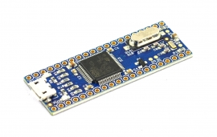

# G30

The G30 System on Chip (SoC) is a low-cost chipsets running the .NET Micro Framework. It is programmed using Microsoft's Visual Studio using C# or Visual Basic which allows developers to take advantage of the extensive built-in NETMF libraries and GHI Electronics added extensions.

To use G30 SoC, follow the setup instructions on the NETMF [intro page](../legacy_products/netmf/intro.md)

* [Datasheet](http://files.ghielectronics.com/downloads/Documents/Datasheets/G30 Datasheet.pdf)

# Using the NETMF software
We discourage the use of NETMF software on our products in favor for TinyCLR OS. [Read more](../legacy_products/netmf/intro.md) about the use of NETMF and TinyCLR OS.

# Using TinyCLR OS
If haven't yet, read about using NETMF devices [with TinyCLR OS](../legacy_products/netmf/intro.md#with-tinyclr-os)

## Loading Bootloader v2
The G30 SoC ships with the Bootloader loaded and locked. No further steps are necessary.

## Loading the Firmware

To activate bootloader v2, LDR0 signal needs to be low while resetting the board.

Download the [G30 firmware](../../tinyclr/downloads.md#g30) and follow [Loading the Firmware](../loaders/ghi_bootloader.md#loading-the-firmware) steps.

# G30 Based products
## G30 Development Board

The development system used for evaluating the EMX SoM.

* [Schematic](http://files.ghielectronics.com/downloads/Schematics/Systems/G30%20Dev%20Board%20Schematic.pdf)

## G30 TH Module

A though-hole version of G30.

* [Schematic](http://files.ghielectronics.com/downloads/Schematics/Systems/G30TH%20Schematic.pdf)

## FEZ Lemur

A Arduino-pinout compatible single board computer.

* [Schematic](http://files.ghielectronics.com/downloads/Schematics/Systems/Fez/FEZ%20Lemur%20Schematic.pdf)
