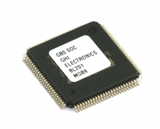

# G80

The G80 System on Chip (SoC) is a low-cost chipsets running the .NET Micro Framework. It is programmed using Microsoft's Visual Studio using C# or Visual Basic which allows developers to take advantage of the extensive built-in NETMF libraries and GHI Electronics added extensions.

To use G80 SoC, follow the setup instructions on the NETMF into page (link).

Resources:
*	Datasheet
*	Development board reference schematic

# Using the NETMF software
We discourage the use of NETMF software on our products in favor for TinyCLR OS. [Read more](../legacy_products/netmf/intro.md) about the use of NETMF and TinyCLR OS.

# Using TinyCLR OS
If haven't yet, read about using NETMF devices [with TinyCLR OS](../legacy_products/netmf/intro.md#with-tinyclr-os)

## Loading Bootloader Version 2
The G80 SoC ships with the Bootloader loaded and locked. No further steps are necessary.

## Loading the Firmware

To activate bootloader version 2, both LDR0 and LDR1 signals need to be low while resetting the board.

Download the [firmware](http://files.ghielectronics.com/downloads/TinyCLR/Firmware/G80/G80%20Firmware.0.6.0.ghi) and folow [Loading the Firmware](../legacy_products/netmf/intro.md#loading-the-firmware) steps.
