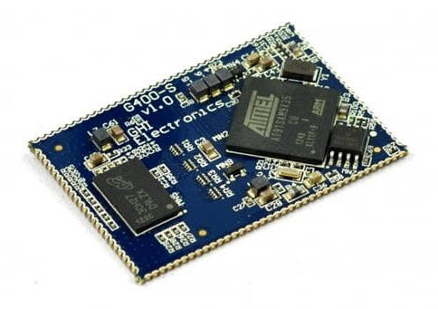
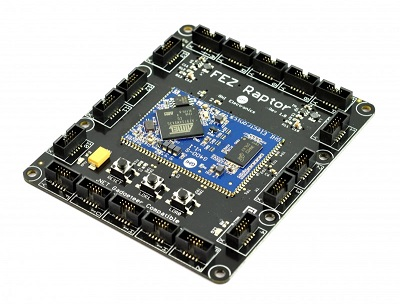

# G400S

The G400S System on Module (SoM) is the surface mount version of the G400D.  Originally designed for .NET Micro Framework, it now runs several other platforms including TinyCLR.

* [Datasheet](http://old.ghielectronics.com/downloads/man/G400S_and_G400D_Datasheet.pdf)

# Specifications

| Spec           | Value                     |
|----------------|---------------------------|
| Processor      | Atmel AT91SAM9X35 ARM 926 |
| Speed          | 400 MHz                   |
| Internal RAM   | 32 KB (SRAM)              |
| Internal Flash | 0 KB                      |
| External RAM   | 128 MB (DDR2 SDRAM)       |
| External Flash | 4 MB (SPI)                |
| Dimensions     | 48.3 x 33.1 x 4.6 mm      |

# Peripherals

*Note:  Many peripherals share I/O pins.  Not all peripherals will be available to your application.*

| Peripheral     | Quantity          |
|----------------|-------------------|
| UART           | 6 (including HS)  |
| UART HS        | 1                 |
| I2C            | 1                 |
| SPI            | 2                 |
| CAN            | 2                 |
| SDIO           | 1                 |
| 10 Bit ADC     | 12                |
| PWM            | 4                 |
| GPIO           | 89                |
| IRQ            | 89                |
| USB Client     | 1                 |
| USB Host       | 2                 |
| LCD            | Supported (16bpp) |
| Ethernet PHY   | Supported         |
| WiFi           | Not supported     |
| DCMI           | Not supported     |
| VBAT           | Supported         |
| JTAG           | Full JTAG         |

# Using NETMF software
We discourage the use of NETMF software on our products in favor of TinyCLR OS. [Read more](../../legacy_products/netmf/intro.md) about the use of NETMF and TinyCLR OS.

# Using TinyCLR OS
TinyCLR is our own operating system and provides a means of programming embedded devices using .NET and Visual Studio.  Visual Studio is widely regarded as one of the best (if not the best) integrated development environments available.  The free Community version of Visual Studio can be downloaded here:  [Visual Studio Downloads](https://www.visualstudio.com/downloads/).  For information on setting up TinyCLR to work in Visual Studio please click here:  [TinyCLR Introduction](../../tinyclr/intro.html)

## Loading Bootloader v2
1. Download the [G400 bootloader file](../../loaders/ghi_bootloader.md#g400).
2. Download and install SAM-BA. We have tested [SAM-BA.2.12.exe](https://old.ghielectronics.com/downloads/NETMF/SDK/sam-ba.2.12.exe) but newer versions of the SAM-BA In-system Programmer are available from [Microchip](http://www.microchip.com/developmenttools/productdetails.aspx?partno=atmel%20sam-ba%20in-system%20programmer).
3. Download and unzip the [update scripts](http://files.ghielectronics.com/downloads/Bootloaders/G400%20Bootloader%20Installer.zip). You will have a folder called `G400 Bootloader Installer`.
4. Rename the bootloader file, downloaded earlier, to bootloader.bin and move it to the `G400 Bootloader Installer` folder.
5. Connect SPI1_MISO pin (pin 75) to ground and reset the board. Wait three seconds and remove the connection between SPI1_MISO and ground. on FEZ Raptor, SPI1_MISO is pin 8 on socket 3.
6. Open up the Device Manager, look under Ports, and find a COM port similar to "Bossa Program Port" or "GPS Detect".
7. In the `G400 Bootloader Installer` folder, run `Flash Bootloader.bat`.
8. When prompted, enter the number of the COM port found under Device Manager. For example: for COM10, enter just 10.
9. You will see "Bootloader Update Complete" when the update is finished. The update will take several minutes.

## Loading the Firmware

> [!Tip]
> First make sure you have bootloader v2 loaded. This needs to be done only once.

To activate bootloader v2, hold the LDR0 (pin 101) signal low while resetting the board.

Download the [G400 firmware](../../../tinyclr/downloads.md#g400) and follow [Loading the Firmware](../../loaders/ghi_bootloader.md#loading-the-firmware) steps.

# G400S Based Product

## The G400S is used in the FEZ Raptor

 