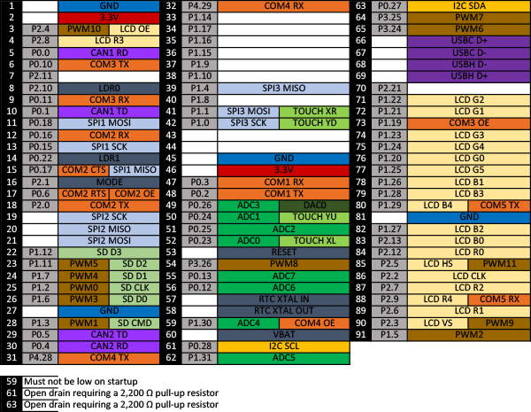
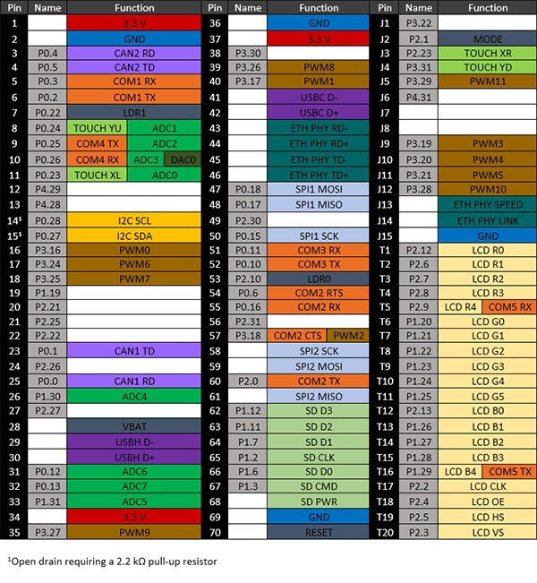
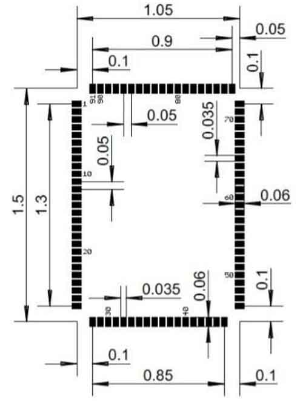

# G120
---

## Overview

The G120 and G120E SoMs are powerful, low-cost, System on Modules part of the GHI Electronics SurfaceMount Compute Modules (SCM) line. These modules can be programmed in .NET C# and Visual Basic using TinyCLR OS or .NET Micro Framework.

Pricing, purchasing, and other information can be found on the [G120 Page](http://www.ghielectronics.com/products/scm/g120) on our main website.

## Ordering Part Number
* G120 SoM: G120B-SM-373
* G120E SoM: G120E-SM-532
* G120E Dev Board: G120D-SM-533

## G120 vs G120E

|                    | G120                               |G120E                           |
|--------------------|------------------------------------|--------------------------------|
| Processor          | NXP LPC1788FET180                  | NXP LPC1788FET208              |
| Package            | 91 pin surface-mount module (SMT)  | 120 MHz                        |
| Dimensions         | 38.1 x 26.7 x 3.5 mm               | 45.8 x 39.4 x 4.4 mm           |
| RTC                | External 32,768 Hz crystal         | Included                       |
| GPIO               | 72                                 | 80                             |
| SPI                | 3                                  | 2                              |
| Ethernet           | ENC28J60 over SPI                  | ENC28J60 over SPI and/or       |
|                    |                                    | Built-in base 100 Ethernet PHY |

## Specifications

| Spec               | Value                     |
|--------------------|---------------------------|
| Processor          | NXP LPC1788FET            |
| Speed              | 120 MHz                   |
| Internal RAM       | 96 KByte (SRAM)           |
| Internal Flash     | 512 KByte                 |
| External RAM       | 16 MByte (DRAM)           |
| External Flash     | 4 MByte (SPI)             |
| Dimensions (G120)  | 38.1 x 26.7 x 3.5 mm      |
| Dimensions (G120E) | 45.8 x 39.4 x 4.4 mm      |
| Temperature Range  |  -40 C to +85 C           |

*Note: Resources are shared between your application and the operating system.*

## Peripherals

* TinyCLR OS ready
* .NET Micro Framework
* RoHS Lead Free
* 120 MHz ARM Cortex-M3 NXP LPC1788
* 6 Mbytes available RAM
* 2.3 Mbytes available flash
* Embedded LCD controller
* 72 to 80 GPIO
* 43 interrupt capable GPIO
* 2 to 3 SPI
* 1 I2C
* 5 UART
* 2 CAN
* 12 PWM
* 8 12-bit analog input
* 1 10-bit analog output
* 4-bit SD/MMC memory card interface
* Low power modes
* RTC
* Watchdog
* Threading
* USB host
* USB client
* SQLite database
* TCP/IP with SSL
  * Full .NET socket interface
  * Ethernet
  * Wi-Fi
  * PPP
* Graphics
  * Images
  * Fonts
  * Controls
* File System
  * Full .NET file interface
  * SD cards
  * USB drives
* Native extensions
  * Runtime Loadable Procedures
  * Device register access
* Signal controls
  * Generation
  * Capture
  * Pulse measurement

## G120 Pinout

Many signals on the G120 are multiplexed to offer multiple functions on a single pin. Developers can decide on the pin functionality to be used through the provided libraries. Any pin with no name, function, or note must be left unconnected.

## G120E Pinout

## Footprints

We recommend no traces or vias under the module. Dimensions are in inches.

### G120 Recommended Footprint

### G120E Recommended Footprint

## Device Startup

The G120 is held in reset when the reset pin is low. Releasing it will begin the system startup process. It is pulled
high internally on the G120E and left floating on the G120.
There are four different components of the device firmware:
1. GHI Bootloader: initializes the system, updates TinyBooter when needed, and executes TinyBooter.
2. TinyBooter: executes TinyCLR, updates TinyCLR when needed, and updates the system configuration.
3. TinyCLR: loads, debugs, and executes the managed application.
4. Managed application: the program developed by the customer.

Which components get executed on startup can be control by manipulating the LDR0 and LDR1 pins. LDR0 and
LDR1 are pulled high on startup.

| LDRO               | LDR1      |Effect                            |
|--------------------|-----------|----------------------------------|
| Ignored            | High      | Execute the managed application  |
| High               | Low       | Wait in TinyBooter               |
| Low                | Low       | Wait in GHI Bootloader           |

Additionally, the communications interface between the host PC and the G120 is selected on startup through the
MODE pin, which is pulled high on startup

| MODE               | G120      | G120E                            |
|--------------------|-----------|----------------------------------|
| High               | USB       | COM1                             |
| Low                | COM1      | USB                              |

The above discussed functions of LDR0, LDR1, and MODE are only during startup. After startup, they return to the
default GPIO state and are available to use as GPIO in the user application.

## .NET Micro Framework (NETMF)

The NETMF software on G120 is mature and complete. For more information on NETMF you can go to the [NETMF Introduction](../../software/netmf/intro.md) page.  The [NETMF Getting Started](../../software/netmf/getting-started.md) page covers NETMF from setup of the host computer to program deployment on both an emulator and target device.

## TinyCLR OS

TinyCLR OS provides a way to program the G120 in C# or Visual Basic from the Microsoft Visual Studio integrated development environment.  To get started you must first install the bootloader and firmware on the G120 (instructions below) and then go to the TinyCLR [Getting Started](../../software/tinyclr/getting-started.md) page for instructions.

### Loading Bootloader v2

The G120 comes with Bootloader v1 pre-installed. You need to upgrade to Bootloader v2. Start by putting G120 into the v1 loader mode by setting LDR0 and LDR1 signals low while reseting the board. You can now load v2 loader as detailed on the [GHI Bootloader](../../hardware/loaders/ghi-bootloader.md) page.

### Loading the Firmware

1. Activate the bootloader, hold the LDR0 signal low while resetting the board.
2. Open [TinyCLR Config](../../software/tinyclr/tinyclr-config.md) tool.
3. Click the loader tab.
4. Select the correct COM port. If you are not seeing it then the device is not in the loader mode.
5. Click the `Update to Latest` button.

You can also update the firmware manually. Download the [firmware](../../software/tinyclr/downloads.md) and learn how to use the [GHI Bootloader](../../hardware/loaders/ghi-bootloader.md) manually.

### Start Coding

Now that you have installed the bootloader and firmware on the G120, you can setup your host computer and start programming. Go to the TinyCLR [Getting Started](../../software/tinyclr/getting-started.md) page for instructions.

### Code Samples

For some examples of using TinyCLR, take a look at the [TinyCLR Samples repo](https://github.com/ghi-electronics/TinyCLR-Samples). You may also find the [TinyCLR tutorials](../../software/tinyclr/tutorials/intro.md) useful.

### Native Code

TinyCLR OS also lets you use native code that works alongside your managed application. Native code can be used to provide improved performance or access to advanced features not exposed through TinyCLR. For more information check out [Native Code on TinyCLR](../../software/tinyclr/native/intro.md).

The memory area reserved for native code in TinyCLR OS on G120 starts at 0xA0F00000 and its length is 0xFFF8.

## Datasheet

This documentation page replaced the legacy datasheet PDF but it is [here](http://files.ghielectronics.com/downloads/Documents/Datasheets/G120%20and%20G120E%20Datasheet.pdf) for reference.

## CAN Bit Timing Settings

The following CAN bit timing parameters were calculated for a G120 driving the SN65HVD230 CAN driver chip. See the [Configuring the Bus](../../software/tinyclr/tutorials/can.md#configuring-the-bus) section of the [CAN Tutorial](../../software/tinyclr/tutorials/can.md) for more information.

| Baud | Propagation | Phase1 | Phase2 | Baudrate Prescaler | Synchronization Jump Width | Use Multi Bit Sampling | Sample Point | Max Osc. Tolerance | Max Cable Length
|---|---|---|---|---|---|---|---|---|---
| 33.333K | 1 | 12 | 2 | 120 | 1 | False | 86.7% | 0.33% | 2145M
| 83.333K | 1 | 13 | 2 | 45  | 1 | False | 87.5% | 0.31% | 845M
| 125K    | 1 | 13 | 2 | 30  | 1 | False | 87.5% | 0.31% | 545M
| 250K    | 1 | 13 | 2 | 15  | 1 | False | 87.5% | 0.31% | 245M
| 500K    | 1 | 12 | 2 | 8   | 1 | False | 86.7% | 0.33% | 92M
| 1M      | 1 | 12 | 2 | 4   | 1 | False | 86.7% | 0.33% | 18M

*Note: Maximum Oscillator Tolerance and Maximum Cable Length are theoretical maximums and must be tested t*ensure reliability.*

## Design Considerations

### Required Pins

Exposing the following pins is required in every design to enable device programming, updates, and recovery:
* LDR0
* LDR1
* Reset
* Desired debug interface(s)
* MODE if required to select a debug interface

### Power Supply

A typical clean power source, suited for digital circuitry, is needed to power the G120. Voltages should be within at
least 10% of the needed voltage. Decoupling capacitors of 0.1 μF are needed near every power pin. Additionally, a
large capacitor, typically 47 μF, should be near the G120 if the power supply is more than few inches away.

### Crystals

The G120 and G120E include the needed system crystal and its associated circuitry. The G120E additionally
includes the RTC crystal and its associated circuitry. However, the G120 does not. It requires an external 32,768 Hz
crystal and circuitry for the RTC to function. Please see the processor’s documentation for advanced information.

### Interrupt Pins

Only pins on ports 0 and 2 support interrupts. 

### Reset

The G120E includes an internal pull-up resistor on the reset pin. The G120 does not, so an external 15 kΩ pull-up
resistor is required for correct operation.

### SPI Channels

SPI2 is shared internally with the flash memory on the G120. Use of a chip select with devices on this channel is
required or the G120 will not function properly. The use of another SPI channel is recommended.

### Ethernet

The built in Ethernet available on the G120E includes all needed Ethernet circuitry internally. However, an
appropriate magnet and connector, like the J0011D or similar, are required.

### Oven Reflow

The G120 is not sealed for moisture. Baking the module before reflow is recommended and required in a humid
environment. The process of reflow can damage the G120 if the temperature is too high or exposure is too long.

The lead-free reflow profile used by GHI Electronics is shown below. The profiles shown are based on SAC 305
solder (3% silver, 0.5% copper). The thermal mass of the assembled board and the sensitivity of the components
on it affect the total dwell time. Differences in the two profiles are where they reach their respective peak
temperatures as well as the time above liquids (TAL). The shorter profile applies to smaller assemblies, whereas
the longer profile applies to larger assemblies such as back-planes or high-density boards. The process window is
described by the shaded area. These profiles are only starting-points and general guidance. The particulars of an
oven and the assembly will determine the final process.

 

## G120 Development Board

The G120E Dev Board is an excellent starting point and reference design for anyone interested in evaluating and
developing with the G120/G120E.

 

* [Schematic](http://files.ghielectronics.com/downloads/Schematics/Systems/G120E%20Dev%20Board%20Schematic.pdf)
* [TinyCLR Samples repo](https://github.com/ghi-electronics/TinyCLR-Samples)

## Legal
### License

This product with its accompanying firmware are licensed royalty-free for commercial and noncommercial use. Using the provided firmware on a non-official product requires additional licensing. The provided documentation/schematics/libraries/sources are not to be used in any manner outside for the benefit of implementing and using this GHI Electronics product into your design.

### Disclaimer

IN NO EVENT SHALL GHI ELECTRONICS, LLC BE LIABLE FOR ANY DIRECT, INDIRECT, INCIDENTAL, SPECIAL, EXEMPLARY, OR CONSEQUENTIAL DAMAGES (INCLUDING, BUT NOT LIMITED TO, PROCUREMENT OF SUBSTITUTE GOODS OR SERVICES; LOSS OF USE, DATA, OR PROFITS; OR BUSINESS INTERRUPTION) HOWEVER CAUSED AND ON ANY THEORY OF LIABILITY, WHETHER IN CONTRACT, STRICT LIABILITY, OR TORT (INCLUDING NEGLIGENCE OR OTHERWISE) ARISING IN ANY WAY OUT OF THE USE OF THIS PRODUCT, EVEN IF ADVISED OF THE POSSIBILITY OF SUCH DAMAGE. GHI ELECTRONICS LINE OF PRODUCTS ARE NOT DESIGNED FOR LIFE SUPPORT APPLICATIONS. SPECIFICATIONS, PRICE AND AVAILABILITY ARE SUBJECT TO CHANGE WITHOUT ANY NOTICE.

***

You can also visit our main website at [**www.ghielectronics.com**](http://www.ghielectronics.com) and our community forums at [**forums.ghielectronics.com**](https://forums.ghielectronics.com/).
