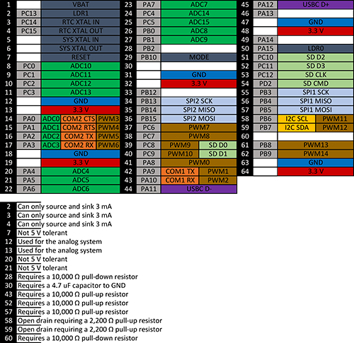

# G30
---

## Overview

The G30 SoC is a low-cost System on Chip part of the GHI Electronics SurfaceMount Compute Modules (SCM) line. This modules can be programmed in .NET C# and Visual Basic using TinyCLR OS or .NET Micro Framework.

Pricing, purchasing and other information can be found on the [G30 Page](http://www.ghielectronics.com/products/scm/g30) on our main website.

## Specifications

| Spec               | Value                     |
|--------------------|---------------------------|
| Processor          | STM ST32F401RET6          |
| Speed              | 84 MHz                    |
| Internal RAM       | 96 KByte (SRAM)           |
| Internal Flash     | 512 KByte                 |
| Package            | LQFP64 10 x 10 mm         |
| Temperature Range  | -40C to +85C              |

*Note: Resources are shared between your application and the operating system.*

## Peripherals

* TinyCLR OS ready
* .NET Micro Framework
* RoHS Lead Free
* 84 MHz ARM Cortex-M4 STM32F401RET6
* 68 Kbytes available RAM
* 128 Kbytes available flash
* 49 GPIO
* 16 interrupt capable GPIO
* 2 SPI
* 1 I2C
* 2 UART
* 15 PWM
* 16 12-bit analog input
* 4-bit SD/MMC memory card interface
* Low power modes
* LQFP64 10 x 10 mm
* RTC
* Watchdog
* Threading
* USB client
* File System
  * Full .NET file interface
  * SD cards
* Native extensions
  * Device register access
* Signal controls
  * Generation
  * Capture
  * Pulse measurement

## G30 Pinout

Many signals on the G30 are multiplexed to offer multiple functions on a single pin. Developers can decide on the pin functionality to be used through the provided libraries. Any pin with no name, function, or note must be left unconnected.

## Footprint

The chip is standard LQFP64 10x10mm. See the ST32F401RET6 datasheet for exact footprint.

## TinyCLR OS
TinyCLR OS provides a way to program the G30 in C# or Visual Basic from the Microsoft Visual Studio integrated development environment.  To get started you must first install the bootloader and firmware on the G30 (instructions below) and then go to the TinyCLR [Getting Started](../../software/tinyclr/getting-started.md) page for instructions.

### Loading Bootloader v2
The G30 ships with the bootloader loaded and locked. No further steps are necessary.

### Loading the Firmware

To activate bootloader v2, hold the LDR0 signal low while resetting the board.

Download the [G30 firmware](../../software/tinyclr/downloads.md#g30) and follow [Loading the Firmware](../../software/loaders/ghi-bootloader.md#loading-the-firmware) steps.

### Start Coding

Now that you have installed the bootloader and firmware on the G30, you can setup your host computer and start programming.  Go to the TinyCLR [Getting Started](../../software/tinyclr/getting-started.md) page for instructions.

### Native Code
TinyCLR OS also lets you use native code that works alongside your managed application. Native code can be used to provide improved performance or access to advanced features not exposed through TinyCLR. For more information check out [Native Code on TinyCLR](../../software/tinyclr/native/intro.md).

The memory area reserved for native code in TinyCLR OS on G30 starts at 0x20016000 and its length is 0x3F8.

## .NET Micro Framework
It is possible to still use .NET Micro Framework (NETMF). Details are on the [NETMF Introduction](../../software/netmf/intro.md) page.  The [NETMF Getting Started](../../software/netmf/getting-started.md) page covers NETMF from setup of the host computer to program deployment on both an emulator and target device.

## Datasheet
This documentation page replaced the legacy datasheet PDF but it is [here](http://files.ghielectronics.com/downloads/Documents/Datasheets/G30%20Datasheet.pdf) for reference.

## Design Considerations

### Required Pins

Exposing the following pins is required in every design to enable device programming, updates, and recovery:

* LDR0
* LDR1
* Desired debug interface(s)
* MODE if required to select a debug interface
### Power Supply

A typical clean power source, suited for digital circuitry, is needed to power the G30. Voltages should be within at
least 10% of the needed voltage. Decoupling capacitors of 0.1 μF are needed near every power pin. Additionally, a
large capacitor, typically 47 μF, should be near the G30 if the power supply is more than few inches away.

### Crystals

The G30 requires an external 12 MHz crystal and associated circuitry to function. For the RTC to function, a 32,768
Hz crystal and circuitry are required. Please see the processor’s documentation for advanced information.

### Interrupt Pins

Interrupts are only available on 16 pins at any given time. Of those 16 pins, the pin number must be unique. For
example: PA1 and PB1 cannot both be used as interrupts at the same time, but PA1 and PB2 can.

### Reset

The reset pin is not pulled in any direction. Designs must be sure to use an appropriate pull-up resistor.

## G30 Development Board
The G30 Dev Board is an excellent starting point and reference design for anyone interested in evaluating and developing with the G30.

* [Schematic](http://files.ghielectronics.com/downloads/Schematics/Systems/G30%20Dev%20Board%20Schematic.pdf)

## Legal
### License
This System on Module with its TinyCLR OS firmware and libraries are licensed for commercial and noncommercial use. No additional fee or licensing is required. None of the provided documentation/schematics/libraries/sources are to be used in any manner outside for the benefit of using and implementing this System on Module into your product. Please see the [FEZ](../fez/intro.md) for an open source TinyCLR OS reference design. The [TinyCLR Licensing](../../software/tinyclr/licensing.md) page has more details.

### Disclaimer

IN NO EVENT SHALL GHI ELECTRONICS, LLC BE LIABLE FOR ANY DIRECT, INDIRECT, INCIDENTAL, SPECIAL, EXEMPLARY, OR CONSEQUENTIAL DAMAGES (INCLUDING, BUT NOT LIMITED TO, PROCUREMENT OF SUBSTITUTE GOODS OR SERVICES; LOSS OF USE, DATA, OR PROFITS; OR BUSINESS INTERRUPTION) HOWEVER CAUSED AND ON ANY THEORY OF LIABILITY, WHETHER IN CONTRACT, STRICT LIABILITY, OR TORT (INCLUDING NEGLIGENCE OR OTHERWISE) ARISING IN ANY WAY OUT OF THE USE OF THIS PRODUCT, EVEN IF ADVISED OF THE POSSIBILITY OF SUCH DAMAGE. GHI ELECTRONICS, LLC LINE OF PRODUCTS ARE NOT DESIGNED FOR LIFE SUPPORT APPLICATIONS. SPECIFICATIONS, PRICE AND AVAILABILITY ARE SUBJECT TO CHANGE WITHOUT ANY NOTICE.

***

TinyCLR lets you program our devices (and others) in C# or Visual Basic using Microsoft's Visual Studio -- and it's all free!  [**Learn more...**](../../software/tinyclr/intro.md).

You can also visit our main website at [**www.ghielectronics.com**](http://www.ghielectronics.com) and our community forums at [**forums.ghielectronics.com**](https://forums.ghielectronics.com/).