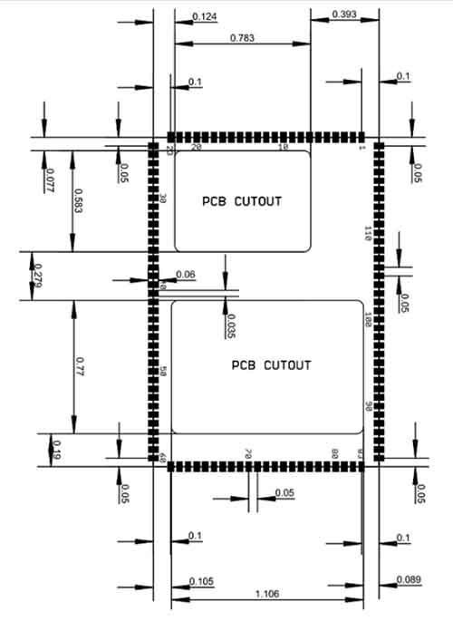
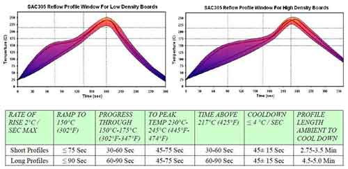

# G400S
---

## Overview

The G400S System on Module (SoM) is the surface mount version of the G400D.  Originally designed for .NET Micro Framework, it now runs several other platforms including TinyCLR.

Pricing, purchasing and other information can be found on the [G400S Page](http://www.ghielectronics.com/products/scm/g400s) on our main website.

## Ordering Part Number
* G400S SoM: G400S-SM-480

## Specifications

| Spec              | Value                     |
|-------------------|---------------------------|
| Processor         | Atmel AT91SAM9X35 ARM 926 |
| Speed             | 400 MHz                   |
| Internal RAM      | 32 KByte (SRAM)           |
| Internal Flash    | 0 KByte                   |
| External RAM      | 128 MByte (DDR2 SDRAM)    |
| External Flash    | 4 MByte (SPI)             |
| Dimensions        | 48.3 x 33.1 x 4.6 mm      |
| Temperature Range | -40 C to +85 C            |

*Note: Not all memory will be available for your application.*

## Peripherals

*Note:  Many peripherals share I/O pins.  Not all peripherals will be available to your application.*

* TinyCLR OS ready
* .NET Micro Framework
* RoHS Lead Free
* 400 MHz ARM 9 Atmel SAM9X35
* 64 Mbytes available RAM
* 1.4 Mbytes available flash
* Embedded LCD controller
* 89 interrupt capable GPIO
* 2 SPI
* 1 I2C
* 6 UART
* 2 CAN
* 4 PWM
* 12 10-bit analog output
* 4-bit SD/MMC memory card interface
* Low power modes
* RTC
* Watchdog
* Threading
* USB host
* USB client
* SQLite database
* TCP/IP with SSL
  * Full .NET socket interface
  * Ethernet
  * PPP
* Graphics
  * Images
  * Fonts
  * Controls
* File System
  * Full .NET file interface
  * SD cards
  * USB drives
* Native extensions
  * Runtime Loadable Procedures
  * Device register access
* Signal controls
  * Generation
  * Capture
  * Pulse measurement

## G400S Pinout

Many signals on the G400 are multiplexed to offer multiple functions on a single pin. Developers can decide on the pin functionality to be used through the provided libraries. Any pin with no name, function, or note must be left unconnected.

## Footprint

### G400S Recommended Footprint

## Device Startup

The G400 is held in reset when the reset pin is low. Releasing it will begin the system startup process. It is pulled
high internally

There are four different components of the device firmware:

1. GHI Bootloader: initializes the system, updates TinyBooter when needed, and executes TinyBooter.
2. TinyBooter: executes TinyCLR, updates TinyCLR when needed, and updates the system configuration.
3. TinyCLR: loads, debugs, and executes the managed application.
4. Managed application: the program developed by the customer.

Which components get executed on startup can be control by manipulating the LDR0 and LDR1 pins. LDR0 and
LDR1 are pulled high on startup.

| LDRO               | LDR1      |Effect                            |
|--------------------|-----------|----------------------------------|
| Ignored            | High      | Execute the managed application  |
| High               | Low       | Wait in TinyBooter               |
| Low                | Low       | Wait in GHI Bootloader           |

Additionally, the communications interface between the host PC and the G400 is selected on startup through the
MODE pin, which is pulled high on startup. The USB interface is selected when MODE is high and COM1 is selected
when MODE is low.

The above discussed functions of LDR0, LDR1, and MODE are only during startup. After startup, they return to the
default GPIO state and are available to use as GPIO in the user application.

## .NET Micro Framework (NETMF)

The NETMF software on G400 is mature and complete. For more information on NETMF you can go to the [NETMF Introduction](../../software/netmf/intro.md) page.  The [NETMF Getting Started](../../software/netmf/getting-started.md) page covers NETMF from setup of the host computer to program deployment on both an emulator and target device.

Bootloader v1 is needed for G400 to work with NETMF. It is available in the NETMF SDK.

## TinyCLR OS

TinyCLR OS provides a way to program the G400 in C# or Visual Basic from the Microsoft Visual Studio integrated development environment.  To get started you must first install the  bootloader and TinyCLR OS firmware (instructions below) and then go to the TinyCLR [Getting Started](../../software/tinyclr/getting-started.md) page for instructions.

### Loading Bootloader Version 2

Download the [G400 bootloader v2 file](../../hardware/loaders/ghi-bootloader.md) and load onto the dataflash. The [SAM-BA Bootloader](../../hardware/loaders/sam-ba-bootloader.md) has the details.

### Loading the Firmware

1. Activate the bootloader, hold the LDR0 signal (pin 101) low while resetting the board.
2. Open [TinyCLR Config](../../software/tinyclr/tinyclr-config.md) tool.
3. Click the loader tab.
4. Select the correct COM port. If you are not seeing it then the device is not in the loader mode.
5. Click the `Update to Latest` button.

You can also update the firmware manually. Download the [firmware](../../software/tinyclr/downloads.md) and learn how to use the [GHI Bootloader](../../hardware/loaders/ghi-bootloader.md) manually.

### Start Coding

Now that you have installed the bootloader and firmware, you can setup your host computer and start programming.  Go to the TinyCLR [Getting Started](../../software/tinyclr/getting-started.md) page for instructions.

### Code Samples

For some examples of using TinyCLR, take a look at the [TinyCLR Samples repo](https://github.com/ghi-electronics/TinyCLR-Samples). You may also find the [TinyCLR tutorials](../../software/tinyclr/tutorials/intro.md) useful.

### Native Code

TinyCLR OS also lets you use native code that works alongside your managed application. Native code can be used to provide improved performance or access to advanced features not exposed through TinyCLR. For more information check out [Native Code on TinyCLR](../../software/tinyclr/native/intro.md).

The memory area reserved for native code in TinyCLR OS on G400S starts at 0x26700000 and its length is 0x16FFFF8.

## Datasheet

This documentation page replaced the legacy datasheet PDF but it is [here](http://files.ghielectronics.com/downloads/Documents/Datasheets/G400S%20and%20G400D%20Datasheet.pdf) for reference.

## CAN Bit Timing Settings

The following CAN bit timing parameters were calculated for a G400 driving the SN65HVD230 CAN driver chip. See the [Configuring the Bus](../../software/tinyclr/tutorials/can.md#configuring-the-bus) section of the [CAN Tutorial](../../software/tinyclr/tutorials/can.md) for more information.

| Baud | Propagation | Phase1 | Phase2 | Baudrate Prescaler | Synchronization Jump Width | Use Multi Bit Sampling | Sample Point | Max Osc. Tolerance | Max Cable Length
|---|---|---|---|---|---|---|---|---|---
| 83.333K | 7 | 4 | 1 | 99 | 0 | False | 87.5% | 0.31% | 845M
| 125K    | 7 | 1 | 1 | 81 | 0 | False | 84.6% | 0.38% | 499M
| 250K    | 7 | 1 | 1 | 40 | 0 | False | 84.6% | 0.38% | 222M
| 500K    | 7 | 7 | 1 | 13 | 1 | False | 89.5% | 0.41% | 92M
| 1M      | 7 | 7 | 1 | 6  | 1 | False | 89.5% | 0.41% | 19M

*Note: Maximum Oscillator Tolerance and Maximum Cable Length are theoretical maximums and must be tested to ensure reliability.*

## Design Considerations

### Required Pins

Exposing the following pins is required in every design to enable device programming, updates, and recovery:
* LDR0
* LDR1
* Reset
* Desired debug interface(s)
* MODE if required to select a debug interface
* SPI1 MISO to update TinyBooter in SDK 2015 R1 and earlier and to install the GHI Bootloader once for SDK
2016 R1 and later

### Power Supply

A typical clean power source, suited for digital circuitry, is needed to power the G400. Voltages should be within at
least 10% of the needed voltage. Decoupling capacitors of 0.1 μF are needed near every power pin. Additionally, a
large capacitor, typically 47 μF, should be near the G400 if the power supply is more than few inches away.
Additionally, the G400 requires additional voltages beyond the typical 3.3 V to function properly. See the pinout
table for details.

### Crystals

The G400 includes the needed system and RTC crystals and their associated circuitry.

### SPI Channels

SPI1 is shared internally with the flash memory on the G400. Use of a chip select with devices on this channel is
required or the G400 will not function properly. The use of another SPI channel is recommended.

### Ethernet

The built in Ethernet available on the G400D includes all needed Ethernet circuitry internally. However, an
appropriate magnet and connector, like the J0011D or similar, are required.

### Soldering the G400S

The G400S is designed to be easily machine-placed or hand-soldered. Static sensitive precautions should be taken
when handling the module.

### Oven Reflow

The G400S is not sealed for moisture. Baking the module before reflow is recommended and required in a humid
environment. The process of reflow can damage the G400 if the temperature is too high or exposure is too long.

The lead-free reflow profile used by GHI Electronics is shown below. The profiles shown are based on SAC 305
solder (3% silver, 0.5% copper). The thermal mass of the assembled board and the sensitivity of the components
on it affect the total dwell time. Differences in the two profiles are where they reach their respective peak
temperatures as well as the time above liquids (TAL). The shorter profile applies to smaller assemblies, whereas
the longer profile applies to larger assemblies such as back-planes or high-density boards. The process window is
described by the shaded area. These profiles are only starting-points and general guidance. The particulars of an
oven and the assembly will determine the final process.

## Legal
### License

This product with its accompanying firmware are licensed royalty-free for commercial and noncommercial use. Using the provided firmware on a non-official product requires additional licensing. The provided documentation/schematics/libraries/sources are not to be used in any manner outside for the benefit of implementing and using this GHI Electronics product into your design.

### Disclaimer

IN NO EVENT SHALL GHI ELECTRONICS, LLC BE LIABLE FOR ANY DIRECT, INDIRECT, INCIDENTAL, SPECIAL, EXEMPLARY, OR CONSEQUENTIAL DAMAGES (INCLUDING, BUT NOT LIMITED TO, PROCUREMENT OF SUBSTITUTE GOODS OR SERVICES; LOSS OF USE, DATA, OR PROFITS; OR BUSINESS INTERRUPTION) HOWEVER CAUSED AND ON ANY THEORY OF LIABILITY, WHETHER IN CONTRACT, STRICT LIABILITY, OR TORT (INCLUDING NEGLIGENCE OR OTHERWISE) ARISING IN ANY WAY OUT OF THE USE OF THIS PRODUCT, EVEN IF ADVISED OF THE POSSIBILITY OF SUCH DAMAGE. GHI ELECTRONICS LINE OF PRODUCTS ARE NOT DESIGNED FOR LIFE SUPPORT APPLICATIONS. SPECIFICATIONS, PRICE AND AVAILABILITY ARE SUBJECT TO CHANGE WITHOUT ANY NOTICE.

***

TinyCLR lets you program our devices (and others) in C# or Visual Basic using Microsoft's Visual Studio-- and it's all free!  [**Learn more...**](../../software/tinyclr/intro.md).

You can also visit our main website at [**www.ghielectronics.com**](http://www.ghielectronics.com) and our community forums at [**forums.ghielectronics.com**](https://forums.ghielectronics.com/).
