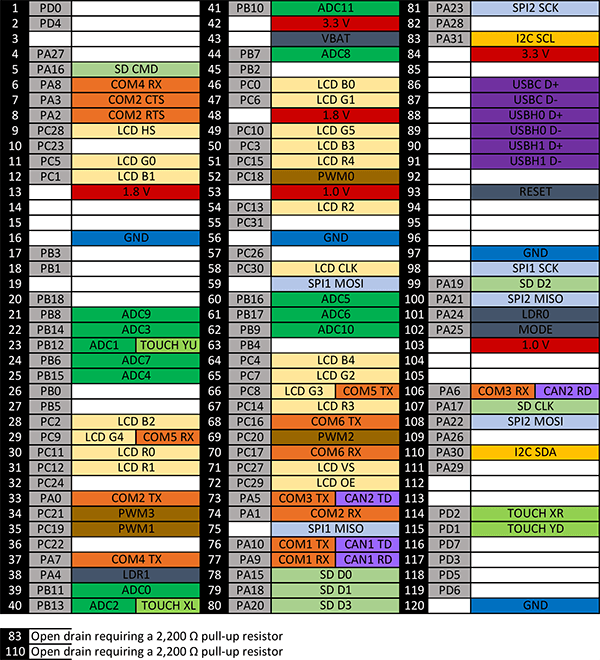

# G400S
---

The G400S System on Module (SoM) is the surface mount version of the G400D.  Originally designed for .NET Micro Framework, it now runs several other platforms including TinyCLR.

* [Datasheet](http://files.ghielectronics.com/downloads/Documents/Datasheets/G400S%20and%20G400D%20Datasheet.pdf)

Pricing, purchasing and other information can be found on the [G400S Page](http://www.ghielectronics.com/products/scm/g400s) on our main website.

## Getting Started

Options for programming the G400S include the following:

### Microsoft's .NET Micro Framework (NETMF)
We discourage the use of NETMF software on our products in favor of TinyCLR OS. For more information on NETMF you can go to the [NETMF Introduction](../../software/netmf/intro.md) page.  The [NETMF Getting Started](../../software/netmf/getting-started.md) page covers NETMF from setup of the host computer to program deployment on both an emulator and target device.

### TinyCLR OS
TinyCLR is our own operating system and provides a means of programming embedded devices using .NET and Visual Studio.  Visual Studio is widely regarded as one of the best (if not the best) integrated development environments available.  The free Community version of Visual Studio can be downloaded here:  [Visual Studio Downloads](https://www.visualstudio.com/downloads/).  For information on setting up TinyCLR to work in Visual Studio please click here:  [TinyCLR Introduction](../../software/tinyclr/intro.md)

#### Loading Bootloader Version 2
Download the [G400 bootloader file](../../software/loaders/ghi-bootloader.md#g400).

Go to the [SAMBA](../../software/loaders/intro.md#sam-ba-bootloader) section of the [Bootloaders Introduction](../../software/loaders/intro.md) page for instructions on loading the bootloader.

#### Loading the Firmware

> [!Tip]
> First make sure you have bootloader v2 loaded. This needs to be done only once.

To activate bootloader v2, hold the LDR0 (pin 101) signal low and reset the board. You may have to wait a couple of seconds before releasing LDR0.

Download the [G400 firmware](../../software/tinyclr/downloads.md#g400) and follow [Loading the Firmware](../../software/loaders/ghi-bootloader.md#loading-the-firmware) steps.

#### Using Native Code with TinyCLR
TinyCLR OS also lets you use native code that that works alongside your managed application. Native code can be used to provide improved performance or access to advanced features not exposed through TinyCLR. For more information check out [Native Code on TinyCLR](../../software/tinyclr/native/intro.md).

TinyCLR cannot relocate native code, so you will have specify its location in the scatterfile. For the G400S, the interop region starts at address 0x26700000, and its length is 0x16FFFF8.

## Specifications

| Spec           | Value                     |
|----------------|---------------------------|
| Processor      | Atmel AT91SAM9X35 ARM 926 |
| Speed          | 400 MHz                   |
| Internal RAM   | 32 KByte (SRAM)           |
| Internal Flash | 0 KByte                   |
| External RAM   | 128 MByte (DDR2 SDRAM)    |
| External Flash | 4 MByte (SPI)             |
| Dimensions     | 48.3 x 33.1 x 4.6 mm      |

*Note: Not all memory will be available for your application.*

## G400S Pinout

## Peripherals

*Note:  Many peripherals share I/O pins.  Not all peripherals will be available to your application.*

| Peripheral     | Quantity          |
|----------------|-------------------|
| UART           | 6 (including HS)  |
| UART HS        | 1                 |
| I2C            | 1                 |
| SPI            | 2                 |
| CAN            | 2                 |
| SDIO           | 1                 |
| 10 Bit ADC     | 12                |
| PWM            | 4                 |
| GPIO           | 89                |
| IRQ            | 89                |
| USB Client     | 1                 |
| USB Host       | 2                 |
| LCD            | Supported (16bpp) |
| Ethernet PHY   | Supported         |
| Wi-Fi          | Not supported     |
| DCMI           | Not supported     |
| VBAT           | Supported         |
| JTAG           | Full JTAG         |

## CAN Bit Timing Settings

The following CAN bit timing paramaters were calculated for a G400 driving the SN65HVD230 CAN driver chip. See the [Configuring the Bus](../../software/tinyclr/tutorials/can.md#configuring-the-bus) section of the [CAN Tutorial](../../software/tinyclr/tutorials/can.md) for more information.

| Baud | Propagation | Phase1 | Phase2 | Baudrate Prescaler | Synchronization Jump Width | Use Multi Bit Sampling | Sample Point | Max Osc. Tolerance | Max Cable Length
|---|---|---|---|---|---|---|---|---|---
| 83.333K | 7 | 4 | 1 | 99 | 0 | False | 87.5% | 0.31% | 845M
| 125K    | 7 | 1 | 1 | 81 | 0 | False | 84.6% | 0.38% | 499M
| 250K    | 7 | 1 | 1 | 40 | 0 | False | 84.6% | 0.38% | 222M
| 500K    | 7 | 7 | 1 | 13 | 1 | False | 89.5% | 0.41% | 92M
| 1M      | 7 | 7 | 1 | 6  | 1 | False | 89.5% | 0.41% | 19M

*Note: Maximum Oscillator Tolerance and Maximum Cable Length are theoretical maximums and must be tested to ensure reliability.*

## G400S Based Product

### The G400S is used in the FEZ Raptor

 
***

TinyCLR lets you program our devices (and others) in C# or Visual Basic using Microsoft's Visual Studio -- and it's all free!  [**Learn more...**](../../software/tinyclr/intro.md).

You can also visit our main website at [**www.ghielectronics.com**](http://www.ghielectronics.com) and our community forums at [**forums.ghielectronics.com**](https://forums.ghielectronics.com/).