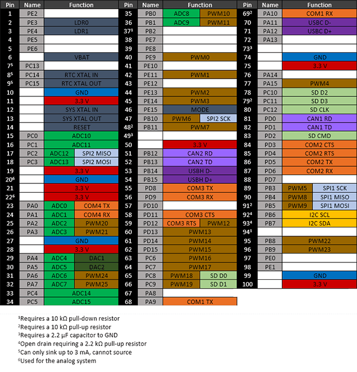

# G80
---

## Overview

The G80 SoC is a low-cost System on Chip part of the GHI Electronics SurfaceMount Compute Modules (SCM) line. This modules can be programmed in .NET C# and Visual Basic using TinyCLR OS or .NET Micro Framework.

Pricing, purchasing and other information can be found on the [G80 Page](http://www.ghielectronics.com/products/scm/g80) on our main website.

## Specifications

| Spec               | Value                     |
|--------------------|---------------------------|
| Processor          | STM32F427VGT6             |
| Speed              | 180 MHz                   |
| Internal RAM       | 256 KByte (SRAM)          |
| Internal Flash     | 1 MByte                   |
| Package            | LQFP100 14 x 14 mm        |
| Temperature Range  | -40C to +85C              |

*Note: Resources are shared between your application and the operating system.*

## Peripherals

* TinyCLR OS ready
* .NET Micro Framework
* RoHS Lead Free
* 180 MHz ARM Cortex-M4 STM32F427VGT6
* 156 Kbytes available RAM
* 256 Kbytes available flash
* 78 GPIO
* 16 interrupt capable GPIO
* 2 SPI
* 1 I2C
* 4 UART
* 2 CAN
* 26 PWM
* 16 12-bit analog input
* 4-bit SD/MMC memory card interface
* Low power modes
* LQFP6100 14 x 14 mm
* RTC
* Watchdog
* Threading
* USB host
* USB client
* TCP/IP with SSL
  * Full .NET socket interface
  * Ethernet
  * PPP
* Graphics
  * Images
  * Fonts
  * Controls
* File System
  * Full .NET file interface
  * SD cards
  * USB drives
* Native extensions
  * Runtime Loadable Procedures
  * Device register access
* Signal controls
  * Generation
  * Capture
  * Pulse measurement

## G80 Pinout

Many signals on the G80 are multiplexed to offer multiple functions on a single pin. Developers can decide on the pin functionality to be used through the provided libraries. Any pin with no name, function, or note must be left unconnected.

## Footprint

The chip is standard LQFP100 14x14mm. See the STM32F427VGT6 datasheet for exact footprint.

## Device Startup

The G80 is held in reset when the reset pin is low. Releasing it will begin the system startup process.

There are three different components of the device firmware:
1. GHI Bootloader: initializes the system, updates TinyCLR when needed, and executes TinyCLR.
2. TinyCLR: loads, debugs, and executes the managed application.
3. Managed application: the program developed by the customer.

Which components get executed on startup can be control by manipulating the LDR0 pin. It is pulled high on
startup. When low, the device waits in the GHI Bootloader. Otherwise, the managed application is executed. LDR1
is reserved for future use.

Additionally, the communications interface between the host PC and the G80 is selected on startup through the
MODE pin, which is pulled high on startup. The USB interface is selected when MODE is high and COM1 is selected
when MODE is low.

The above discussed functions of LDR0, LDR1, and MODE are only during startup. After startup, they return to the
default GPIO state and are available to use as GPIO in the user application

## .NET Micro Framework (NETMF)

The NETMF software on G80 is mature and complete. For more information on NETMF you can go to the [NETMF Introduction](../../software/netmf/intro.md) page.  The [NETMF Getting Started](../../software/netmf/getting-started.md) page covers NETMF from setup of the host computer to program deployment on both an emulator and target device.

## TinyCLR OS
TinyCLR OS provides a way to program the G80 in C# or Visual Basic from the Microsoft Visual Studio integrated development environment.  To get started you must first install the firmware on the G80 (instructions below) and then go to the TinyCLR [Getting Started](../../software/tinyclr/getting-started.md) page for instructions.

### Loading the Firmware

1. Activate the bootloader, hold the LDR0 signal low while resetting the board.
2. Open [TinyCLR Config](../../software/tinyclr/tinyclr-config.md) tool.
3. Click the loader tab.
4. Select the correct COM port. If you are not seeing it then the device is not in the loader mode.
5. Click the `Update to Latest` button.

You can also update the firmware manually. Download the [firmware](../../software/tinyclr/downloads.md) and learn how to use the [GHI Bootloader](../../software/loaders/ghi-bootloader.md) manually.

### Start Coding

Now that you have installed the firmware on the G80, you can setup your host computer and start programming.  Go to the TinyCLR [Getting Started](../../software/tinyclr/getting-started.md) page for instructions.

### Code Samples

For some examples of using TinyCLR, take a look at the [TinyCLR Samples repo](https://github.com/ghi-electronics/TinyCLR-Samples). You may also find the [TinyCLR tutorials](../../software/tinyclr/tutorials/intro.md) useful.

### Native Code
TinyCLR OS also lets you use native code that works alongside your managed application. Native code can be used to provide improved performance or access to advanced features not exposed through TinyCLR. For more information check out [Native Code on TinyCLR](../../software/tinyclr/native/intro.md).

The memory area reserved for native code in TinyCLR OS on G80 starts at 0x2002F000 and its length is 0xFF8.

## .NET Micro Framework
It is possible to still use .NET Micro Framework (NETMF). Details are on the [NETMF Introduction](../../software/netmf/intro.md) page.  The [NETMF Getting Started](../../software/netmf/getting-started.md) page covers NETMF from setup of the host computer to program deployment on both an emulator and target device.

## Datasheet
This documentation page replaced the legacy datasheet PDF but it is [here](http://files.ghielectronics.com/downloads/Documents/Datasheets/G80%20Datasheet.pdf) for reference.

## CAN Bit Timing Settings

The following CAN bit timing parameters were calculated for a G80 driving the TJA1050T CAN driver chip. See the [Configuring the Bus](../../software/tinyclr/tutorials/can.md#configuring-the-bus) section of the [CAN Tutorial](../../software/tinyclr/tutorials/can.md) for more information.

| Baud | Propagation | Phase1 | Phase2 | Baudrate Prescaler | Synchronization Jump Width | Use Multi Bit Sampling | Sample Point | Max Osc. Tolerance | Max Cable Length
|---|---|---|---|---|---|---|---|---|---
| 33.333K | 1 | 12 | 2 | 90 | 1 | False | 86.7%  | 0.33% | 2145M
| 83.333K | 1 | 12 | 2 | 36 | 1 | False | 86.7%  | 0.33% | 825M
| 125K    | 1 | 12 | 2 | 24 | 1 | False | 86.7%  | 0.33% | 531M
| 250K    | 1 | 12 | 2 | 12 | 1 | False | 86.7%  | 0.33% | 238M
| 500K    | 1 | 12 | 2 | 6  | 1 | False | 86.7%  | 0.33% | 91M
| 1M      | 1 | 12 | 2 | 3  | 1 | False | 86.7%  | 0.33% | 18M

*Note: Maximum Oscillator Tolerance and Maximum Cable Length are theoretical maximums and must be tested to ensure reliability.*

## Design Considerations

### Required Pins

Exposing the following pins is required in every design to enable device programming, updates, and recovery:
* LDR0
* LDR1
* Reset
* Desired debug interface(s)
* MODE if required to select a debug interface

### Power Supply

A typical clean power source, suited for digital circuitry, is needed to power the G80. Voltages should be within at
least 10% of the needed voltage. Decoupling capacitors of 0.1 μF are needed near every power pin. Additionally, a
large capacitor, typically 47 μF, should be near the G80 if the power supply is more than few inches away.

### Crystals

The G80 requires an external 12 MHz crystal and associated circuitry to function. For the RTC to function, a 32,768
Hz crystal and circuitry are required. Please see the processor’s documentation for advanced information.

### Interrupt Pins

Interrupts are only available on 16 pins at any given time. Of those 16 pins, the pin number must be unique. For
example: PA1 and PB1 cannot both be used as interrupts at the same time, but PA1 and PB2 can.

### Reset

The reset pin is not pulled in any direction. Designs must be sure to use an appropriate pull-up resistor.

## G80 Development Board

The G80 Dev Board is an excellent starting point and reference design for anyone interested in evaluating and developing with the G80.

* [Schematics](http://files.ghielectronics.com/downloads/Schematics/Systems/G80%20Dev%20Board%20Schematic.pdf)
* [TinyCLR Samples repo](https://github.com/ghi-electronics/TinyCLR-Samples)

## Legal

### License

This product and its firmware and libraries are licensed royalty-free for commercial and noncommercial use. None of the provided documentation/schematics/libraries/sources are to be used in any manner outside for the benefit of implementing and using this product into your design.

### Disclaimer

IN NO EVENT SHALL GHI ELECTRONICS, LLC BE LIABLE FOR ANY DIRECT, INDIRECT, INCIDENTAL, SPECIAL, EXEMPLARY, OR CONSEQUENTIAL DAMAGES (INCLUDING, BUT NOT LIMITED TO, PROCUREMENT OF SUBSTITUTE GOODS OR SERVICES; LOSS OF USE, DATA, OR PROFITS; OR BUSINESS INTERRUPTION) HOWEVER CAUSED AND ON ANY THEORY OF LIABILITY, WHETHER IN CONTRACT, STRICT LIABILITY, OR TORT (INCLUDING NEGLIGENCE OR OTHERWISE) ARISING IN ANY WAY OUT OF THE USE OF THIS PRODUCT, EVEN IF ADVISED OF THE POSSIBILITY OF SUCH DAMAGE. GHI ELECTRONICS, LLC LINE OF PRODUCTS ARE NOT DESIGNED FOR LIFE SUPPORT APPLICATIONS. SPECIFICATIONS, PRICE AND AVAILABILITY ARE SUBJECT TO CHANGE WITHOUT ANY NOTICE.

***

TinyCLR you program our devices (and others) in C# or Visual Basic using Microsoft's Visual Studio -- and it's all free!  [**Learn more...**](../../software/tinyclr/intro.md).

You can also visit our main website at [**www.ghielectronics.com**](http://www.ghielectronics.com) and our community forums at [**forums.ghielectronics.com**](https://forums.ghielectronics.com/).
