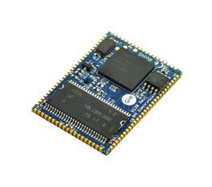

# Surface Mount Compute Modules
---

Our SCMs are surface mount embedded controllers and are ideal for harsh or high vibration environments.

Our SCMs can be programmed using a variety of tools including our own TinyCLR operating system, Microsoft's .NET Micro Framework, and bare metal C/C++.

|  |  |
|--|--|
| **G30**   [**Learn more...**](g30.md) | **G80**   [**Learn more...**](g80.md) |
|  |  |
| **G120 / G120E**   [**Learn more...**](g120.md) | **G400S**   [**Learn more...**](g400s.md) |
|  |  |
 
***

Our TinyCLR operating system lets you program our devices (and others) in C# or Visual Basic using Microsoft's Visual Studio -- and it's all free!  [**Learn more...**](../../software/tinyclr/intro.md).

You can also visit our main website at [**www.ghielectronics.com**](http://www.ghielectronics.com) and our community forums at [**forums.ghielectronics.com**](https://forums.ghielectronics.com/).