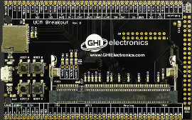
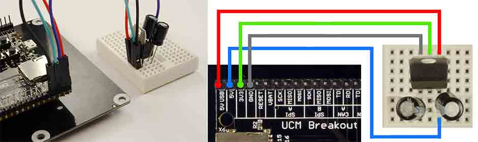
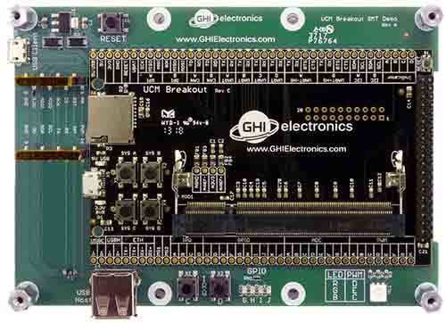
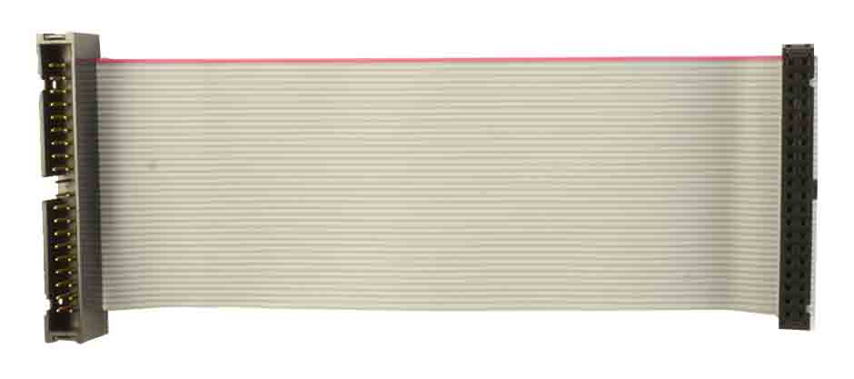
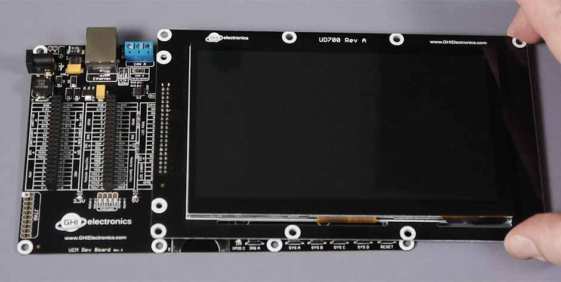
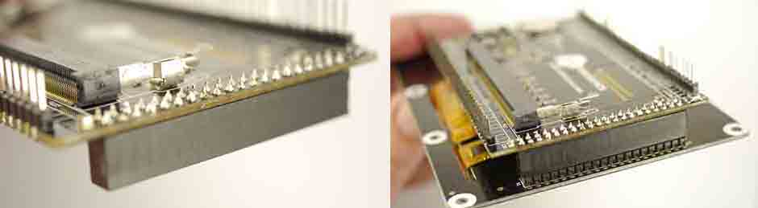
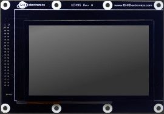
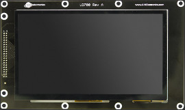
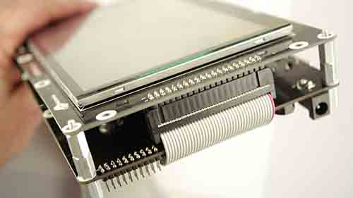

 # UCM Development Options
---

These options are provided to speed the development of your product and make it possible to start programming your application within minutes without designing or building new hardware.

You may also use these products as quick drop-in options into your design as well.

## Code Samples

For some examples of using the development options in TinyCLR, take a look at the [TinyCLR Samples repo](https://github.com/ghi-electronics/TinyCLR-Samples). You may also find the [TinyCLR tutorials](../../software/tinyclr/tutorials/intro.md) useful.

## UCM Dev Board

Ordering Part Number: UCD-DEV-E	

[Schematic](http://files.ghielectronics.com/downloads/Schematics/Systems/UCM%20Dev%20Board%20Rev%20E%20Schematic.pdf)

The UCM Dev Board is the fastest and easiest way to start using our Universal Compute Modules. This board provides a socket for the UCM, standard connectors for input/output, and three 40 pin socket headers for connecting peripherals and a display. Peripheral connectors include external power, Ethernet, CAN, USB host and client, RTC backup battery, DCMI interface and an SD card slot.  It also has a buzzer, LEDs, a reset button, and user programmable boot buttons.

To start development using the UCM Dev Board, just plug a UCM into the socket on the board and connect the board's USB Client port to a host computer using a micro USB. Go to the documentation page for the particular UCM you are using for instructions.

For power, the board can be powered through either USB connectors or the barrel jack. Always use the barrel jack for power when using displays, especially the larger ones. USB does not provide sufficient power needed for displays.

> [!Tip]
> The barrel jack is pin positive, sleeve negative, 2.1mm. It is capable of anywhere 7V to 30V. 1A of power should be enough for most needs.

## UCM Breakout Board

Ordering Part Number: UCD-BKT-C	

[Schematic](http://files.ghielectronics.com/downloads/Schematics/Systems/UCM%20Breakout%20Rev%20C%20Schematic.pdf)

The UCM Breakout Board provides a socket for UCMs, and both through hole and surface mount edge connections for soldering the Breakout Board to your own circuit board. You can solder pin headers to the Breakout Board and use traditional breadboarding techniques to build your prototype as well. This board makes it easier to use UCMs in prototypes or products without the need to solder the fine pitch 200 pin SO-DIMM socket.

For added convenience, it also includes USB Client connector, a reset button, four user programmable boot buttons, and a micro SD card slot. 

Please note that this is a **Breakout Board** and it does not have any power supplies. You will need to add 3.3V or 5V as needed to power up your modules. However, the power from USB is available on one of the pins (5V USB) so it is possible to wire a 3.3V regulator.

> [!Tip]
> There are 2 LEDs by the USB connector, for 3.3V and 5V. They are useful to check that you have supplied the necessary power.

A simple board can be designed and hand soldered to host the Breakout Board. You can turn an idea into a product prototype in days!

This example board example (in green) is made to be the exact same size as the 4.3" universal display board.

It can be designed with the display connector conveniently located in the right place.  

To start using the breakout board, plug one of the UCMs into the socket on the board and wire in 3.3V (you may also need 5V) and plug in USB into your PC. Go to the documentation page for the particular UCM you are using for instructions.

## Universal Displays

Available displays work directly with the options above, just make sure you are using a SoM supporting the needed peripherals. The Universal Displays can be connected directly or wired though a 40-pin IDE extension ribbon cable, similar to the old-style IDE hard drive cable extender, with a Male connector on one end and a Female connector on the other. 

To connect a display with the Dev Board, simply plug it on top.

The display can be larger than the board but it will still use the same connector (HDR C).

When using the Breakout Board you need to add a female header. Make sure the header is placed on the back of the Breakout Board.

Note how the Breakout Board, and potentially your host board, hide behind the display. This is a good advantage when mounting the display inside a product.

Adding a ribbon cable allows for further flexibility on where and how far the display is mounted. The length of the cable is determined by clock frequency used with the display. If the image on the display is not stable, lower the clock or shorten the cable. In our testing, our display have worked perfectly with 10" cable.

### UCD-D43-A

Ordering Part Number: UCD-D43-A
Display Module: [ER-TFT043-3](www.buydisplay.com) with capacitive touch panel.

[Schematic](http://files.ghielectronics.com/downloads/Schematics/Systems/UD435%20Rev%20A%20Schematic.pdf)

This display module has a 4.3" 480x272 TFT display with capacitive touch screen. The display needs a UCM with TFT display support and needs I2C for the capacitive touch. The backlight is controllable through GPIO A.

This is an example code using the UD435 display. For more details, see the [display](../../software/tinyclr/tutorials/display.md) and [graphics](../../software/tinyclr/tutorials/graphics.md) tutorials.

The capacitive touch controller is connected I2C A with the interrupt pin on GPIO B. See the [touch tutorial](../../software/tinyclr/tutorials/touch.md) for details on using the touch screen.

See below for the display configuration values:

Property | Value
---------|---------
Width | 480
Height | 272
DataFormat | RGB565
Pixel Clock Rate | 5 MHz <= x <= 12MHz
Pixel Polarity | low
DataEnable Is Fixed | false
DataEnable Polarity | low
Horizontal Back Porch | 46
Horizontal Front Porch | 16
Horizontal Sync Polarity | low
Horizontal Sync Pulse Width | 1
Vertical Back Porch | 23
Vertical Front Porch | 7
Vertical Sync Polarity | low
Vertical Sync Pulse Width | 1

### UCD-D70-A

Ordering Part Number: UCD-D70-A
Display Module: [ER-TFT070-4](www.buydisplay.com) with capacitive touch panel.

[Schematic](http://files.ghielectronics.com/downloads/Schematics/Systems/UD700%20Rev%20A%20Schematic.pdf)

This display module has a 7" 800x480 TFT display with capacitive touch screen. The display needs a UCM with TFT display support and needs I2C for the capacitive touch. The backlight is controllable through GPIO A.

The display is exactly the same size as the Dev Board. They can be nicely mounted back to back with stand offs. A ribbon cable will be needed for the display signals.

This is an example code using the display. For more details, see the [display](../../software/tinyclr/tutorials/display.md) and [graphics](../../software/tinyclr/tutorials/graphics.md) tutorials.

The capacitive touch controller is connected I2C A with the interrupt pin on GPIO B. See the [touch tutorial](../../software/tinyclr/tutorials/touch.md) for details on using the touch screen.

See below for the display configuration values:

Property | Value
---------|---------
Width | 800
Height | 480
DataFormat | RGB565
Pixel Clock Rate | <= 50 MHz
Pixel Polarity | low
Data Enable Is Fixed | false
Data Enable Polarity | low
Horizontal Back Porch | 46
Horizontal Front Porch | 16
Horizontal Sync Polarity | low
Horizontal Sync Pulse Width | 1
Vertical Back Porch | 23
Vertical Front Porch | 7
Vertical Sync Polarity | low
Vertical Sync Pulse Width | 1

## Custom Boards

The "Display Interface" utilized on development options include TFT parallel 16bit/24bit bus, I2C bus, SPI, bus and 2 GPIOs. It is possible to design a custom display to utilize the UCM mainboards, or design a mainboard to utilize the available displays. Additionally, the designs of the development options can be used as a reference to start a UCMbased design. GHI Electronics' engineering/manufacturing is available for such designs.

***

## Legal
### License

This product with its accompanying firmware are licensed royalty-free for commercial and noncommercial use. Using the provided firmware on nonofficial product requires additional licensing. The provided documentation/schematics/libraries/sources are not to be used in any manner outside for the benefit of implementing and using this GHI Electronics product into your design.

### Disclaimer

IN NO EVENT SHALL GHI ELECTRONICS, LLC BE LIABLE FOR ANY DIRECT, INDIRECT, INCIDENTAL, SPECIAL, EXEMPLARY, OR CONSEQUENTIAL DAMAGES (INCLUDING, BUT NOT LIMITED TO, PROCUREMENT OF SUBSTITUTE GOODS OR SERVICES; LOSS OF USE, DATA, OR PROFITS; OR BUSINESS INTERRUPTION) HOWEVER CAUSED AND ON ANY THEORY OF LIABILITY, WHETHER IN CONTRACT, STRICT LIABILITY, OR TORT (INCLUDING NEGLIGENCE OR OTHERWISE) ARISING IN ANY WAY OUT OF THE USE OF THIS PRODUCT, EVEN IF ADVISED OF THE POSSIBILITY OF SUCH DAMAGE. GHI ELECTRONICS LINE OF PRODUCTS ARE NOT DESIGNED FOR LIFE SUPPORT APPLICATIONS. SPECIFICATIONS, PRICE AND AVAILABILITY ARE SUBJECT TO CHANGE WITHOUT ANY NOTICE.

***

You can visit our main website at [**www.ghielectronics.com**](http://www.ghielectronics.com) and our community forums at [**forums.ghielectronics.com**](https://forums.ghielectronics.com/).