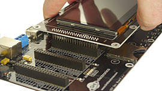
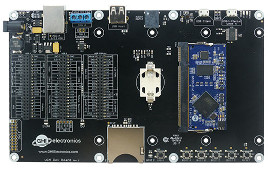

# UCM Development Options
---


These options are provided to speed the development of your product and make it possible to start programming your application within minutes without designing or building new hardware.

You may also use these products as quick drop-in options into your design as well.

## UCM Dev Board


Model Number: UCD-DEV-E	

[Schematic](http://files.ghielectronics.com/downloads/Schematics/Systems/UCM%20Dev%20Board%20Rev%20E%20Schematic.pdf)

The UCM Dev Board is the fastest and easiest way to start using our Universal Compute Modules. This board provides a socket for the UCM, standard connectors for input/output, and three 40 pin socket headers for connecting peripherals and a display. Peripheral connectors include external power, Ethernet, CAN, USB host and client, RTC backup battery, DCMI interface and an SD card slot.  It also has a buzzer, LEDs, a reset button, and user programmable boot buttons.

To start development using the UCM Dev Board, just plug a UCM into the socket on the board and connect the board to a host computer using a micro USB cable. Go to the documentation page for the particular UCM you are using for instructions.

## UCM Breakout Board


Model Number: UCD-BKT-C	

[Schematic](http://files.ghielectronics.com/downloads/Schematics/Systems/UCM%20Breakout%20Rev%20C%20Schematic.pdf)

The UCM Breakout Board provides a socket for UCMs, and both through hole and surface mount edge connections for soldering the Breakout Board to your own circuit board. You can solder pin headers to the Breakout Board and use traditional breadboarding techniques to build your prototype as well. This board makes it easier to use UCMs in prototypes or products without the need to solder the fine pitch 200 pin SO-DIMM socket.

For added convenience, it also includes USB Client connector, a reset button, four user programmable boot buttons, and a micro SD card slot. 

Please note that this is a **Breakout Board** and it does not have any power supplies. You will need to add 3.3V or 5V as needed to power up your modules. However, the power from USB is available on one of the pins (5V USB) so it is possible to wire a 3.3V regulator.


A simple board can be designed and hand soldered to host the Breakout Board. You can turn an idea into a product prototype in days!

(image)

To start using the breakout board, plug one of the UCMs into the socket on the board and wire in 3.3V (you may also need 5V) and plug in USB into your PC. Go to the documentation page for the particular UCM you are using for instructions.

## Universal Displays

Available displays work directly with the options above, just make sure you are using a SoM supporting the needed peripherals. The Universal Displays can be connected directly or wired though a 40-pin ribbon cable, similar to the old-style IDE hard drive cables.

To connect a display with the Dev Board, simply plug it on top.

(image)

The display can be larger than the board but it will still use the same connector (HDR C).

(image)

When using the Breakout Board you can solder the display directly or solder a female header onto the Breakout Board.

(image)

Note how the Breakout Board, and potentially your host board, hide behind the display.

(image)

When using a ribbon cable, attention needs to be paid to the orientation of the connectors. Teh connector used is dual row. Pin 1 from the cable can be on the right side or the left side of the connector! For example, to use a standard IDE cable, a male to male gender changer is need. This is not simply a male-to-male header, but a small circuit that mirrors the pins appropriately.

(image of connector)

When using the Breakout Board with a ribbon cable, this can be resolved by placing the headers on the opposite side.

(image)


### UCD-D43-A


Model Number: UCD-D43-A
Display Module: ER-TFT043-3

[Schematic](http://files.ghielectronics.com/downloads/Schematics/Systems/UD435%20Rev%20A%20Schematic.pdf)

This display module has a 4.3" 480x272 TFT display with capacitive touch screen. The display needs a UCM with TFT display support and needs I2C for the capacitive touch. The backlight is controllable through GPIO A.

This is an example code using the UD435 display. For more details, see the [display](../../software/tinyclr/tutorials/display.md) and [graphics](../../software/tinyclr/tutorials/graphics.md) tutorials.

The needed display configuration are in this example.

```cs
using System.Drawing;
using System.Threading;
using GHIElectronics.TinyCLR.Devices.Display;
using GHIElectronics.TinyCLR.Devices.Gpio;
using GHIElectronics.TinyCLR.Pins;

class Program {
    private static void Main() {
        UCMStandard.SetModel(UCMModel.UC5550);
        var backlight = GpioController.GetDefault().OpenPin(UCMStandard.GpioPin.A);
        backlight.SetDriveMode(GpioPinDriveMode.Output);
        backlight.Write(GpioPinValue.High);
        var displayController = DisplayController.GetDefault();
        // Enter the proper display configurations
        displayController.SetConfiguration(new ParallelDisplayControllerSettings {
            Width = 480,
            Height = 272,
            DataFormat = DisplayDataFormat.Rgb565,
            HorizontalBackPorch = 46,
            HorizontalFrontPorch = 16,
            HorizontalSyncPolarity = false,
            HorizontalSyncPulseWidth = 1,
            DataEnableIsFixed = false,
            DataEnablePolarity = false,
            PixelClockRate = 12_000_000,
            PixelPolarity = false,
            VerticalBackPorch = 23,
            VerticalFrontPorch = 7,
            VerticalSyncPolarity = false,
            VerticalSyncPulseWidth = 1
        });

        displayController.Enable();
        var screen = Graphics.FromHdc(displayController.Hdc);
        var greenPen = new Pen(Color.Green, 5);
        int x = 50, y = 50, dx = 5, dy = 4;
        while (true) {
            screen.Clear(Color.Black);
            screen.DrawEllipse(greenPen, x, y, 10, 10);
            screen.Flush();
            x += dx;
            y += dy;
            if (x < 0 || x > 480) dx *= -1;
            if (y < 0 || y > 272) dy *= -1;
            Thread.Sleep(20);
        }
    }
}
```

For the capacitive touch screen, a driver is provided as a NuGet package.

(where is the touch tutorial?)

### UCD-D70-A


Model Number: UCD-D70-A
Display Module: ER-TFT070-4

[Schematic](http://files.ghielectronics.com/downloads/Schematics/Systems/UD700%20Rev%20A%20Schematic.pdf)


This display module has a 7" 800x480 TFT display with capacitive touch screen. The display needs a UCM with TFT display support and needs I2C for the capacitive touch. The backlight is controllable through GPIO A.

The display is exactly the same size as the Dev Board. Tehy can be nicely mounted back to back with stand offs. A ribbon cable will be needed for the display signals.

(image)

This is an example code using the display. For more details, see the [display](../../software/tinyclr/tutorials/display.md) and [graphics](../../software/tinyclr/tutorials/graphics.md) tutorials.

The needed display configuration are in this example.

```cs
using System.Drawing;
using System.Threading;
using GHIElectronics.TinyCLR.Devices.Display;
using GHIElectronics.TinyCLR.Devices.Gpio;
using GHIElectronics.TinyCLR.Pins;

class Program {
    private static void Main() {
        UCMStandard.SetModel(UCMModel.UC5550);
        var backlight = GpioController.GetDefault().OpenPin(UCMStandard.GpioPin.A);
        backlight.SetDriveMode(GpioPinDriveMode.Output);
        backlight.Write(GpioPinValue.High);
        var displayController = DisplayController.GetDefault();
        // Enter the proper display configurations
        displayController.SetConfiguration(new ParallelDisplayControllerSettings {
            Width = 800,
            Height = 480,
            DataFormat = DisplayDataFormat.Rgb565,
            HorizontalBackPorch = 46,
            HorizontalFrontPorch = 16,
            HorizontalSyncPolarity = false,
            HorizontalSyncPulseWidth = 1,
            DataEnableIsFixed = false,
            DataEnablePolarity = false,
            PixelClockRate = 24_000_000,
            PixelPolarity = false,
            VerticalBackPorch = 23,
            VerticalFrontPorch = 7,
            VerticalSyncPolarity = false,
            VerticalSyncPulseWidth = 1
        });

        displayController.Enable();
        var screen = Graphics.FromHdc(displayController.Hdc);
        var greenPen = new Pen(Color.Green, 5);
        int x = 50, y = 50, dx = 5, dy = 4;
        while (true) {
            screen.Clear(Color.Black);
            screen.DrawEllipse(greenPen, x, y, 10, 10);
            screen.Flush();
            x += dx;
            y += dy;
            if (x < 0 || x > 800) dx *= -1;
            if (y < 0 || y > 480) dy *= -1;
            Thread.Sleep(20);
        }
    }
}
```
For the capacitive touch screen, a driver is provided as a NuGet package.

(where is the touch tutorial?)


***

You can visit our main website at [**www.ghielectronics.com**](http://www.ghielectronics.com) and our community forums at [**forums.ghielectronics.com**](https://forums.ghielectronics.com/).