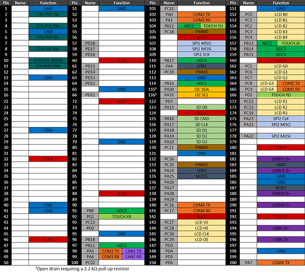

# G400D
---

## Overview
The G400D System on Module (SoM) is a 400 MHz ARM9. It is the first [Universal Compute Modules (UCMs)](intro.md). Originally running .NET Micro Framework exclusively, it can now be used with TinyCLR OS.

Pricing, purchasing and other information can be found on the [G400D Page](http://www.ghielectronics.com/products/ucm/g400d) on our main website.

> [!Tip]
> Modules designed for the UCM standard have more functionality available when not following the rules set by the standard. It is up to you to decide how much your design will follow the UCM standard.

## Ordering Part Number
* G400D SoM: G400D-SM-400

## Specifications
| Spec           | Value                                        |
|----------------|----------------------------------------------|
| Processor      | Atmel AT91SAM9X35 ARM 926                    |
| Speed          | 400 MHz                                      |
| Internal RAM   | 32 KByte (SRAM)                              |
| Internal Flash | 0 KByte                                      |
| External RAM   | 128 MByte (DDR2 SDRAM)                       |
| External Flash | 4 MByte (SPI)                                |
| Dimensions     | 67.7 x 31.9 x 5.0 mm                         |

*Note: Resources are shared between your application and the operating system.*

## Peripherals
This table lists the available peripherals. The "overall" column shows the available pins if the design did not follow the UCM standard.

| Peripheral     | UCM Standard       | Overall               |
|----------------|--------------------|-------------------------|
| UART           | 1                  | 5 (including HS)        |
| UART HS        | 1                  | 1                       |
| I2C            | 1                  | 1                       |
| SPI            | 1                  | 1                       |
| CAN            | 1                  | 2                       |
| SDIO           | 1                  | 1                       |
| ADC            | 8                  | 8                       |
| PWM            | 4                  | 4                       |
| GPIO           | 12                 | 70                      |
| IRQ            | 4                  | 70                      |
| USB Client     | Supported          | Supported               |
| USB Host       | 1                  | 2                       |
| LCD            | Supported (16bpp)  | Supported (16bpp)       |
| Ethernet PHY   | Supported          | Supported               |
| WiFi          | Not supported      | Not supported           |
| DCMI           | Not supported      | Not supported           |
| VBAT           | Supported          | Supported               |
| JTAG           | Full JTAG          | Full JTAG               |

## Development Options

The UCM [development options](development-options.md) can greatly simplify the process of building a product or prototype using the UC5550.  Options include a development board and displays which can get you programming in minutes.

## .NET Micro Framework (NETMF)

The NETMF software on G400 is mature and complete. For more information on NETMF you can go to the [NETMF Introduction](../../software/netmf/intro.md) page.  The [NETMF Getting Started](../../software/netmf/getting-started.md) page covers NETMF from setup of the host computer to program deployment on both an emulator and target device.

Bootloader v1 is needed for G400 to work with NETMF. It is available in the NETMF SDK.

## TinyCLR OS
TinyCLR OS provides a way to program the G400 in C# or Visual Basic from the Microsoft Visual Studio integrated development environment.  To get started you must first install the bootloader and firmware on the UC5550 (instructions below) and then go to the TinyCLR [Getting Started](../../software/tinyclr/getting-started.md) page for instructions.

### Loading Bootloader Version 2

Download the [G400 bootloader v2 file](../../hardware/loaders/ghi-bootloader.md) and load onto the dataflash. The [SAM-BA Bootloader](../../hardware/loaders/sam-ba-bootloader.md) has the details.

### Loading the Firmware

1. Activate the bootloader, hold the LDR0 signal (SYS B) low while resetting the board.
2. Open [TinyCLR Config](../../software/tinyclr/tinyclr-config.md) tool.
3. Click the loader tab.
4. Select the correct COM port. If you are not seeing it then the device is not in the loader mode.
5. Click the `Update to Latest` button.

You can also update the firmware manually. Download the [firmware](../../software/tinyclr/downloads.md) and learn how to use the [GHI Bootloader](../../hardware/loaders/ghi-bootloader.md) manually.

### Start Coding

Now that you have installed the bootloader and firmware, you can setup your host computer and start programming.  Go to the TinyCLR [Getting Started](../../software/tinyclr/getting-started.md) page for instructions.

### Code Samples

For some examples of using TinyCLR, take a look at the [TinyCLR Samples repo](https://github.com/ghi-electronics/TinyCLR-Samples). You may also find the [TinyCLR tutorials](../../software/tinyclr/tutorials/intro.md) useful.

### Native Code
You have the choice of loading the module with your preferred RTOS. Also, you can load [Native Code](../../software/tinyclr/native/intro.md) in TinyCLR OS at runtime that works alongside your managed application. Native code can be used to provide improved performance or access to advanced features.

The memory area reserved for native code in TinyCLR OS on G400D starts at 0x26700000 and its length is 0x16FFFF8.

## Datasheet
This documentation page replaced the legacy datasheet PDF but it is [here](http://files.ghielectronics.com/downloads/Documents/Datasheets/G400S%20and%20G400D%20Datasheet.pdf) for reference.

## G400D Pinout

Many signals on the G400D are multiplexed to offer multiple functions on a single pin. Developers can decide on the pin functionality to be used through the provided libraries. Any pin with no name, function, or note must be left unconnected.

## CAN Bit Timing Settings

The following CAN bit timing parameters were calculated for a G400 driving the SN65HVD230 CAN driver chip. See the [Configuring the Bus](../../software/tinyclr/tutorials/can.md#configuring-the-bus) section of the [CAN Tutorial](../../software/tinyclr/tutorials/can.md) for more information.

| Baud | Propagation | Phase1 | Phase2 | Baudrate Prescaler | Synchronization Jump Width | Use Multi Bit Sampling | Sample Point | Max Osc. Tolerance | Max Cable Length
|---|---|---|---|---|---|---|---|---|---
| 83.333K | 7 | 4 | 1 | 99 | 0 | False | 87.5% | 0.31% | 845M
| 125K    | 7 | 1 | 1 | 81 | 0 | False | 84.6% | 0.38% | 499M
| 250K    | 7 | 1 | 1 | 40 | 0 | False | 84.6% | 0.38% | 222M
| 500K    | 7 | 7 | 1 | 13 | 1 | False | 89.5% | 0.41% | 92M
| 1M      | 7 | 7 | 1 | 6  | 1 | False | 89.5% | 0.41% | 19M

*Note: Maximum Oscillator Tolerance and Maximum Cable Length are theoretical maximums and must be tested to ensure reliability.*

## G400 Development Board

This is no longer in production, replaced by the [Development Options](development-options.md)

* [Schematic](http://files.ghielectronics.com/downloads/Schematics/Systems/G400D%20Dev%20Board%20Schematic.pdf)

## Legal
### License

This product with its accompanying firmware are licensed royalty-free for commercial and noncommercial use. Using the provided firmware on a non-official product requires additional licensing. The provided documentation/schematics/libraries/sources are not to be used in any manner outside for the benefit of implementing and using this GHI Electronics product into your design.

### Disclaimer

IN NO EVENT SHALL GHI ELECTRONICS, LLC BE LIABLE FOR ANY DIRECT, INDIRECT, INCIDENTAL, SPECIAL, EXEMPLARY, OR CONSEQUENTIAL DAMAGES (INCLUDING, BUT NOT LIMITED TO, PROCUREMENT OF SUBSTITUTE GOODS OR SERVICES; LOSS OF USE, DATA, OR PROFITS; OR BUSINESS INTERRUPTION) HOWEVER CAUSED AND ON ANY THEORY OF LIABILITY, WHETHER IN CONTRACT, STRICT LIABILITY, OR TORT (INCLUDING NEGLIGENCE OR OTHERWISE) ARISING IN ANY WAY OUT OF THE USE OF THIS PRODUCT, EVEN IF ADVISED OF THE POSSIBILITY OF SUCH DAMAGE. GHI ELECTRONICS LINE OF PRODUCTS ARE NOT DESIGNED FOR LIFE SUPPORT APPLICATIONS. SPECIFICATIONS, PRICE AND AVAILABILITY ARE SUBJECT TO CHANGE WITHOUT ANY NOTICE.

***

Want to quickly build your prototype? Check out the UCM [**Development Options**](development-options.md).

You can also visit our main website at [**www.ghielectronics.com**](http://www.ghielectronics.com) and our community forums at [**forums.ghielectronics.com**](https://forums.ghielectronics.com/).