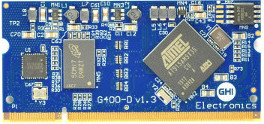

# G400D
---

## Overview
The G400D System on Module (SoM) is the first of the [Universal Compute Modules (UCMs)](intro.md). Originally running .NET Micro Framework exclusively, it is now used with other platforms including TinyCLR.

Pricing, purchasing and other information can be found on the [G400D Page](http://www.ghielectronics.com/products/ucm/g400d) on our main website.

## Getting Started

The UCM [development options](development-options.md) can greatly simplify the process of building a product or prototype using the G400D.  Options include a development board and displays which can get you programming in minutes.  Please refer to the [Development Options](development-options.md) page for more information.

There are several options available for programming the G400D which are described below.

### Using Microsoft's .NET Micro Framework (NETMF)
We discourage the use of NETMF software on our products in favor of TinyCLR OS. For more information on NETMF you can go to the [NETMF Introduction](../../software/netmf/intro.md) page.  The [NETMF Getting Started](../../software/netmf/getting-started.md) page covers NETMF from setup of the host computer to program deployment on both an emulator and target device.

### Using TinyCLR OS
TinyCLR provides a way to program the G400D in C# or Visual Basic from the Microsoft Visual Studio integrated development environment.  To get started you must first install the bootloader and firmware on the G400D (instructions below) and then go to the TinyCLR [Getting Started](../../software/tinyclr/getting-started.md) page for instructions on setting up the host computer and writing and deploying programs.

#### Loading Bootloader Version 2
Download the [G400 bootloader file](../../software/tinyclr/loaders/ghi-bootloader.md#g400).

Go to the [SAMBA](../../software/tinyclr/loaders/intro.md#sam-ba-bootloader) section of the [Bootloaders Introduction](../../software/tinyclr/loaders/intro.md) page for instructions on loading the bootloader.

#### Loading the Firmware

> [!Tip]
> First make sure you have bootloader v2 loaded. This needs to be done only once.

To activate bootloader v2, hold the LDR0 signal low and reset the board. You may have to wait a couple of seconds before releasing LDR0. On the UCM Dev board and UCM Breakout board, hold down the BOOT B button, press the RESET button, wait a second or two, and then release BOOT B.

Download the [G400 firmware](../../software/tinyclr/downloads.md#g400) and follow [Loading the Firmware](../../software/tinyclr/loaders/ghi-bootloader.md#loading-the-firmware) steps.

#### Setup the Host Computer and Start Coding

Now that you have installed the bootloader and firmware on the G400D, you can setup your host computer and start programming.  Go to the TinyCLR [Getting Started](../../software/tinyclr/getting-started.md#tinyclr-computer-setup) page for instructions.

## Datasheet
The G400D datasheet can be found [here](http://files.ghielectronics.com/downloads/Documents/Datasheets/G400S%20and%20G400D%20Datasheet.pdf).

## Specifications
| Spec           | Value                                        |
|----------------|----------------------------------------------|
| Processor      | Atmel AT91SAM9X35 ARM 926                    |
| Speed          | 400 MHz                                      |
| Internal RAM   | 32 KByte (SRAM)                              |
| Internal Flash | 0 KByte                                      |
| External RAM   | 128 MByte (DDR2 SDRAM)                       |
| External Flash | 4 MByte (SPI)                                |

## Peripherals
| Peripheral     | UCM Standard       | Overall\*               |
|----------------|--------------------|-------------------------|
| UART           | 1                  | 5 (including HS)        |
| UART HS        | 1                  | 1                       |
| I2C            | 1                  | 1                       |
| SPI            | 1                  | 1                       |
| CAN            | 1                  | 2                       |
| SDIO           | 1                  | 1                       |
| ADC            | 8                  | 8                       |
| PWM            | 4                  | 4                       |
| GPIO           | 12                 | 70                      |
| IRQ            | 4                  | 70                      |
| USB Client     | Supported          | Supported               |
| USB Host       | 1                  | 2                       |
| LCD            | Supported (16bpp)  | Supported (16bpp)       |
| Ethernet PHY   | Supported          | Supported               |
| Wi-Fi          | Not supported      | Not supported           |
| DCMI           | Not supported      | Not supported           |
| VBAT           | Supported          | Supported               |
| JTAG           | Full JTAG          | Full JTAG               |

\**The "Overall" column includes peripherals that fall outside of the UCM standard definition.  Using these peripherals may reduce code portability with our other UCM models.  Also, as many of these non-standard peripherals share I/O pins, not all of them will be available to your application.*

## Pinout  
| SO-DIMM Pin   | UCM Standard                  | Function Name                                 |
|---------------|-------------------------------|-----------------------------------------------|
| 1             | AGND                          | GND                                           |
| 2             | Ethernet TX-                  | ETH PHY TX-                                   |
| 3             | Module Specific 1             |                                               |
| 4             | Ethernet TX+                  | ETH PHY TX+                                   |
| 5             | Analog VREF-                  | GND                                           |
| 6             | Ethernet RX-                  | ETH PHY RX-                                   |
| 7             | Reserved                      |                                               |
| 8             | Ethernet RX+                  | ETH PHY RX+                                   |
| 9             | Reserved                      |                                               |
| 10            | Indicator A                   | ETH PHY LED SPEED                             |
| 11            | Indicator B                   | ETH PHY LED LINK                              |
| 12            | Reserved                      |                                               |
| 13            | GND                           | GND                                           |
| 14            | DCMI D0                       |                                               |
| 15            | DCMI D1                       |                                               |
| 16            | DCMI D2                       |                                               |
| 17            | DCMI D3                       |                                               |
| 18            | DCMI D4                       |                                               |
| 19            | DCMI D5                       |                                               |
| 20            | Analog 3.3V                   | 3.3V                                          |
| 21            | DCMI D6                       |                                               |
| 22            | DCMI D7                       |                                               |
| 23            | DCMI VSYNC                    |                                               |
| 24            | DCMI HSYNC                    |                                               |
| 25            | DCMI PIXCLK                   |                                               |
| 26            | DCMI XCLK                     |                                               |
| 27            | GND                           | GND                                           |
| 28            | PWM E                         |                                               |
| 29            | PWM F                         |                                               |
| 30            | PWM G                         |                                               |
| 31            | PWM H                         |                                               |
| 32            | Analog VREF+                  | 3.3V                                          |
| 33            | Reserved                      |                                               |
| 34            | 5V                            |                                               |
| 35            | Module Specific 4             | PB3                                           |
| 36            | Module Specific 5             | PB4 (DNP)                                     |
| 37            | Module Specific 6             | PB5                                           |
| 38            | Module Specific 7             | PB6                                           |
| 39            | Module Specific 8             | PB7                                           |
| 40            | GND                           | GND                                           |
| 41            | GND                           | GND                                           |
| 42            | LCD 24bpp R0                  |                                               |
| 43            | LCD 24bpp R1                  |                                               |
| 44            | LCD 24bpp R2                  |                                               |
| 45            | LCD 24bpp G0                  |                                               |
| 46            | 3.3V                          | 3.3V                                          |
| 47            | LCD 24bpp G1                  |                                               |
| 48            | LCD 24bpp B0                  |                                               |
| 49            | LCD 24bpp B1                  |                                               |
| 50            | LCD 24bpp B2                  |                                               |
| 51            | GND                           | GND                                           |
| 52            | Module Specific 9             | PB1                                           |
| 53            | Reserved                      |                                               |
| 54            | Reserved                      |                                               |
| 55            | Reserved                      |                                               |
| 56            | 5V                            |                                               |
| 57            | IRQ A                         | PD18                                          |
| 58            | IRQ B                         | PD17                                          |
| 59            | IRQ C                         | PD16                                          |
| 60            | 3.3V                          | 3.3V                                          |
| 61            | IRQ D                         | PD15                                          |
| 62            | GPIO A                        | PD14                                          |
| 63            | GPIO B                        | PD13                                          |
| 64            | GPIO C                        | PD12                                          |
| 65            | GND                           | GND                                           |
| 66            | GPIO D                        | PD11                                          |
| 67            | GPIO E                        | PD10                                          |
| 68            | GPIO F                        | PD9                                           |
| 69            | GPIO G                        | PD8                                           |
| 70            | 5V                            |                                               |
| 71            | Reserved                      |                                               |
| 72            | 3.3V                          | 3.3V                                          |
| 73            | I2C B SDA                     |                                               |
| 74            | I2C B SCL                     |                                               |
| 75            | UART C TX                     |                                               |
| 76            | UART C RX                     |                                               |
| 77            | UART D TX                     |                                               |
| 78            | UART D RX                     |                                               |
| 79            | GND                           | GND                                           |
| 80            | Reserved                      |                                               |
| 81            | Reserved                      |                                               |
| 82            | Reserved                      |                                               |
| 83            | Reserved                      |                                               |
| 84            | Reserved                      |                                               |
| 85            | Reserved                      |                                               |
| 86            | 5V                            |                                               |
| 87            | USB Device ID                 |                                               |
| 88            | 3.3V                          | 3.3V                                          |
| 89            | UART B TX                     |                                               |
| 90            | UART B RX                     |                                               |
| 91            | ADC A                         | PB8, ADC9                                     |
| 92            | GPIO H                        | PD2                                           |
| 93            | SPI B MISO                    |                                               |
| 94            | SPI B MOSI                    |                                               |
| 95            | GND                           | GND                                           |
| 96            | SPI B SCK                     |                                               |
| 97            | ADC B                         | PB11, ADC0                                    |
| 98            | CAN A TD                      | PA5, UART3 TX, CAN2 TX                        |
| 99            | CAN A RD                      | PA6, UART3 RX, CAN2 RX                        |
| 100           | CAN B TD                      |                                               |
| 101           | CAN B RD                      |                                               |
| 102           | UART HS A TX                  | PA0, UART2 TX                                 |
| 103           | UART HS A RX                  | PA1, UART2 RX                                 |
| 104           | ADC C                         | PB12, ADC1                                    |
| 105           | PWM A                         | PC18, PWM0                                    |
| 106           | 3.3V                          | 3.3V                                          |
| 107           | BOOT A                        | SPI1 MISO                                     |
| 108           | Module Specific 2             | SPI1 MOSI                                     |
| 109           | Module Specific 3             | SPI1 SCK                                      |
| 110           | ADC D                         | PB17, ADC6                                    |
| 111           | BOOT C                        | PA4, LDR1                                     |
| 112           | PWM B                         | PC19, PWM1                                    |
| 113           | GND                           | GND                                           |
| 114           | ADC E                         | PB16, ADC5                                    |
| 115           | I2C A SDA                     | PA30, I2C SDA                                 |
| 116           | I2C A SCL                     | PA31, I2C SCL                                 |
| 117           | UART A RX                     | PA9, UART1 RX, CAN1 RX                        |
| 118           | UART A TX                     | PA10, UART1 TX, CAN1 TX                       |
| 119           | GPIO I                        | PC24                                          |
| 120           | UART HS A RTS                 | PA2, UART2 RTS                                |
| 121           | UART HS A CTS                 | PA3, UART2 CTS                                |
| 122           | GPIO J                        | PD7                                           |
| 123           | SD Card D0                    | PA15, SD D0                                   |
| 124           | 3.3V                          | 3.3V                                          |
| 125           | SD Card CMD                   | PA16, SD CMD                                  |
| 126           | SD Card CLK                   | PA17, SD CLK                                  |
| 127           | SD Card D1                    | PA18, SD D1                                   |
| 128           | SD Card D2                    | PA19, SD D2                                   |
| 129           | SD Card D3                    | PA20, SD D3                                   |
| 130           | PWM C                         | PC21, PWM3                                    |
| 131           | GND                           | GND                                           |
| 132           | GPIO K                        | PC26                                          |
| 133           | PWM D                         | PC20, PWM2                                    |
| 134           | BOOT B                        | PA24, LDR0                                    |
| 135           | BOOT D                        | PA25, MODE                                    |
| 136           | GPIO L                        | PA26                                          |
| 137           | Module Specific 10            | PA27                                          |
| 138           | UART HS B RTS                 |                                               |
| 139           | UART HS B CTS                 |                                               |
| 140           | UART HS B TX                  | PC16, UART6 TX                                |
| 141           | UART HS B RX                  | PC17, UART6 RX                                |
| 142           | 3.3V                          | 3.3V                                          |
| 143           | LCD VSYNC                     | PC27, LCD VSYNC                               |
| 144           | LCD HSYNC                     | PC28, LCD HSYNC                               |
| 145           | LCD CLK                       | PC30, LCD CLK                                 |
| 146           | LCD DE                        | PC29, LCD DE                                  |
| 147           | Module Specific 11            | PD3                                           |
| 148           | SD Card CD                    | PD4                                           |
| 149           | Module Specific 12            | PD5                                           |
| 150           | Reserved                      |                                               |
| 151           | GND                           | GND                                           |
| 152           | LCD B3                        | PC0, LCD B3                                   |
| 153           | LCD B4                        | PC1, LCD B4                                   |
| 154           | LCD B5                        | PC2, LCD B5                                   |
| 155           | LCD B6                        | PC3, LCD B6                                   |
| 156           | LCD B7                        | PC4, LCD B7                                   |
| 157           | ADC F                         | PB13, ADC2                                    |
| 158           | ADC G                         | PB14, ADC3                                    |
| 159           | ADC H                         | PB15, ADC4                                    |
| 160           | 3.3V                          | 3.3V                                          |
| 161           | LCD G2                        | PC5, LCD G2                                   |
| 162           | LCD G3                        | PC6, LCD G3                                   |
| 163           | LCD G4                        | PC7, LCD G4                                   |
| 164           | LCD G5                        | PC8, LCD G5, UART5 TX                         |
| 165           | LCD G6                        | PC9, LCD G6, UART5 RX                         |
| 166           | Module Specific 13            | PD1                                           |
| 167           | Indicator C                   | PA8, UART4 RX                                 |
| 168           | LCD R7                        | PC15, LCD R7                                  |
| 169           | GND                           | GND                                           |
| 170           | LCD G7                        | PC10, LCD G7                                  |
| 171           | LCD R3                        | PC11, LCD R3                                  |
| 172           | LCD R4                        | PC12, LCD R4                                  |
| 173           | LCD R5                        | PC13, LCD R5                                  |
| 174           | LCD R6                        | PC14, LCD R6                                  |
| 175           | SPI A SCK                     | PA23, SPI2 SCK                                |
| 176           | SPI A MISO                    | PA21, SPI2 MISO                               |
| 177           | Module Specific 14            | WKUP                                          |
| 178           | SPI A MOSI                    | PA22, SPI2 MOSI                               |
| 179           | Module Specific 15            | SHDN                                          |
| 180           | 3.3V                          | 3.3V                                          |
| 181           | Module Specific 16            | PWR EN                                        |
| 182           | Module Specific 17            | USB H2+                                       |
| 183           | VBAT                          | VBAT                                          |
| 184           | Module Specific 18            | USB H2-                                       |
| 185           | GND                           | GND                                           |
| 186           | GND                           | GND                                           |
| 187           | RESET                         | RESET                                         |
| 188           | USB Host D+                   | USB H1+                                       |
| 189           | JTAG RTCK                     | RTCK                                          |
| 190           | USB Host D-                   | USB H1-                                       |
| 191           | JTAG TDO                      | TDO                                           |
| 192           | 3.3V                          | 3.3V                                          |
| 193           | JTAG NTRST                    | NTRST                                         |
| 194           | USB Device D+                 | USB D+                                        |
| 195           | JTAG TDI                      | TDI                                           |
| 196           | USB Device D-                 | USB D-                                        |
| 197           | JTAG TCK (SWCLK)              | TCK                                           |
| 198           | GND                           | GND                                           |
| 199           | JTAG TMS (SWDIO)              | TMS                                           |
| 200           | Indicator D                   | PA7, UART4 TX                                 |

## G400 Based products

### G400 Development Board

The development system used for evaluating the G400 SoM.

* [Schematic](http://files.ghielectronics.com/downloads/Schematics/Systems/G400D%20Dev%20Board%20Schematic.pdf)

***

Want to quickly build your prototype? Check out the UCM [**Development Options**](development-options.md).

You can also visit our main website at [**www.ghielectronics.com**](http://www.ghielectronics.com) and our community forums at [**forums.ghielectronics.com**](https://forums.ghielectronics.com/).