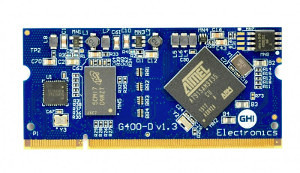

# Universal Compute Modules
---

Our Universal Compute Modules are based on a 200 pin SO-DIMM form factor.  All models follow a standard pin out making it easy to change modules to fit the needs of your product.

Our UCMs can be programmed using a variety of tools including our own TinyCLR operating system, Microsoft's .NET Micro Framework, and bare metal C/C++.

|  |  |
|--|--|
| **The UCM Standard**   Description, peripherals and pinouts. [**Learn more...**](standard.md) | **UC2550**   Our low power UCM. [**Learn more...**](uc2550.md) |
|  |  |
| **UC5500**   Based on the Cortex M7. [**Learn more...**](uc5550.md) | **G400D**   Our original UCM. [**Learn more...**](g400d.md) |
|  |  |
| **UCM Development Options**   Development boards, breakout boards, displays. [**Learn more...**](development-options.md) |  |
|  |  |

***

[**Learn more**](standard.md) about the [**UCM Standard**](standard.md).

Want to quickly build your prototype?  Check out our [**UCM Development Options**](development-options.md).

You can also visit our main website at [**www.ghielectronics.com**](http://www.ghielectronics.com) and our community forums at [**forums.ghielectronics.com**](https://forums.ghielectronics.com/).