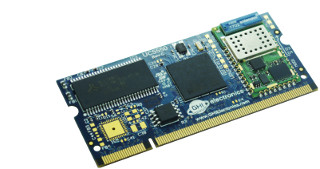
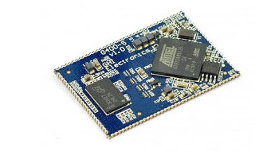
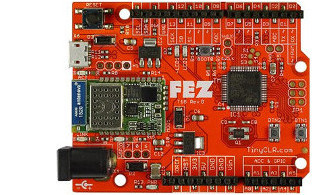

# GHI Electronics Documentation
---
Here you will find GHI Electronic's product documentation.  For more information visit the main website at [**www.ghielectronics.com**](http://www.ghielectronics.com). You can also visit our community forums at [**forums.ghielectronics.com**](https://forums.ghielectronics.com).

> [!Note]
> Please check back often for the latest updates to our products, documentation, and software.

***

## Product Sections
|  |  |
|---|---|
| **UCMs (Universal Compute Modules)**   Interchangeable plug-in microcontroller modules suitable for a wide variety of applications. [**Learn More...**](hardware/ucm/intro.md) | **SCMs (Surface Compute Modules)**   Surface mount microcontroller modules ideal for harsh or high vibration environments. [**Learn More...**](hardware/scm/intro.md) |
|  |  |
| **FEZ**   The Maker Board to Rule Them All! [**Learn More...**](hardware/fez/intro.md)| **TinyCLR Operating System**   TinyCLR OS is light weight .NET operating system for IoT and embedded devices. [**Learn More...**](software/tinyclr/intro.md) |
|  |  |
| **NETMF**   The original embedded .NET upon which TinyCLR OS is based [**Learn More...**](software/netmf/intro.md) | **File System**   Technical details and manuals for the File System products. [**Learn More...**](hardware/filesystem/intro.md) |
|  |  |

***

You can also visit our main website at [**www.ghielectronics.com**](http://www.ghielectronics.com) and our community forums at [**forums.ghielectronics.com**](https://forums.ghielectronics.com/).

