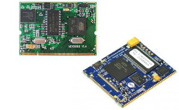
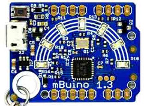

# Legacy Products Introduction
---

This section covers GHI's legacy products. These products are not recommended for new designs and are no longer covered by our free support. Please [contact us](https://www.ghielectronics.com/contact) directly for details on our paid support services.

|  |  |
|--|--|
| **SoMs**   [**Learn more...**](som.md) | **Gadgeteer**   [**Learn more...**](../hardware/gadgeteer/intro.md) |
|  |  |
| **Gadgeteering**   [**Learn more...**](../hardware/gadgeteering.md) | **File System**   [**Learn more...**](../hardware/filesystem.md) |
|  |  |
| **Imaging**   [**Learn more...**](../hardware/imaging.md) | **Raspberry PI Hats**   [**Learn more...**](../hardware/raspberrypi-hats.md) |
|  |  |
| **mBuino**   [**Learn more...**](../hardware/mbuino.md) | 
|  |  |

> [!Tip]
> Our [**community forum**](https://forums.ghielectronics.com/) is a great place to get help from our engineers and from thousands of community members: **https://forums.ghielectronics.com/**

## Producing Legacy Products

GHI Electronic's products are all engineered and manufactured in-house.  While some of our older products are deemed legacy and not recommended for new designs, we can still produce them, however a minimum order may be required.

We understand the need for continued product support and availability. Please [contact us](https://www.ghielectronics.com/company/contact) to discuss ways to fulfill your immediate needs and also to discuss upgrade options.

***

Visit our main website at [**www.ghielectronics.com**](http://www.ghielectronics.com) and our community forums at [**forums.ghielectronics.com**](https://forums.ghielectronics.com/).