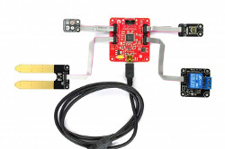
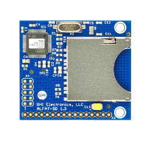
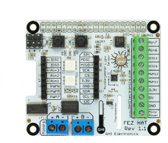

# Legacy Products Introduction
---

This section covers our legacy products. These products are not recommended for new designs and are no longer covered by our free support. Please [contact us](https://www.ghielectronics.com/contact) directly for details on our paid support services.

|  |  |
|--|--|
| **NETMF**   [**Learn more...**](netmf/intro.md) | **Gadgeteer**   [**Learn more...**](gadgeteer/intro.md) |
|  |  |
| **Gadgeteering**   [**Learn more...**](gadgeteering.md) | **File System**   [**Learn more...**](filesystem.md) |
|  |  |
| **Imaging**   [**Learn more...**](imaging.md) | **Raspberry PI Hats**   [**Learn more...**](raspberrypi_hats.md) |
|  |  |
| **mBuino**   [**Learn more...**](mbuino.md) | 
|  |  |

> [!Tip]
> Our [**community forum**](https://forums.ghielectronics.com/) is a great place to get help from our engineers and from the thousands of community members: **https://forums.ghielectronics.com/**

# Producing Legacy Products

GHI Electronics is the engineering and the manufacturing behind all its products. While some products have been made legacy and not recommended for new designs, they can still be produced. There may be a required minimum order quantity. 

We understand the need for continued product support and availability. Please [contact us](https://www.ghielectronics.com/contact) directly to discuss ways to fulfill your immediate needs and also to discuss upgrade options.

***

Visit our main website at [**www.ghielectronics.com**](http://www.ghielectronics.com) and our community forums at [**forums.ghielectronics.com**](https://forums.ghielectronics.com/).