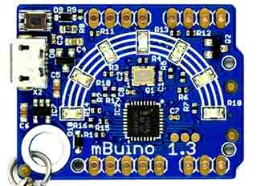

# mBuino
---

The mBuino is a tiny keychain circuit. It is GHI Electronics contribution to the mbed community. Learn more [here](https://developer.mbed.org/platforms/mBuino/)

* [Schematic](http://files.ghielectronics.com/downloads/Schematics/Systems/mBuino%20Schematic.pdf)

***

Visit our main website at [**www.ghielectronics.com**](http://www.ghielectronics.com) and our community forums at [**forums.ghielectronics.com**](https://forums.ghielectronics.com/).