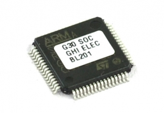
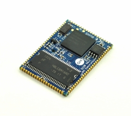

# Surface Mount Compute Modules
---

Our Surface Compute Modules are surface mount embedded controllers and are ideal for harsh or high vibration environments.

Our SCMs and UCMs can be programmed using a variety of languages and development environments including our own TinyCLR operating system.  TinyCLR allows you to write programs using Microsoft's Visual Studio development environment and Visual Basic or C# programming languages.

A free version of Visual Studio is available.  Find out more on our [TinyCLR OS introduction](../tinyclr/intro.md) page. 

|  |  |
|--|--|
| **G30**   [**Learn more...**](g30.md) | **G80**   [**Learn more...**](g80.md) |
|  |  |
| **G120 / G120E**   [**Learn more...**](g120.md) | **G400S**   [**Learn more...**](g400s.md) |
|  |  |
 
***

Visit our main website at [**www.ghielectronics.com**](http://www.ghielectronics.com) and our community forums at [**forums.ghielectronics.com**](https://forums.ghielectronics.com/).